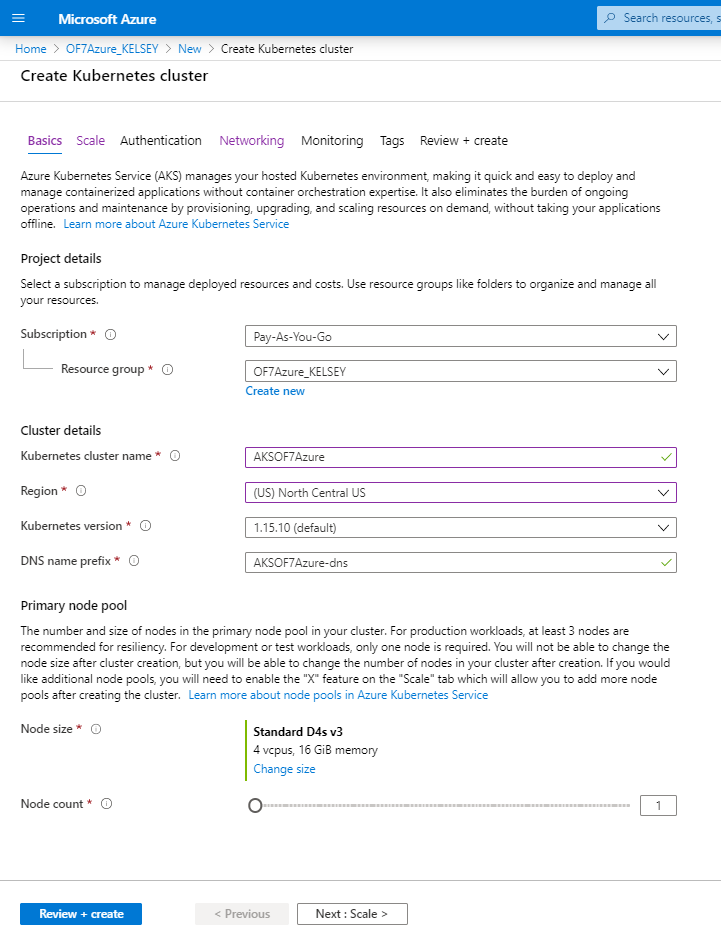
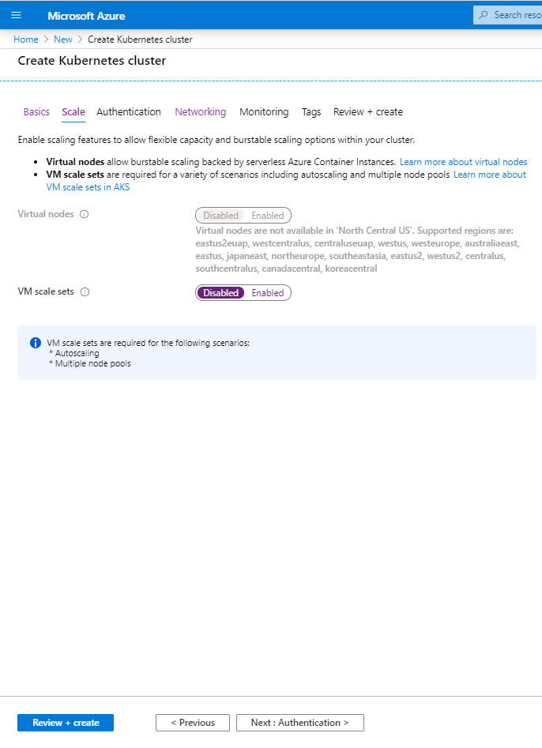
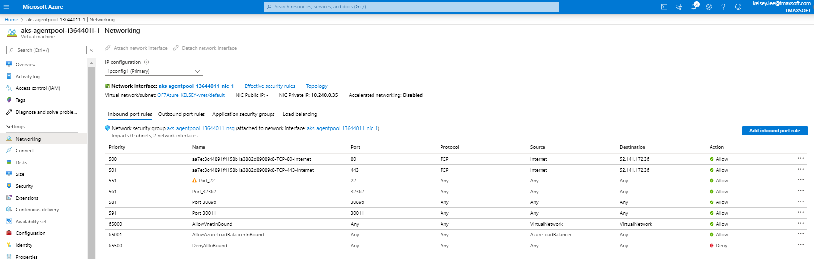

# Azure service with OpenFrame by Kelsey

## Table of Contents

+ [1. Add Azure Kubernetes Service(AKS)](#1-add-azure-kubernetes-serviceaks)
  + [1.1 Add the Service from Azure Website](#11-add-the-service-from-azure-website)
  + [1.2 Set the Node](#12-set-the-node)
+ [2. Set Pods](#2-set-pods)
  + [2.1 Crate a Pod Yaml File](#21-crate-a-pod-yaml-file)
  + [2.2 Create a Pod](#22-create-a-pod)
+ [3. Connect to the Running Pod](#3-connect-to-the-running-pod)
  + [3.1 Execute a running Pod from a Node](#31-execute-a-running-pod-from-a-node)
+ [4. Set Services](#4-set-services)
  + [4.1 Create a Service Yaml File](#41-create-a-service-yaml-file)
  + [4.2 Create Services](#42-create-services)
+ [5. Network Configuration](#5-network-configuration)
  + [5.1 Set the Inbound NAT Rules of Kubernetes with the Nodeports](#51-set-the-inbound-nat-rules-of-kubernetes-with-the-nodeports)
  + [5.2 Set the Inbound Ports](#52-set-the-inbound-ports)

## Azure Service

# 1. Add Azure Kubernetes Service(AKS)

## 1.1 Add the Service from Azure Website

### Add resource as Kubernetes service


1) Basic
    - Set the region as NorthCentralUS here. Resources may vary depends on the region.
    
    
    
    

    - Select the Node(VM) size

2) Scale

    

3) Authentication as default

4) Networking

    

5) Monitoring

    

6) Tag as you want

7) Review + create

    
    
8) Set the user id and password for the node(VM)

    - Hit the "Reset password" menu from the node(VM).
    
        

## 1.2 Set the Node 

### Use Azure cloud

1) Get access credentials for a managed Kubernetes cluster

    ``` az aks get-credentials --resource-group [resource_group_name] --name [AKS_cluster_name]```

    *Example :*

    ``` az aks get-credentials --resource-group OF7Azure_KELSEY --name AKSOF7Azure```

    *Merged "AKSOF7azure" as current context in /home/kelsey/.kube/config*


2) Check the node status

    ```kubectl get nodes```
    ```
    NAME                       STATUS   ROLES   AGE     VERSION
    aks-agentpool-13644011-1   Ready    agent   2m20s   v1.15.10
    ```

3) When you need to reset the cluster 

    ```kubectl config delete-cluster [cluster name]```

    *Example :*

    ```kubectl config delete-cluster AKSOF7azure```

    *deleted cluster AKSOF7Azure from /home/kelsey/.kube/config*

# 2. Set Pods

## 2.1 Crate a Pod Yaml File

    apiVersion: v1
    kind: Pod
    metadata:
      name: of7azure
      labels:
        of7azurefinal: of7azure
    spec:
      containers:
      - name: of7azure
        image: kelsey92/of7azurefinal:of7azure
        ports:
          - containerPort: 6606
        command: ["/bin/sh", "-ec", "while :; do echo '.'; sleep 5 ; done"]

    * Containerport is used for connecting another container in the same Pod.

## 2.2 Create a Pod

1) Use the command below for creating a new Pod

    ```kubectl create -f [yaml file name]```

    *Example :*

    ```kubectl create -f of7test.yaml```

    *pod/of7azure created*

2) Check the specific Pod

    ```kubectl get pod [pod name]```

3) Check all Pods

    ```kubectl get pods``` 

    ```
    NAME       READY   STATUS              RESTARTS   AGE
    of7azure   0/1     ContainerCreating   0          2m14s

    NAME       READY   STATUS              RESTARTS   AGE
    of7azure   1/1     Running             0          26m
    ```

4) Get the detailed information of the Pod

    ```kubectl describe pod [pod name]```

    ```
      Name:         of7azure
      Namespace:    default
      Priority:     0
      Node:         aks-agentpool-13644011-1/10.240.0.35
      Start Time:   Thu, 26 Mar 2020 01:40:36 +0000
      Labels:       of7azurefinal=of7azure
      Annotations:  <none>
      Status:       Running
      IP:           10.240.0.40
      IPs:          <none>
      Containers:
        of7azure:
          Container ID:  docker://05a08dc994462c770b43b3954f49071dcb8d059ff6eaf23ba93c7c71c3f813f4
          Image:         kelsey92/of7azurefinal:of7azure
          Image ID:      docker-pullable://kelsey92/of7azurefinal@sha256:f74723dd0541d9a7643eb1c7751321398ec1f76253ac28d50cb2cee57f663d2c
          Port:          6606/TCP
          Host Port:     0/TCP
          Command:
            /bin/sh
            -ec
            while :; do echo '.'; sleep 5 ; done
          State:          Running
            Started:      Thu, 26 Mar 2020 01:40:38 +0000
          Ready:          True
          Restart Count:  0
          Environment:    <none>
          Mounts:
            /var/run/secrets/kubernetes.io/serviceaccount from default-token-pvcdl (ro)
      Conditions:
        Type              Status
        Initialized       True
        Ready             True
        ContainersReady   True
        PodScheduled      True
      Volumes:
        default-token-pvcdl:
          Type:        Secret (a volume populated by a Secret)
          SecretName:  default-token-pvcdl
          Optional:    false
      QoS Class:       BestEffort
      Node-Selectors:  <none>
      Tolerations:     node.kubernetes.io/not-ready:NoExecute for 300s
                       node.kubernetes.io/unreachable:NoExecute for 300s
      Events:
        Type    Reason     Age    From                               Message
        ----    ------     ----   ----                               -------
        Normal  Scheduled  27m    default-scheduler                  Successfully assigned default/of7azure to aks-agentpool-13644011-1
        Normal  Pulling    27m    kubelet, aks-agentpool-13644011-1  Pulling image "kelsey92/of7azurefinal:of7azure"
        Normal  Pulled     3m40s  kubelet, aks-agentpool-13644011-1  Successfully pulled image "kelsey92/of7azurefinal:of7azure"
        Normal  Created    3m19s  kubelet, aks-agentpool-13644011-1  Created container of7azure
        Normal  Started    3m18s  kubelet, aks-agentpool-13644011-1  Started container of7azure
    ```

# 3. Connect to the Running Pod
 
## 3.1 Execute a running Pod from a Node

### Execute a Running Pod from Azure Cloud

    kubectl exec -it of7azure -- /bin/bash

1) Check which Node is the one the Pod is running in and connect to the Node

    *Use putty or other applications to connect*

    - NODE A (aks-agentpool-#####-0) 
      
      52.141.172.195:22

    - NODE B (aks-agentpool-#####-1) 
      
      52.141.172.195:20
      
2) Change user by using the information below

    ID : of7azure
    
    Password : TmaxSnow2020

    ```
    $ sudo su - of7azure
    [sudo] password for of7azure: 

    of7azure@aks-agentpool-#########-0:~$
    ```

3) Check the running Pod container by using grep the Pod name

    *Let's say nfsof7azure-848d8d6cc7-r222f is the Pod name*

    ```
    of7azure@aks-agentpool-24893396-0:~$ sudo docker ps | grep nfsof7azure-848d8d6cc7-r222f
    b0007ece0a8e        kelsey92/of7azurefinal                            "/bin/sh -ec 'while ??   56 minutes ago      Up 56 minutes                                                                  k8s_of7azure_nfsof7azure-848d8d6cc7-r222f_default_6c487354-6707-42f4-a3a8-b5e105978c3e_0
    524852746c25        mcr.microsoft.com/k8s/core/pause:1.2.0            "/pause"                 About an hour ago   Up About an hour                                                               k8s_POD_nfsof7azure-848d8d6cc7-r222f_default_6c487354-6707-42f4-a3a8-b5e105978c3e_0
    ```
    
4) Execute the running Pod container

    *The first field is the container ID, execute the container which is running by /bin/sh command*

    ```sudo docker exec -i -t b0007ece0a8e /bin/bash```

5) Change the user in the container to use OpenFrame

    ```
    [root@of7azure /]# su - of7azure
    Last login: Thu Mar 26 01:01:15 UTC 2020 on pts/0

    [of7azure@of7azure ~]$ 
    ```

6) When you need to delete Pods

    ```kubectl delete pod --all```
  
# 4. Set Services

### Nodeport service for using JEUS, Webterminal, OFManager

## 4.1 Create a Service Yaml File

    apiVersion: v1
    kind: Service
    metadata:
      name: jeus
    spec:
      type: NodePort
      selector:
        of7azurefinal: of7azure
      ports:
      - protocol: TCP
        port: 9736
        targetPort: 9736

    apiVersion: v1
    kind: Service
    metadata:
      name: ofmanager
    spec:
      type: NodePort
      selector:
        of7azurefinal: of7azure
      ports:
      - protocol: TCP
        port: 8087
        targetPort: 8087

    apiVersion: v1
    kind: Service
    metadata:
      name: webterminal
    spec:
      type: NodePort
      selector:
        of7azurefinal: of7azure
      ports:
      - protocol: TCP
        port: 8088
        targetPort: 8088

## 4.2 Create Services

1) Create services by using the command below

    ```kubectl create -f NodePort_8088.yaml```
    
    *service/webterminal created*

    ```kubectl create -f NodePort_8087.yaml```
    
    *service/ofmanager created*

    ```kubectl create -f NodePort_9736.yaml```
    
    *service/jeus created*

2) Check services

    ```kubectl get services```

    ```bash
    NAME          TYPE        CLUSTER-IP     EXTERNAL-IP   PORT(S)          AGE
    jeus          NodePort    10.0.139.162   <none>        9736:32362/TCP   2m58s
    kubernetes    ClusterIP   10.0.0.1       <none>        443/TCP          47h
    ofmanager     NodePort    10.0.234.165   <none>        8087:30896/TCP   3m7s
    webterminal   NodePort    10.0.179.58    <none>        8088:30011/TCP   3m11s
    ```

3) Get detailed information of services

    ```kubectl describe services [service name]```

    ```
    Name:                     jeus
    Namespace:                default
    Labels:                   <none>
    Annotations:              <none>
    Selector:                 of7azurefinal=of7azure
    Type:                     NodePort
    IP:                       10.0.139.162
    Port:                     <unset>  9736/TCP
    TargetPort:               9736/TCP
    NodePort:                 <unset>  32362/TCP
    Endpoints:                10.240.0.40:9736
    Session Affinity:         None
    External Traffic Policy:  Cluster
    Events:                   <none>
    ```

    ```
    Name:                     ofmanager
    Namespace:                default
    Labels:                   <none>
    Annotations:              <none>
    Selector:                 of7azurefinal=of7azure
    Type:                     NodePort
    IP:                       10.0.234.165
    Port:                     <unset>  8087/TCP
    TargetPort:               8087/TCP
    NodePort:                 <unset>  30896/TCP
    Endpoints:                10.240.0.40:8087
    Session Affinity:         None
    External Traffic Policy:  Cluster
    Events:                   <none>
    ```

    ```
    Name:                     webterminal
    Namespace:                default
    Labels:                   <none>
    Annotations:              <none>
    Selector:                 of7azurefinal=of7azure
    Type:                     NodePort
    IP:                       10.0.179.58
    Port:                     <unset>  8088/TCP
    TargetPort:               8088/TCP
    NodePort:                 <unset>  30011/TCP
    Endpoints:                10.240.0.40:8088
    Session Affinity:         None
    External Traffic Policy:  Cluster
    Events:                   <none>
    ```

4) When you need to delete services

   ```kubectl delete service [service name]```


# 5. Network Configuration

## 5.1 Set the Inbound NAT Rules of Kubernetes with the Nodeports

1) Hit the add button from Inbound NAT rules
  
    

2) Jeus

    **Type the jeus Nodeport in Target port**

    


3) Webterminal

    **Type the webterminal Nodeport in Target port**

    


4) Ofmanager

    **Type the ofmanager Nodeport in Target port**

    


## 5.2 Set the Inbound Ports 

1) Hit the Add inbound port rule from the Node Networking setting
   
   

2) Add inbound ports

    Type the port in "Destination port ranges"

    
    
    Add all nodeports as inbound ports like above.


# Copyrighted by Kelsey
