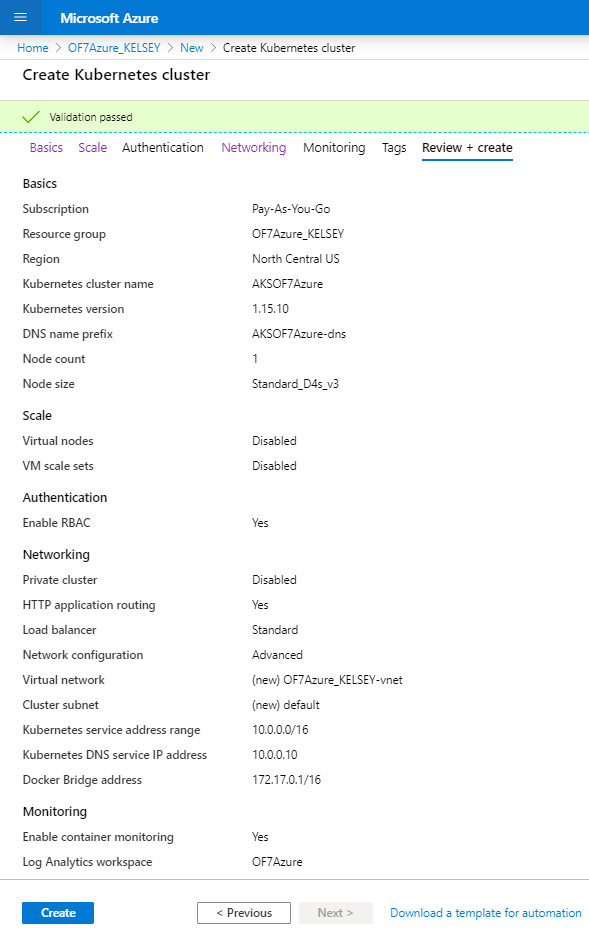

# Azure service with OpenFrame by Kelsey

## Table of Contents

+ [1. Azure Service](#step-2-azure-service)
  + [1.1 Add Azure Kubernetes service(AKS)](#21-add-azure-kubernetes-serviceaks)
  + [1.2 Set Pods](#22-set-pods)
  + [1.3 Connect to the running Pod](#23-connect-to-the-running-pod)
  + [1.4 Set services](#23-set-services)
  + [1.5 Network configuration](#24-network-configuration)


## 1. Azure Service

### 1.1 Add Azure Kubernetes service(AKS)

1. Add the service from Azure Website.

* Add resource as kubernetes service

    

* Basic

    
    
    **Set the region as NorthCentralUS here. Resources may vary depends on the region.**

    

*Select the Node(VM) size*

* Scale

    

* Authentication as default

* Networking

    

* Monitoring

    

* Tag as you want

* Review + create

    
    
* Set the user id and password for the node(VM)

    Hit the "Reset password" menu from the node(VM).
    
        

2. Set the Node 

    **Use Azure cloud**

* Get access credentials for a managed Kubernetes cluster

    ```az aks get-credentials --resource-group [resource_group_name] --name [AKS_cluster_name]```

    *Example :*

    ``` az aks get-credentials --resource-group OF7Azure_KELSEY --name AKSOF7Azure```

    *Merged "AKSOF7azure" as current context in /home/kelsey/.kube/config*


* Check the node status

    ```kubectl get nodes```
    ```bash
    NAME                       STATUS   ROLES   AGE     VERSION
    aks-agentpool-13644011-1   Ready    agent   2m20s   v1.15.10
    ```

* When you need to reset the cluster 

    ```kubectl config delete-cluster [cluster name]```

    *Example :*

    ```kubectl config delete-cluster AKSOF7azure```

    *deleted cluster AKSOF7Azure from /home/kelsey/.kube/config*

### 1.2 Set Pods

1. Crate a Pod yaml file

    ```bash
    apiVersion: v1
    kind: Pod
    metadata:
      name: of7azure
      labels:
        of7azurefinal: of7azure
    spec:
      containers:
      - name: of7azure
        image: kelsey92/of7azurefinal:of7azure
        ports:
          - containerPort: 6606
        command: ["/bin/sh", "-ec", "while :; do echo '.'; sleep 5 ; done"]
    ```

    * Containerport is used for connecting another container in the same Pod

2. Create a Pod

* Use the command below for creating a new Pod

    ```kubectl create -f [yaml file name]```

    *Example :*

    ```kubectl create -f of7test.yaml```

    *pod/of7azure created*

* Check the specific Pod

    ```kubectl get pod [pod name]```

* Check all Pods

    ```kubectl get pods``` 

    ```bash
    NAME       READY   STATUS              RESTARTS   AGE
    of7azure   0/1     ContainerCreating   0          2m14s

    NAME       READY   STATUS              RESTARTS   AGE
    of7azure   1/1     Running             0          26m
    ```

* Get the detailed information of the Pod

    ```kubectl describe pod [pod name]```

    ```bash
  Name:         of7azure
  Namespace:    default
  Priority:     0
  Node:         aks-agentpool-13644011-1/10.240.0.35
  Start Time:   Thu, 26 Mar 2020 01:40:36 +0000
  Labels:       of7azurefinal=of7azure
  Annotations:  <none>
  Status:       Running
  IP:           10.240.0.40
  IPs:          <none>
  Containers:
    of7azure:
      Container ID:  docker://05a08dc994462c770b43b3954f49071dcb8d059ff6eaf23ba93c7c71c3f813f4
      Image:         kelsey92/of7azurefinal:of7azure
      Image ID:      docker-pullable://kelsey92/of7azurefinal@sha256:f74723dd0541d9a7643eb1c7751321398ec1f76253ac28d50cb2cee57f663d2c
      Port:          6606/TCP
      Host Port:     0/TCP
      Command:
        /bin/sh
        -ec
        while :; do echo '.'; sleep 5 ; done
      State:          Running
        Started:      Thu, 26 Mar 2020 01:40:38 +0000
      Ready:          True
      Restart Count:  0
      Environment:    <none>
      Mounts:
        /var/run/secrets/kubernetes.io/serviceaccount from default-token-pvcdl (ro)
  Conditions:
    Type              Status
    Initialized       True
    Ready             True
    ContainersReady   True
    PodScheduled      True
  Volumes:
    default-token-pvcdl:
      Type:        Secret (a volume populated by a Secret)
      SecretName:  default-token-pvcdl
      Optional:    false
  QoS Class:       BestEffort
  Node-Selectors:  <none>
  Tolerations:     node.kubernetes.io/not-ready:NoExecute for 300s
                   node.kubernetes.io/unreachable:NoExecute for 300s
  Events:
    Type    Reason     Age    From                               Message
    ----    ------     ----   ----                               -------
    Normal  Scheduled  27m    default-scheduler                  Successfully assigned default/of7azure to aks-agentpool-13644011-1
    Normal  Pulling    27m    kubelet, aks-agentpool-13644011-1  Pulling image "kelsey92/of7azurefinal:of7azure"
    Normal  Pulled     3m40s  kubelet, aks-agentpool-13644011-1  Successfully pulled image "kelsey92/of7azurefinal:of7azure"
    Normal  Created    3m19s  kubelet, aks-agentpool-13644011-1  Created container of7azure
    Normal  Started    3m18s  kubelet, aks-agentpool-13644011-1  Started container of7azure
  ```


### 1.3 Connect to the running Pod

1) Execute a running Pod from Azure Cloud

    ```kubectl exec -it of7azure -- /bin/bash```
    
2) Execute a running Pod from the Node where the Pod is running

- Check which Node is the one the Pod is running in and connect to the Node

    *Use putty or other applications to connect*

    - NODE A (aks-agentpool-#####-0) 
      
      52.141.172.195:22

    - NODE B (aks-agentpool-#####-1) 
      
      52.141.172.195:20
      
- Change user by using the information below

    ID : of7azure
    
    Password : TmaxSnow2020

    ```bash
    $ sudo su - of7azure
    [sudo] password for of7azure: 

    of7azure@aks-agentpool-#########-0:~$
    ```

- Check the running Pod container by using grep the Pod name

    *Let's say nfsof7azure-848d8d6cc7-r222f is the Pod name*

    ```bash
    of7azure@aks-agentpool-24893396-0:~$ sudo docker ps | grep nfsof7azure-848d8d6cc7-r222f
    b0007ece0a8e        kelsey92/of7azurefinal                            "/bin/sh -ec 'while ??   56 minutes ago      Up 56 minutes                                                                  k8s_of7azure_nfsof7azure-848d8d6cc7-r222f_default_6c487354-6707-42f4-a3a8-b5e105978c3e_0
    524852746c25        mcr.microsoft.com/k8s/core/pause:1.2.0            "/pause"                 About an hour ago   Up About an hour                                                               k8s_POD_nfsof7azure-848d8d6cc7-r222f_default_6c487354-6707-42f4-a3a8-b5e105978c3e_0
    ```
    
- Execute the running Pod container

    *The first field is the container ID, execute the container which is running by /bin/sh command*

    ```sudo docker exec -i -t b0007ece0a8e /bin/bash```

- Change the user in the container to use OpenFrame

  ```bash
  [root@of7azure /]# su - of7azure
  Last login: Thu Mar 26 01:01:15 UTC 2020 on pts/0

  [of7azure@of7azure ~]$ 
  ```

* When you need to delete Pods

  ```kubectl delete pod --all```
  

### 1.4 Set services

* Nodeport service for using JEUS, Webterminal, OFManager

1. Create a service yaml file.

    ```bash
    apiVersion: v1
    kind: Service
    metadata:
      name: jeus
    spec:
      type: NodePort
      selector:
        of7azurefinal: of7azure
      ports:
      - protocol: TCP
        port: 9736
        targetPort: 9736
    ```

    ```bash
    apiVersion: v1
    kind: Service
    metadata:
      name: ofmanager
    spec:
      type: NodePort
      selector:
        of7azurefinal: of7azure
      ports:
      - protocol: TCP
        port: 8087
        targetPort: 8087
    ```

    ```bash
    apiVersion: v1
    kind: Service
    metadata:
      name: webterminal
    spec:
      type: NodePort
      selector:
        of7azurefinal: of7azure
      ports:
      - protocol: TCP
        port: 8088
        targetPort: 8088
    ```

2. Create services

* Create services by using the command below

    ```kubectl create -f NodePort_8088.yaml```
    
    *service/webterminal created*

    ```kubectl create -f NodePort_8087.yaml```
    
    *service/ofmanager created*

    ```kubectl create -f NodePort_9736.yaml```
    
    *service/jeus created*

* Check services

    ```kubectl get services```

    ```bash
    NAME          TYPE        CLUSTER-IP     EXTERNAL-IP   PORT(S)          AGE
    jeus          NodePort    10.0.139.162   <none>        9736:32362/TCP   2m58s
    kubernetes    ClusterIP   10.0.0.1       <none>        443/TCP          47h
    ofmanager     NodePort    10.0.234.165   <none>        8087:30896/TCP   3m7s
    webterminal   NodePort    10.0.179.58    <none>        8088:30011/TCP   3m11s
    ```

* Get detailed information of services

    ```kubectl describe services [service name]```

    ```bash
    Name:                     jeus
    Namespace:                default
    Labels:                   <none>
    Annotations:              <none>
    Selector:                 of7azurefinal=of7azure
    Type:                     NodePort
    IP:                       10.0.139.162
    Port:                     <unset>  9736/TCP
    TargetPort:               9736/TCP
    NodePort:                 <unset>  32362/TCP
    Endpoints:                10.240.0.40:9736
    Session Affinity:         None
    External Traffic Policy:  Cluster
    Events:                   <none>
    ```

    ```bash
    Name:                     ofmanager
    Namespace:                default
    Labels:                   <none>
    Annotations:              <none>
    Selector:                 of7azurefinal=of7azure
    Type:                     NodePort
    IP:                       10.0.234.165
    Port:                     <unset>  8087/TCP
    TargetPort:               8087/TCP
    NodePort:                 <unset>  30896/TCP
    Endpoints:                10.240.0.40:8087
    Session Affinity:         None
    External Traffic Policy:  Cluster
    Events:                   <none>
    ```

    ```bash
    Name:                     webterminal
    Namespace:                default
    Labels:                   <none>
    Annotations:              <none>
    Selector:                 of7azurefinal=of7azure
    Type:                     NodePort
    IP:                       10.0.179.58
    Port:                     <unset>  8088/TCP
    TargetPort:               8088/TCP
    NodePort:                 <unset>  30011/TCP
    Endpoints:                10.240.0.40:8088
    Session Affinity:         None
    External Traffic Policy:  Cluster
    Events:                   <none>
    ```

* When you need to delete services

   ```kubectl delete service [service name]```


### 1.5 Network configuration 

1. Set the Inbound NAT rules of Kubernetes with the Nodeports.

  * Hit the add button from Inbound NAT rules.
  
    

  * Jeus

    **Type the jeus Nodeport in Target port**

    


  * Webterminal

    **Type the webterminal Nodeport in Target port**

    


  * Ofmanager

    **Type the ofmanager Nodeport in Target port**

    


2. Set the Inbound ports 

* Hit the Add inbound port rule from the Node Networking setting.
   
   

* Add inbound ports

    Type the port in "Destination port ranges"

    
    
    Add all nodeports as inbound ports like above.


# Copyrighted by Kelsey
