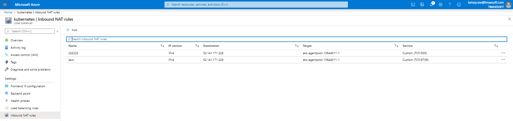

# Azure service with OpenFrame by Kelsey

## Table of Contents

+ [1. Create image of OpenFrame](#step-1-create-image-of-openframe)
  + [1.1 Install docker](#11-install-docker)
  + [1.2 Get centos container](#12-get-centos-container)
  + [1.3 Install OpenFrame](#13-install-openframe)
      + [1.3.1 Pre settings](#131-pre-settings)
      + [1.3.2 JAVA installation](#132-java-installation)
      + [1.3.3 Tibero installation](#133-tibero-installation)
      + [1.3.4 UnixODBC installation](#134-unixodbc-installation)
      + [1.3.5 OFCOBOL installation](#135-ofcobol-installation)
      + [1.3.6 PROSORT installation](#136-prosort-installation)
      + [1.3.7 Base installation](#137-base-installation)
      + [1.3.8 Batch installation](#138-batch-installation)
      + [1.3.9 TACF installation](#139-tacf-installation)
      + [1.3.10 OSC installation](#1310-osc-installation)
      + [1.3.11 JEUS installation](#1311-jeus-installation)
      + [1.3.12 OFGW installation](#1312-ofgw-installation)
      + [1.3.13 OFManager installation](#1313-ofmanager-installation)
      + [1.3.14 OFMiner installation](#1314-ofminer-installation)
  + [1.4 Create OpenFrame image](#14-create-openframe-image)
  + [1.5 Use OpenFrame image](#15-use-openframe-image)
+ [2. Azure Service](#step-2-azure-service)
  + [2.1 Add Azure Kubernetes service(AKS)](#21-add-azure-kubernetes-serviceaks)
  + [2.2 Set Pods](#22-set-pods)
  + [2.3 Connect to the running Pod](#23-connect-to-the-running-pod)
  + [2.4 Set services](#23-set-services)
  + [2.5 Network configuration](#24-network-configuration)


## Step 1. Create image of OpenFrame

### 1.1 Install docker

First, you need to get the OpenFrame image to use the AKS service. To create it, you need Docker account and install Docker in your VM. Your account will be needed when you push/pull the images in your Dockerhub repository.

```bash
sudo apt-get update
sudo apt-get remove docker docker-engine docker.io
sudo apt install docker.io
sudo systemctl start docker
sudo systemctl enable docker
sudo docker –version
```

### 1.2 Get CentOs container

**Run an empty Centos container to install OpenFrame.** 
* Search the official Centos image and pull it on your VM. Use it to run a container.

**Set the hostname with -h option when you run it.** 
* OpenFrame will need a hostname to get the licenses or set the envionment.

* Ubuntu
```bash
sudo docker search centos
sudo docker pull centos
sudo docker run -h [hostname] -i -t centos
```

* CentOS
```bash
sudo yum check-update
sudo yum update
sudo yum install -y yum-utils device-mapper-persistent-data lvm2
sudo yum-config-manager --add-repo https://download.docker.com/linux/centos/docker-ce.repo
sudo yum install docker
sudo systemctl start docker
sudo systemctl enable docker
sudo systemctl status docker0
```

Other docker commands :

| COMMAND                    | DESCRIPTION                     |
|----------------------------|---------------------------------|
| docker ps                  | check running containers        |
| docker ps -a               | check all containers            |
| docker exec [container ID] | execute a running container     |
| docker stop [container ID] | stop the container              |
| docker rm   [container ID] | remove the container            |

**docker run and docker exec are different!!**

Example :

```sudo docker ps -a | grep centos```
     
     CONTAINER ID  IMAGE   COMMAND      CREATED        STATUS       PORTS  NAMES          
     fc58fa646357  centos  "/bin/bash"  2 minutes ago  Up 2 minutes        keen_poitras

```sudo docker exec -i -t fc58fa646357 /bin/bash```

```sudo docker stop fc58fa646357```


### 1.3 Install OpenFrame

### 1.3.1 Pre settings
__a.__  Required Package Installation

If you see "error: rpmdbNextIterator: skipping h#" error message, please use this command below.

It happen when followed package that were having problems when querying the rpm database for a package that was installed which cause meta tag mess up:

``` rpm --rebuilddb ```

```bash 
yum install -y  dos2unix
yum install -y  glibc*
yum install -y  glibc.i686 glibc.x86_64
yum install -y *libtermcap*
yum install -y  gcc
yum install -y  gcc-c++
yum install -y libncurses*
yum install ncurses*
yum update
```
* Packages for running tibero
```bash
yum install libaio
yum install libnsl
```

* Extra Packages if needed
```bash
yum install strace
yum install ltrace
yum install gdb 
yum install nano 
yum install vim-enhanced 
yum install git 
yum install htop
```

__b.__ Create symbolic link
```bash
ln -s /usr/lib64/libncurses.so.5.9 /usr/lib/libtermcap.so
ln -s /usr/lib64/libncurses.so.5.9 /usr/lib/libtermcap.so.2
```

__c.__ Kernel Parameters Modification 

vi /etc/sysctl.conf  

```bash
kernel.shmall = 2097152
kernel.shmmax = 4294967295
kernel.shmmni = 4096
kernel.sem = 100000 32000 10000 10000
fs.file-max = 65536
net.ipv4.ip_local_port_range = 1024 65000  
```
* The parameters below are not supported in a container environment, so you can discard those.
```bash
net.core.rmem_default=262144
net.core.wmem_default=262144
net.core.rmem_max=262144
net.core.wmem_max=262144
```
```bash
sysctl: cannot stat /proc/sys/net/core/rmem_default: No such file or directory
sysctl: cannot stat /proc/sys/net/core/wmem_default: No such file or directory
sysctl: cannot stat /proc/sys/net/core/rmem_max: No such file or directory
sysctl: cannot stat /proc/sys/net/core/wmem_max: No such file or directory
```

* Refresh the kernel parameters.
```bash
/sbin/sysctl -p 
```

__d.__ Firewall setting
* Firewall does not work in the container. Instead, you can use port forwarding option(-p) when you run the container. I will talk about this later in 'use OpenFrame image' part.

```
chkconfig iptables off
```

__e.__ Prepare licenses from Technet
* Use the correct hostname for downloading license files from Technet website.
* You need to check hostname and the number of cores.

__f.__ Set hostname
* Use -h option when you run the container. It automatically sets the hostname for the container.
* Check /etc/hosts file to see if the hostname sets correctly.

__g.__ Add user as hostname
``` 
groupadd mqm -g 10000
useradd -d /home/of7azure -g mqm -s /bin/bash -m of7azure -u 10001
```

```
groupadd dba -g 10005
useradd -d /home/oftibr -g dba -s /bin/bash -m oftibr -u 10002
```

__h.__ Add information in bash_profile
```
# clear screen
clear


echo ""
echo "**********************************************"
echo "***          ##OF 7 DEMO ENV ##            ***"
echo "**********************************************"
echo "***              OF-CS TEAM                  *"
echo "**********************************************"
echo "***  account : oframe7                     ***"
echo "***  Download binary : IMS-222950          ***"
echo "***  Installed Product :                   ***"
echo "***    - java version  1.7.0_79            ***"
echo "***                                        ***"
echo "***                            2020.09.14  ***"
echo "**********************************************"
echo ""
```


**Copy OpenFrame binary files from host to container**
```sudo docker cp [filename] [containername]:[path]```

### 1.3.2 JAVA installation
- Prepare JAVA rpm file
```
rpm -ivh jdk-7u79-linux-x64.rpm
```

Add the part below to .bash_profile
```
# JAVA ENV
export JAVA_HOME=/usr/java/jdk1.7.0_79/
export PATH=$JAVA_HOME/bin:$PATH
export CLASSPATH=$CLASSPATH:$JAVA_HOME/jre/lib/ext:$JAVA_HOME/lib/tools.jar
```
- Check the JAVA version
```
java -version
java version "1.7.0_79"
Java(TM) SE Runtime Environment (build 1.7.0_79-b15)
Java HotSpot(TM) 64-Bit Server VM (build 24.79-b02, mixed mode)
```

### 1.3.3 Tibero installation

```bash
tar -xzvf [tibero tar file]
mv license.xml tibero6/license/
```
```bash
vi .bash_profile

# Tibero6 ENV
export TB_HOME=$HOME/tibero6
export TB_SID=oframe
export TB_PROF_DIR=$TB_HOME/bin/prof
export LD_LIBRARY_PATH=$TB_HOME/lib:$TB_HOME/client/lib:$LD_LIBRARY_PATH
export PATH=$TB_HOME/bin:$TB_HOME/client/bin:$PATH

source ~/.bash_profile
```
```
sh $TB_HOME/config/gen_tip.sh

vi $TB_HOME/config/$TB_SID.tip
```
```bash
DB_NAME=oframe
LISTENER_PORT=8629
CONTROL_FILES="/home/oframe7/tbdata/c1.ctl"
DB_CREATE_FILE_DEST="/home/oframe7/tbdata" # match the directory CONTROL_FILES
#CERTIFICATE_FILE="/home/oframe7/tibero6/config/svr_wallet/oframe.crt"
#PRIVKEY_FILE="/home/oframe7/tibero6/config/svr_wallet/oframe.key"
#WALLET_FILE="/home/oframe7/tibero6/config/svr_wallet/WALLET"
#EVENT_TRACE_MAP="/home/oframe7/tibero6/config/event.map"
MAX_SESSION_COUNT=100
TOTAL_SHM_SIZE=2G
MEMORY_TARGET=3G 
THROW_WHEN_GETTING_OSSTAT_FAIL = N # THIS IS IMPORTANT (network Kernel Parameters)
```
```
tbboot nomount 
    
tbsql sys/tibero

SQL> CREATE DATABASE
USER SYS IDENTIFIED BY TIBERO
MAXINSTANCES 8                                            
MAXDATAFILES 4096                                         
CHARACTER SET MSWIN949
LOGFILE   GROUP 1 ('redo001.redo') SIZE 512M,            
          GROUP 2 ('redo002.redo') SIZE 512M,            
          GROUP 3 ('redo003.redo') SIZE 512M,            
          GROUP 4 ('redo004.redo') SIZE 512M,            
          GROUP 5 ('redo005.redo') SIZE 512M             
MAXLOGGROUPS 255                                          
MAXLOGMEMBERS 8                                           
NOARCHIVELOG                                              
DATAFILE 'system001.dtf' SIZE 200M autoextend on maxsize 1G
DEFAULT TABLESPACE USR                                    
DATAFILE 'usr001.dtf' SIZE 200M  autoextend on maxsize 1G 
DEFAULT TEMPORARY TABLESPACE TEMP                         
TEMPFILE 'temp001.dtf' SIZE 200M autoextend on maxsize 1G 
UNDO TABLESPACE UNDO0                                     
DATAFILE 'undo001.dtf' SIZE 200M autoextend on maxsize 1G; 
```
```
tbboot
    
sh $TB_HOME/scripts/system.sh 

SYS password : tibero
SYSCAT password : syscat
```
```
tbsql tibero/tmax

create tablespace "DEFVOL" datafile 'DEFVOL.dbf' size 100M autoextend on;
create tablespace "TACF00" datafile 'TACF00.dbf' size 50M  autoextend on;
create tablespace "OFM_REPOSITORY" datafile 'OFM_REPOSITORY.dbf' size 50M  autoextend on;
create tablespace "OFMLOG" datafile 'OFM_LOG.dbf' size 300M  autoextend on next 300M;
create tablespace "OFMGR01" datafile 'OFMGR01.DBF'  size 100M autoextend on  next 50M;
```

### 1.3.4 UnixODBC installation

**Container environment does not have make file under /usr/bin**

* Install make,wget packages.

```yum install make```
```yum install wget```

* unixODBC-2.3.7 is suitable for CentOS8 

```bash
wget ftp://ftp.unixodbc.org/pub/unixODBC/unixODBC-2.3.7.tar.gz
tar -zxvf unixODBC-2.3.7.tar.gz
cd unixODBC-2.3.7
./configure --prefix=$HOME/unixODBC --sysconfdir=$HOME/unixODBC/etc
make
make install
```
```
vi ~/.bash_profile

# UNIX ODBC ENV
export ODBC_HOME=$HOME/unixODBC
export PATH=$ODBC_HOME/bin:$PATH
export LD_LIBRARY_PATH=$ODBC_HOME/lib:$LD_LIBRARY_PATH
export ODBCINI=$HOME/unixODBC/etc/odbc.ini
export ODBCSYSINI=$HOME

source ~/.bash_profile
```    

```
odbcinst -j

unixODBC 2.3.7
DRIVERS............: /home/of7azure/odbcinst.ini
SYSTEM DATA SOURCES: /home/of7azure/odbc.ini
FILE DATA SOURCES..: /home/of7azure/ODBCDataSources
USER DATA SOURCES..: /home/of7azure/unixODBC/etc/odbc.ini
SQLULEN Size.......: 8
SQLLEN Size........: 8
SQLSETPOSIROW Size.: 8
```

```
ln $ODBC_HOME/lib/libodbc.so $ODBC_HOME/lib/libodbc.so.1
ln $ODBC_HOME/lib/libodbcinst.so $ODBC_HOME/lib/libodbcinst.so.1
```

**odbc.ini**

```
[oframe]
Description = Tibero ODBC driver for Tibero6
Driver = Tibero
DSN = oframe
SID = oframe
User = tibero
Password = tmax
```

**odbcinst.ini**

```
[Tibero]
Description = Tibero ODBC driver for Tibero6
Driver = /home/of7azure/tibero6/client/lib/libtbodbc.so
Setup =
FileUsage =
CPTimeout =
CPReuse =
Driver Logging = 7

[ODBC]
Trace = NO
TraceFile = /home/of7azure/odbc.log
ForceTrace = Yes
Pooling = No
DEBUG = 1
```

- Check the connection using the command below.
```
[oframe7@oframe7 ~]$ isql oframe tibero tmax
+---------------------------------------+
| Connected!                            |
|                                       |
| sql-statement                         |
| help [tablename]                      |
| quit                                  |
|                                       |
+---------------------------------------+
SQL> quit
```

### 1.3.5 OFCOBOL installation

```
./OpenFrame_COBOL_4_0_732_Linux_x86_64.bin

source ~/.bash_profile

cp licofcob.dat $OFCOB_HOME/license

ofcob --version
```

```
vi HELLO.cob

000100 IDENTIFICATION DIVISION.
000200 PROGRAM-ID.     HELLO.
000300 ENVIRONMENT DIVISION.
000400 DATA DIVISION.
000500 WORKING-STORAGE SECTION.
000600 PROCEDURE DIVISION.
000600     DISPLAY "Hello world!"

ofcob -x HELLO.cob 

./HELLO
```

### 1.3.6 PROSORT installation

```
tar -xzvf prosort-bin-prosort_2sp3-linux64-2209-opt.tar.gz
```

```
vi ~/.bash_profile

# PROSORT ENV
export PROSORT_HOME=$HOME/prosort
export PROSORT_SID=gbg
export PATH=$PATH:$PROSORT_HOME/bin
export LD_LIBRARY_PATH=$PROSORT_HOME/lib:$LD_LIBRARY_PATH
export LIBPATH=$PROSORT_HOME/lib:$LD_LIBRARY_PATH

source ~/.bash_profile
```

```
mkdir $PROSORT_HOME/license

cp license.xml $PROSORT_HOME/license

$PROSORT_HOME/config/gen_tip.sh
```

```
prosort -h
Usage: prosort [options] [sort script files]

options
-------
  -h             Display this information
  -v             Display version information
  -s             Display state information
  -j             Display profile information
  -x             Use SyncSort compatible mode
```

### 1.3.7 Base installation

- Copy OpenFrame and Tmax licences under each directory.

- base.properties
```
OPENFRAME_HOME=/home/oframe7/OpenFrame
TP_HOST_NAME=oframe7
TP_HOST_IP=192.168.105.209
ODBC_USERNAME=tibero
ODBC_PASSWORD=tmax
ODBC_DATABASE=oframe
TSAM_USERNAME=tibero
TSAM_PASSWORD=tmax
TSAM_DATABASE=oframe
OPENFRAME_LICENSE_PATH=/home/oframe9/Installer/license/OPENFRAME
TMAX_LICENSE_PATH=/home/oframe9/Installer/license/TMAX
```


```
./OpenFrame_Base7_Fix3R_Linux_x86_64.bin -f base.properties

cp /usr/lib/libtermcap.so.2 $TMAXDIR/lib -> use this only if needed.

source ~/.bash_profile
```

```
tmboot

tmadmin

--- Welcome to Tmax Admin (Type "quit" to leave) --- 

$$1 NODE1 (tmadm): si
------------------------------------------------------------------------
  clh   svrname    (svri)   status     count   qcount   qpcount  emcount
------------------------------------------------------------------------
    0   ofrsasvr   (   4)      RDY         0        0         0        0
    0   ofrlhsvr   (   5)      RDY         0        0         0        0
    0   ofrdmsvr   (   6)      RDY         0        0         0        0
    0   ofrdsedt   (   7)      RDY         0        0         0        0
    0   ofrcmsvr   (   8)      RDY         0        0         0        0
    0   ofruisvr   (   9)      RDY         0        0         0        0
    0   ofrsmlog   (  10)      RDY         0        0         0        0
    0   vtammgr    (  11)      RDY         0        0         0        0
    
quit

tmdown

```

### 1.3.8 Batch installation

- batch.properties
```
OPENFRAME_HOME=/home/oframe1/OpenFrame
ODBC_USERNAME=tibero
ODBC_PASSWORD=tmax
ODBC_DATABASE=oframe
```

```
./OpenFrame_Batch7_Fix3_MVS_Linux_x86_64.bin -f batch.properties

source ~/.bash_profile
```

```
tmboot

tmadmin

--- Welcome to Tmax Admin (Type "quit" to leave) --- 

$$1 NODE1 (tmadm): si
------------------------------------------------------------------------
  clh   svrname    (svri)   status     count   qcount   qpcount  emcount
------------------------------------------------------------------------
    0   ofrsasvr   (   4)      RDY         0        0         0        0
    0   ofrlhsvr   (   5)      RDY         0        0         0        0
    0   ofrdmsvr   (   6)      RDY         0        0         0        0
    0   ofrdsedt   (   7)      RDY         0        0         0        0
    0   ofrcmsvr   (   8)      RDY         0        0         0        0
    0   ofruisvr   (   9)      RDY         0        0         0        0
    0   ofrsmlog   (  10)      RDY         0        0         0        0
    0   vtammgr    (  11)      RDY         0        0         0        0
    0   obmjmsvr   (  12)      RDY         0        0         0        0
    0   obmjschd   (  13)      RDY         1        0         0        0
    0   obmjinit   (  14)      RDY         2        0         0        0
    0   obmjhist   (  15)      RDY         0        0         0        0
    0   obmjspbk   (  16)      RDY         0        0         0        0
    0   ofrpmsvr   (  17)      RDY         0        0         0        0
    0   obmtsmgr   (  18)      RDY         0        0         0        0
    0   obmjtimr   (  19)      RDY         0        0         0        0

quit

tmdown

```

For running a JOB, please check the LIBPATH from tjclrun.conf

```bash
[SYSLIB]
 BIN_PATH=${OFDATA_HOME}/volume_default/SYS1.USERLIB:${OPENFRAME_HOME}/bin:${OPENFRAME_HOME}/util:${COBDIR}/bin:/usr/local/bin:/bin
 LIB_PATH=${OPENFRAME_HOME}/lib:${OPENFRAME_HOME}/core/lib:${TB_HOME}/client/lib:${COBDIR}/lib:/usr/lib:/lib:/lib/i686:/usr/local/lib:${PROSORT_HOME}/lib:/opt/FSUNbsort/lib:${ODBC_HOME}/lib:${OFCOB_HOME}/lib:${OFASM_HOME}/lib
 COB_PATH=${COBPATH}
```

### 1.3.9 TACF installation
- tacf.properties
```
OPENFRAME_HOME=/home/oframe1/OpenFrame
```

```
./OpenFrame_Tacf7_Fix3_Linux_x86_64.bin -f tacf.properties

source ~/.bash_profile
```

```
tmboot

tmadmin

--- Welcome to Tmax Admin (Type "quit" to leave) --- 

$$1 NODE1 (tmadm): si
------------------------------------------------------------------------
  clh   svrname    (svri)   status     count   qcount   qpcount  emcount
------------------------------------------------------------------------
    0   ofrsasvr   (   4)      RDY         0        0         0        0
    0   ofrlhsvr   (   5)      RDY         0        0         0        0
    0   ofrdmsvr   (   6)      RDY         0        0         0        0
    0   ofrdsedt   (   7)      RDY         0        0         0        0
    0   ofrcmsvr   (   8)      RDY         0        0         0        0
    0   ofruisvr   (   9)      RDY         0        0         0        0
    0   ofrsmlog   (  10)      RDY         0        0         0        0
    0   vtammgr    (  11)      RDY         0        0         0        0
    0   obmjmsvr   (  12)      RDY         0        0         0        0
    0   obmjschd   (  13)      RDY         1        0         0        0
    0   obmjinit   (  14)      RDY         2        0         0        0
    0   obmjhist   (  15)      RDY         0        0         0        0
    0   obmjspbk   (  16)      RDY         0        0         0        0
    0   ofrpmsvr   (  17)      RDY         0        0         0        0
    0   obmtsmgr   (  18)      RDY         0        0         0        0
    0   obmjtimr   (  19)      RDY         0        0         0        0
    0   tmsvr      (  20)      RDY         0        0         0        0

quit

```

```
tacfmgr

Input USERNAME  : ROOT
Input PASSWORD  : SYS1

TACFMGR: TACF MANAGER START!!!
QUIT
TACFMGR: TACF MANAGER END!!!

tmdown

```

```
cd $OPENFRAME_HOME/lib

ln -s $ODBC_HOME/lib/libodbc.so.2.0.0 libodbc.so

```

### 1.3.10 OSC installation

- osc.properties
```
OPENFRAME_HOME=/home/oframe7/OpenFrame

TSAM_USERNAME=tibero
TSAM_PASSWORD=tmax
TSAM_DATABASE=oframe

VTAM_PORT=5556
```

```
./OpenFrame_OSC7_Fix3_Linux_x86_64.bin -f osc.properties

source ~/.bash_profile
```

```
oscboot -C

oscboot -r OSCOIVP1

tmadmin
--- Welcome to Tmax Admin (Type "quit" to leave) --- 

$$1 NODE1 (tmadm): si
------------------------------------------------------------------------
  clh   svrname    (svri)   status     count   qcount   qpcount  emcount
------------------------------------------------------------------------
    0   ofrsasvr   (   4)      RDY         0        0         0        0
    0   ofrlhsvr   (   5)      RDY        10        0         0        0
    0   ofrdmsvr   (   6)      RDY         0        0         0        0
    0   ofrdsedt   (   7)      RDY         0        0         0        0
    0   ofrcmsvr   (   8)      RDY         0        0         0        0
    0   ofruisvr   (   9)      RDY         0        0         0        0
    0   ofrsmlog   (  10)      RDY         0        0         0        0
    0   vtammgr    (  11)      RDY         0        0         0        0
    0   obmjmsvr   (  12)      RDY         0        0         0        0
    0   obmjschd   (  13)      RDY         1        0         0        0
    0   obmjinit   (  14)      RDY         2        0         0        0
    0   obmjhist   (  15)      RDY         0        0         0        0
    0   obmjspbk   (  16)      RDY         0        0         0        0
    0   ofrpmsvr   (  17)      RDY         0        0         0        0
    0   obmtsmgr   (  18)      RDY         0        0         0        0
    0   obmjtimr   (  19)      RDY         0        0         0        0
    0   tmsvr      (  20)      RDY         0        0         0        0
    0   oscmgr     (  21)      RDY         2        0         0        0
    0   oscmcsvr   (  22)      RDY         0        0         0        0
    0   oscmnsvr   (  23)      RDY         0        0         0        0
    0   oscncsvr   (  24)      RDY         0        0         0        0
    0   oscscsvr   (  25)      RDY         2        0         0        0
    0   oscdfsvr   (  26)      RDY         0        0         0        0
    0   oscjcsvr   (  27)      RDY         0        0         0        0
    0   OSCOIVP1   (  28)      RDY         1        0         0        0
    0   OSCOIVP1C  (  29)      RDY         0        0         0        0
    0   OSCOIVP1OMC (  30)      RDY         0        0         0        0
    0   OSCOIVP1TL (  31)      RDY         2        0         0        0
    0   OSCOIVP1_TCL1 (  32)      RDY         0        0         0        0
    0   TPFMAGENT  (  33)      RDY        12        0         0        0

quit

oscdown
```

### 1.3.11 JEUS installation

```
./jeus7_unix_generic_ko.bin

vi ~/.bash_profile

# JEUS ENV
export JEUS_HOME=$HOME/jeus7
PATH="$HOME/jeus7/bin:$HOME/jeus7/lib/system:$HOME/jeus7/webserver/bin:${PATH}"
export PATH

# JEUS alias
alias dsboot='startDomainAdminServer -domain jeus_domain -u administrator -p TmaxFall2020'
alias msboot='startManagedServer -domain jeus_domain -server server1 -u administrator -p TmaxFall2020'
alias msdown='stopServer -u administrator -p jeusadmin -host 192.168.96.195:9936' -> check port number
alias dsdown='stopServer -u administrator -p jeusadmin -host 192.168.96.195:9736' -> check port number

source ~/.bash_profile
```

```
/home/oframe7/jeus7/setup/domain-config-template.properties

# If you want to set encrypted password, change it by set-password command with algorithm option in jeusadmin
jeus.password=jeusadmin
jeus.username=administrator
# Node configuration
nodename=oframe
```

- License 
```
cp license.bin $JEUS_HOME/license
```

```
systemctl stop firewalld

systemctl disable firewalld
```

### 1.3.12 OFGW installation

```
Jeus Domain Name (DEFAULT: jeus_domain): 

Jeus Server Name (DEFAULT: server1): 

Jeus Administrator Password (DEFAULT: ): tmax123

Jeus DAS IP (DEFAULT: 10.0.2.15): 

Jeus DAS Base Port (DEFAULT: 9736): 

DataBase Server Name (DEFAULT: 10.0.2.15):

DataBase Port (DEFAULT: ): 8629      

DataBase SID (DEFAULT: oframe): 

DataBase User ID (DEFAULT: ): tibero

DataBase User PW (DEFAULT: ): tmax

Enter requested information

Gateway Name (DEFAULT: ofgw): 

Gateway PORT (DEFAULT: 5556): 

Datasource ID (DEFAULT: ofgw): 

Application Name (DEFAULT: webterminal): 

Enter requested information
($OPENFRAME_HOME/core/config/oframe.m)

Tmax NODE Name (DEFAULT: NODE1): 

Tmax NODE IP (DEFAULT: 10.0.2.15):

Tmax NODE PORT (DEFAULT: 7001): 

Enter requested information
ex) /home/user/license/OFGWLicense

OpenFrame GW License Path (DEFAULT: ): /home/oframe7/BINARY/LICENSE/OFGWLicense
```

```
http://192.168.55.33:8088/webterminal/
```

### 1.3.13 OFManager installation

```
JEUS DomainAdminServer Password (DEFAULT: ): tmax123

JEUS DomainAdminServer IP (DEFAULT: 10.0.2.15): 

JEUS DomainAdminServer Base Port (DEFAULT: 9736): 

DataBase Server Name (DEFAULT: 10.0.2.15): 

DataBase Port (DEFAULT: ): 8629

DataBase Name (DEFAULT: oframe): 

DataBase User ID (DEFAULT: ): tibero

DataBase User PW (DEFAULT: ): tmax

Datasource ID (DEFAULT: ds_ofm1): 

Application Name (DEFAULT: ofmanager): 

TABLESPACE Name (DEFAULT: OFMGR01): 

Webterminal IP (DEFAULT: 10.0.2.15): 

Webtermianl Application Name (DEFAULT: webterminal): 

OFGW LU PORT (DEFAULT: 5556): 

OFGW Name (DEFAULT: ofgw): 

Enter requested information
ex) /home/user/license/OFManagerLicense

OFManager License Path (DEFAULT: ): /home/oframe7/BINARY/LICENSE/OFManagerLicense
```

```
http://192.168.55.33:8088/ofmanager
```

### 1.3.14 OFMiner installation

```
Plase Enter the Domain Name and the Server name
(Installation Server Folder)

Jeus Server Name (DEFAULT: server1): 

Jeus Administrator PW (DEFAULT: ): tmax123

Jeus PORT (DEFAULT: ): 9736

DataBase IP (DEFAULT: 10.0.2.15): 

DataBase PORT (DEFAULT: 8629): 

DataBase NAME (DEFAULT: oframe): 

DataBase User ID (DEFAULT: tibero): 

DataBase User PW (DEFAULT: tmax): 

Enter requested information
ex) /home/user1/license/OFMinerLicense

OFMiner License Path (DEFAULT: ): /home/oframe7/BINARY/LICENSE/OFMinerLicense
```

```
cp OFMinerLicense $OFMINER_HOME/license
```

```
http://192.168.55.33:8088/OFMiner/
```

### 1.4 Create OpenFrame image

**Exit(stop) the container and commit the current container.**

```sudo docker ps -a | grep centos```

    CONTAINER ID  IMAGE    COMMAND      CREATED         STATUS          PORTS   NAMES  
    fc58fa646357  centos   "/bin/bash"  16 hours ago    Up 30 minutes            keen_poitras

``` sudo docker stop fc58fa646357 ```

``` sudo docker commit -a "kelsey" -m "of7azure" keen_poitras kelsey92/of7azurefinal:of7azure ```

**You need to name it with the rule below for pushing/pulling the image through Dockerhub.**

```bash
username/repository:tag
kelsey92/of7azurefinal:of7azure
```

```sudo docker login```

```bash
Login with your Docker ID to push and pull images from Docker Hub. If you don't have a Docker ID, head over to https://hub.docker.com to create one.
Username: kelsey92
Password: 
WARNING! Your password will be stored unencrypted in /home/of7azure/.docker/config.json.
Configure a credential helper to remove this warning. See
https://docs.docker.com/engine/reference/commandline/login/#credentials-store

Login Succeeded
````

``` sudo docker push kelsey92/of7azurefinal:of7azure ```

``` The push refers to repository [docker.io/kelsey92/of7azurefinal]```

* If you want to cut down the layers of the image

```sudo docker export f3b5881af3b7 | sudo docker import - kelsey92/of7azurefinal:of7azure```

### 1.5 Use OpenFrame image

**Docker should be installed and you need to login to Dockerhub.** 
[Install docker](#11-install-docker)

```bash
sudo docker login
dockerhub username
password
```

**Pull the image from the Dockerhub repository**

```sudo docker pull kelsey92/of7azurefinal:of7azure```

**Check if the image is successfully pulled in your VM**

```sudo docker images | grep kelsey```

**Run the container with OpenFrame image**

- Port forwarding with -p option when you run the container. Use multiple options with all ports you need.

```sudo docker run -i -t -h of7azure -p 9736:9736 -p 8088:8088 -p 8087:8087 kelsey92/of7azurefinal:of7azure /bin/bash```

#### If you run more than one containers.

- Docker container ip address changes if you run more than one containers.

- First container
```bash
18: eth0@if19: <BROADCAST,MULTICAST,UP,LOWER_UP> mtu 1500 qdisc noqueue state UP group default 
    link/ether 02:42:ac:11:00:03 brd ff:ff:ff:ff:ff:ff link-netnsid 0
    inet 172.17.0.2/16 brd 172.17.255.255 scope global eth0
       valid_lft forever preferred_lft forever
```

- Second container
```bash
18: eth0@if19: <BROADCAST,MULTICAST,UP,LOWER_UP> mtu 1500 qdisc noqueue state UP group default 
    link/ether 02:42:ac:11:00:03 brd ff:ff:ff:ff:ff:ff link-netnsid 0
    inet 172.17.0.3/16 brd 172.17.255.255 scope global eth0
       valid_lft forever preferred_lft forever
```

**Those environment variables from bash_profile shoule be changed.**

    vi ~/.bash_profile
```bash
TMAX_HOST_ADDR= 127.0.0.1 # localhost ip address
export TMAX_HOST_ADDR
alias msdown1='stopServer -u administrator -p tmax123 -host localhost:9936'
alias msdown2='stopServer -u administrator -p tmax123 -host localhost:9636'
alias dsdown='stopServer -u administrator -p tmax123 -host localhost:9736'
```
    source ~/.bash_profile
    
**Region configuration file should be modified.**

    vi osc.OSCOIVP1.conf
```bash
[TDQ]
        TDQ_INTRA_DSNAME=OSC.TDQLIB.INTRA
        TDQ_LOG_ADDRESS=127.0.0.1:8896 # localhost ip address
```

**Webterminal setting should be modified.**

    vi ofgw.properties
```bash
tmax.retrytime = 60000
#tmax.node.list = NODE1,NODE2
tmax.node.list = NODE1
tmax.node.NODE1.name = NODE1
tmax.node.NODE1.ip = 127.0.0.1 # localhost ip address
tmax.node.NODE1.port = 8001
tmax.node.NODE1.min = 5
tmax.node.NODE1.max = 1024
tmax.node.NODE1.rate = 2
tmax.node.NODE1.timeout = 20000
tmax.node.NODE1.idletime = 90
```

**OFManager setting should be modified**

    vi ofmanager.properties
```bash
# OFGW Property
openframe.webterminal.url = 127.0.0.1:5556/webterminal # localhost ip address
openframe.webterminal.name= ofgw

# Tmax Property
openframe.tmax.ip= 127.0.0.1 # localhost ip address
openframe.tmax.port= 8001
```

**JEUS setting should be modified**

*Change 172.17.0.3 to 0.0.0.0 from data-resource section to use localhost ip address.*

    vi domain.xml
```bash
   <resources>
      <data-source>
         <database>
            <data-source-id>ofgw</data-source-id>
            <export-name>ofgw</export-name>
            <data-source-class-name>com.tmax.tibero.jdbc.ext.TbConnectionPoolDataSource</data-source-class-name>
            <data-source-type>ConnectionPoolDataSource</data-source-type>
            <vendor>tibero</vendor>
            <server-name>172.17.0.3</server-name> # 0.0.0.0
            <port-number>8629</port-number>
            <database-name>oframe</database-name>
            <user>tibero</user>
            <password>tmax</password>

           (continues)

         <database>
            <data-source-id>ds_ofm1</data-source-id>
            <export-name>ds_ofm1</export-name>
            <data-source-class-name>com.tmax.tibero.jdbc.ext.TbConnectionPoolDataSource</data-source-class-name>
            <data-source-type>ConnectionPoolDataSource</data-source-type>
            <vendor>tibero</vendor>
            <server-name>172.17.0.3</server-name> # 0.0.0.0
            <port-number>8629</port-number>
            <database-name>oframe</database-name>
            <user>tibero</user>
            <password>tmax</password>
```


## Step 2. Azure Service

### 2.1 Add Azure Kubernetes service(AKS)

1. Add the service from Azure Website.

* Add resource as kubernetes service

    

* Basic

    
    
    **Set the region as NorthCentralUS here. Resources may vary depends on the region.**

    

*Select the Node(VM) size*

* Scale

    

* Authentication as default

* Networking

    

* Monitoring

    

* Tag as you want

* Review + create

    
    
* Set the user id and password for the node(VM)

    Hit the "Reset password" menu from the node(VM).
    
        

2. Set the Node 

    **Use Azure cloud**

* Get access credentials for a managed Kubernetes cluster

    ```az aks get-credentials --resource-group [resource_group_name] --name [AKS_cluster_name]```

    *Example :*

    ``` az aks get-credentials --resource-group OF7Azure_KELSEY --name AKSOF7Azure```

    *Merged "AKSOF7azure" as current context in /home/kelsey/.kube/config*


* Check the node status

    ```kubectl get nodes```
    ```bash
    NAME                       STATUS   ROLES   AGE     VERSION
    aks-agentpool-13644011-1   Ready    agent   2m20s   v1.15.10
    ```

* When you need to reset the cluster 

    ```kubectl config delete-cluster [cluster name]```

    *Example :*

    ```kubectl config delete-cluster AKSOF7azure```

    *deleted cluster AKSOF7Azure from /home/kelsey/.kube/config*

### 2.2 Set Pods

1. Crate a Pod yaml file

    ```bash
    apiVersion: v1
    kind: Pod
    metadata:
      name: of7azure
      labels:
        of7azurefinal: of7azure
    spec:
      containers:
      - name: of7azure
        image: kelsey92/of7azurefinal:of7azure
        ports:
          - containerPort: 6606
        command: ["/bin/sh", "-ec", "while :; do echo '.'; sleep 5 ; done"]
    ```

    * Containerport is used for connecting another container in the same Pod

2. Create a Pod

* Use the command below for creating a new Pod

    ```kubectl create -f [yaml file name]```

    *Example :*

    ```kubectl create -f of7test.yaml```

    *pod/of7azure created*

* Check the specific Pod

    ```kubectl get pod [pod name]```

* Check all Pods

    ```kubectl get pods``` 

    ```bash
    NAME       READY   STATUS              RESTARTS   AGE
    of7azure   0/1     ContainerCreating   0          2m14s

    NAME       READY   STATUS              RESTARTS   AGE
    of7azure   1/1     Running             0          26m
    ```

* Get the detailed information of the Pod

    ```kubectl describe pod [pod name]```

    ```bash
  Name:         of7azure
  Namespace:    default
  Priority:     0
  Node:         aks-agentpool-13644011-1/10.240.0.35
  Start Time:   Thu, 26 Mar 2020 01:40:36 +0000
  Labels:       of7azurefinal=of7azure
  Annotations:  <none>
  Status:       Running
  IP:           10.240.0.40
  IPs:          <none>
  Containers:
    of7azure:
      Container ID:  docker://05a08dc994462c770b43b3954f49071dcb8d059ff6eaf23ba93c7c71c3f813f4
      Image:         kelsey92/of7azurefinal:of7azure
      Image ID:      docker-pullable://kelsey92/of7azurefinal@sha256:f74723dd0541d9a7643eb1c7751321398ec1f76253ac28d50cb2cee57f663d2c
      Port:          6606/TCP
      Host Port:     0/TCP
      Command:
        /bin/sh
        -ec
        while :; do echo '.'; sleep 5 ; done
      State:          Running
        Started:      Thu, 26 Mar 2020 01:40:38 +0000
      Ready:          True
      Restart Count:  0
      Environment:    <none>
      Mounts:
        /var/run/secrets/kubernetes.io/serviceaccount from default-token-pvcdl (ro)
  Conditions:
    Type              Status
    Initialized       True
    Ready             True
    ContainersReady   True
    PodScheduled      True
  Volumes:
    default-token-pvcdl:
      Type:        Secret (a volume populated by a Secret)
      SecretName:  default-token-pvcdl
      Optional:    false
  QoS Class:       BestEffort
  Node-Selectors:  <none>
  Tolerations:     node.kubernetes.io/not-ready:NoExecute for 300s
                   node.kubernetes.io/unreachable:NoExecute for 300s
  Events:
    Type    Reason     Age    From                               Message
    ----    ------     ----   ----                               -------
    Normal  Scheduled  27m    default-scheduler                  Successfully assigned default/of7azure to aks-agentpool-13644011-1
    Normal  Pulling    27m    kubelet, aks-agentpool-13644011-1  Pulling image "kelsey92/of7azurefinal:of7azure"
    Normal  Pulled     3m40s  kubelet, aks-agentpool-13644011-1  Successfully pulled image "kelsey92/of7azurefinal:of7azure"
    Normal  Created    3m19s  kubelet, aks-agentpool-13644011-1  Created container of7azure
    Normal  Started    3m18s  kubelet, aks-agentpool-13644011-1  Started container of7azure
  ```


### 2.3 Connect to the running Pod

1) Execute a running Pod from Azure Cloud

    ```kubectl exec -it of7azure -- /bin/bash```
    
2) Execute a running Pod from the Node where the Pod is running

- Check which Node is the one the Pod is running in and connect to the Node

    *Use putty or other applications to connect*

    - NODE A (aks-agentpool-#####-0) 
      
      52.141.172.195:22

    - NODE B (aks-agentpool-#####-1) 
      
      52.141.172.195:20
      
- Change user by using the information below

    ID : of7azure
    
    Password : Tmaxsoft@1234

    ```bash
    $ sudo su - of7azure
    [sudo] password for of7azure: 

    of7azure@aks-agentpool-#########-0:~$
    ```

- Check the running Pod container by using grep the Pod name

    *Let's say nfsof7azure-848d8d6cc7-r222f is the Pod name*

    ```bash
    of7azure@aks-agentpool-24893396-0:~$ sudo docker ps | grep nfsof7azure-848d8d6cc7-r222f
    b0007ece0a8e        kelsey92/of7azurefinal                            "/bin/sh -ec 'while ??   56 minutes ago      Up 56 minutes                                                                  k8s_of7azure_nfsof7azure-848d8d6cc7-r222f_default_6c487354-6707-42f4-a3a8-b5e105978c3e_0
    524852746c25        mcr.microsoft.com/k8s/core/pause:1.2.0            "/pause"                 About an hour ago   Up About an hour                                                               k8s_POD_nfsof7azure-848d8d6cc7-r222f_default_6c487354-6707-42f4-a3a8-b5e105978c3e_0
    ```
    
- Execute the running Pod container

    *The first field is the container ID, execute the container which is running by /bin/sh command*

    ```sudo docker exec -i -t b0007ece0a8e /bin/bash```

- Change the user in the container to use OpenFrame

  ```bash
  [root@of7azure /]# su - of7azure
  Last login: Thu Mar 26 01:01:15 UTC 2020 on pts/0

  [of7azure@of7azure ~]$ 
  ```

* When you need to delete Pods

  ```kubectl delete pod --all```
  

### 2.4 Set services

* Nodeport service for using JEUS, Webterminal, OFManager

1. Create a service yaml file.

    ```bash
    apiVersion: v1
    kind: Service
    metadata:
      name: jeus
    spec:
      type: NodePort
      selector:
        of7azurefinal: of7azure
      ports:
      - protocol: TCP
        port: 9736
        targetPort: 9736
    ```

    ```bash
    apiVersion: v1
    kind: Service
    metadata:
      name: ofmanager
    spec:
      type: NodePort
      selector:
        of7azurefinal: of7azure
      ports:
      - protocol: TCP
        port: 8087
        targetPort: 8087
    ```

    ```bash
    apiVersion: v1
    kind: Service
    metadata:
      name: webterminal
    spec:
      type: NodePort
      selector:
        of7azurefinal: of7azure
      ports:
      - protocol: TCP
        port: 8088
        targetPort: 8088
    ```

2. Create services

* Create services by using the command below

    ```kubectl create -f NodePort_8088.yaml```
    
    *service/webterminal created*

    ```kubectl create -f NodePort_8087.yaml```
    
    *service/ofmanager created*

    ```kubectl create -f NodePort_9736.yaml```
    
    *service/jeus created*

* Check services

    ```kubectl get services```

    ```bash
    NAME          TYPE        CLUSTER-IP     EXTERNAL-IP   PORT(S)          AGE
    jeus          NodePort    10.0.139.162   <none>        9736:32362/TCP   2m58s
    kubernetes    ClusterIP   10.0.0.1       <none>        443/TCP          47h
    ofmanager     NodePort    10.0.234.165   <none>        8087:30896/TCP   3m7s
    webterminal   NodePort    10.0.179.58    <none>        8088:30011/TCP   3m11s
    ```

* Get detailed information of services

    ```kubectl describe services [service name]```

    ```bash
    Name:                     jeus
    Namespace:                default
    Labels:                   <none>
    Annotations:              <none>
    Selector:                 of7azurefinal=of7azure
    Type:                     NodePort
    IP:                       10.0.139.162
    Port:                     <unset>  9736/TCP
    TargetPort:               9736/TCP
    NodePort:                 <unset>  32362/TCP
    Endpoints:                10.240.0.40:9736
    Session Affinity:         None
    External Traffic Policy:  Cluster
    Events:                   <none>
    ```

    ```bash
    Name:                     ofmanager
    Namespace:                default
    Labels:                   <none>
    Annotations:              <none>
    Selector:                 of7azurefinal=of7azure
    Type:                     NodePort
    IP:                       10.0.234.165
    Port:                     <unset>  8087/TCP
    TargetPort:               8087/TCP
    NodePort:                 <unset>  30896/TCP
    Endpoints:                10.240.0.40:8087
    Session Affinity:         None
    External Traffic Policy:  Cluster
    Events:                   <none>
    ```

    ```bash
    Name:                     webterminal
    Namespace:                default
    Labels:                   <none>
    Annotations:              <none>
    Selector:                 of7azurefinal=of7azure
    Type:                     NodePort
    IP:                       10.0.179.58
    Port:                     <unset>  8088/TCP
    TargetPort:               8088/TCP
    NodePort:                 <unset>  30011/TCP
    Endpoints:                10.240.0.40:8088
    Session Affinity:         None
    External Traffic Policy:  Cluster
    Events:                   <none>
    ```

* When you need to delete services

   ```kubectl delete service [service name]```


### 2.5 Network configuration 

1. Set the Inbound NAT rules of Kubernetes with the Nodeports.

  * Hit the add button from Inbound NAT rules.
  
    

  * Jeus

    **Type the jeus Nodeport in Target port**

    


  * Webterminal

    **Type the webterminal Nodeport in Target port**

    


  * Ofmanager

    **Type the ofmanager Nodeport in Target port**

    


2. Set the Inbound ports 

* Hit the Add inbound port rule from the Node Networking setting.
   
   

* Add inbound ports

    Type the port in "Destination port ranges"

    
    
    Add all nodeports as inbound ports like above.


# Copyrighted by Kelsey

