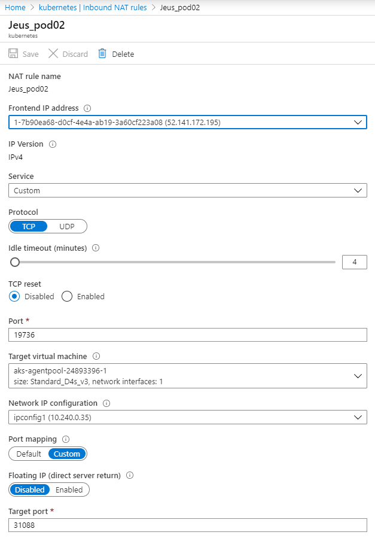

# Fail-over test with Azure Kubernetes service(AKS) by Kelsey

## Table of Contents

+ [1. Fail-over Environment setting](#1-fail-over-environment-setting)
  + [1-1. Fail-over concept](#1-1-fail-over-concept)
  + [1-2. Configure data Volume](#1-2-configure-data-volume)
     + [A. Storage Class (SC)](#a-storage-class-sc)
     + [B. Persistent Volume (PV)](#b-persistent-volume-pv)
     + [C. Persistent Volume Claim (PVC)](#c-persistent-volume-claim-pvc)
  + [1-3 Use Persistent Volume with Pod replication.](#1-3-use-persistent-volume-with-pod-replication)
     + [1-3.1 Use Persistent Volume with Azure Kubernetes Service.](#1-31-use-persistent-volume-with-azure-kubernetes-service)
     + [1-3.2 Use the custom Persistent Volume with replicated Pod.](#1-32-use-the-custom-persistent-volume-with-replicated-pod)
+ [2. Fail-over Test](#2-fail-over-test)
  + [2-1. Test Senario & Result](#2-1-test-senario--result)

# 1. Fail-over Environment setting

## 1-1. Fail-over concept

* A Pod which has OpenFrame container is running in NODE1. NODE2 is a back up(empty) Node.


* When NODE1 dies, the Pod will be terminated from NODE1 and a new one will be created in NODE2.


*A Pod is the basic execution unit of a Kubernetes application–the smallest and simplest unit in the Kubernetes object model that you create or deploy. A Pod represents processes running on your Cluster.*

**Here are two check points for doing the fail-over test.**

When NODE1 dies,

1) A new Pod should not lose the critical data of the old Pod.
- Persistent Volume and Persistent Volume Claim will be used(Dynamic Provisioning).

2) A new Pod should automatically be created in a different Node and run successfully.
- Deployment with replicated Pods will be used(in this case, only one Pod is needed).

## 1-2. Configure data Volume

### A. Storage Class (SC) 

* A claim can request a particular class by specifying the name of a StorageClass using the attribute storageClassName. Only PVs of the requested class, ones with the same storageClassName as the PVC, can be bound to the PVC.

* Access Modes

    ```bash
    ReadWriteOnce – the volume can be mounted as read-write by a single node (RWO)
    ReadOnlyMany  – the volume can be mounted read-only by many nodes        (ROX) 
    ReadWriteMany – the volume can be mounted as read-write by many nodes    (RWX)
    ```
* A PersistentVolume can be mounted on a host in any way supported by the resource provider. As shown in the table below, providers will have different capabilities and each PV’s access modes are set to the specific modes supported by that particular volume. For example, NFS can support multiple read/write clients, but a specific NFS PV might be exported on the server as read-only. Each PV gets its own set of access modes describing that specific PV’s capabilities.

   

* Storage Class sample yaml file

    ```vi azure_sc.yaml```
    ```bash
    apiVersion: storage.k8s.io/v1
    kind: StorageClass
    metadata:
    name: azurefile
    provisioner: kubernetes.io/azure-file
    mountOptions:
      - dir_mode=0777
      - file_mode=0777
      - uid=0
      - gid=0
      - mfsymlinks
      - cache=strict
    parameters:
      skuName: Standard_LRS
    ```

### B. Persistent Volume (PV) 

- A PersistentVolume (PV) is a piece of storage in the cluster that has been provisioned by an administrator or dynamically provisioned using Storage Classes. It is a resource in the cluster just like a node is a cluster resource.

- **PVs are volume plugins like Volumes, but have a lifecycle independent of any individual Pod that uses the PV.** This API object captures the details of the implementation of the storage, be that NFS, iSCSI, or a cloud-provider-specific storage system.

### C. Persistent Volume Claim (PVC) 

* A Persistent Volume Claim (PVC) is a request for storage by a user. It is similar to a Pod. Pods consume node resources and PVCs consume PV resources. Pods can request specific levels of resources (CPU and Memory). Claims can request specific size and access modes (e.g., they can be mounted once read/write or many times read-only).

* While PersistentVolumeClaims allow a user to consume abstract storage resources, it is common that users need PersistentVolumes with varying properties, such as performance, for different problems. Cluster administrators need to be able to offer a variety of PersistentVolumes that differ in more ways than just size and access modes, without exposing users to the details of how those volumes are implemented. For these needs, there is the StorageClass resource.

## 1-3 Use Persistent Volume with Pod replication.

**Dynamic provisioning should be used for fail-over test.**

*If you use Static provisioning, you need to create a volume for each Pod. For fail-over test, Pods will be deleted and created multiple times. A Volume shoule be automatically attached to the running Pod. So, Dynamic provisioning is suitable for fail-over test.*

### 1-3.1 Use Persistent Volume with Azure Kubernetes Service.

1) Check Storage Class.

    ```kubectl get sc```
    ```bash
    NAME                PROVISIONER                AGE
    azurefile           kubernetes.io/azure-file   6d1h
    azurefile-premium   kubernetes.io/azure-file   6d1h
    default (default)   kubernetes.io/azure-disk   6d1h
    managed-premium     kubernetes.io/azure-disk   6d1h
    ```
* Those four Storage Classes are provided by Azure Service. You can create a custom Storage Class when you use custom Persistent Volume.

* In this case, I will use managed-premium to use Azure Kubernetes Service(AKS). 

    ```kubectl describe sc managed-premium```
    ```bash
    Name:            managed-premium
    IsDefaultClass:  No
    Annotations:     kubectl.kubernetes.io/last-applied-configuration={"allowVolumeExpansion":true,"apiVersion":"storage.k8s.io/v1beta1","kind":"StorageClass","metadata":{"annotations":{},"labels":{"kubernetes.io/cluster-service":"true"},"name":"managed-premium"},"parameters":{"cachingmode":"ReadOnly","kind":"Managed","storageaccounttype":"Premium_LRS"},"provisioner":"kubernetes.io/azure-disk"}

    Provisioner:           kubernetes.io/azure-disk
    Parameters:            cachingmode=ReadOnly,kind=Managed,storageaccounttype=Premium_LRS
    AllowVolumeExpansion:  True
    MountOptions:          <none>
    ReclaimPolicy:         Delete
    VolumeBindingMode:     Immediate
    Events:                <none>
    ```

2) Create a Persistent Volume Claim with the chosen Storage Class.

    ```vi volumeclaim.yaml```
    ```bash 
    apiVersion: v1
    kind: PersistentVolumeClaim
    metadata:
      name: of7storage
    spec:
      accessModes:
      - ReadWriteOnce
      storageClassName: managed-premium  -> If not set, it is set to default
      resources:
        requests:
          storage: 500Gi
    ```
    ``` kubectl create -f volumeclaim.yaml```
    
    ``` kubectl get pvc```
    ```bash
    NAME         STATUS   VOLUME                                     CAPACITY   ACCESS MODES   STORAGECLASS      AGE
    of7storage   Bound    pvc-a0a48609-8975-433f-9b73-bc371cbb0702   500Gi      RWO            managed-premium   16h
    ```
    
    ``` kubectl describe pvc of7storage ```
    ```bash
    Name:          of7storage
    Namespace:     default
    StorageClass:  managed-premium
    Status:        Bound
    Volume:        pvc-a0a48609-8975-433f-9b73-bc371cbb0702
    Labels:        <none>
    Annotations:   pv.kubernetes.io/bind-completed: yes
                   pv.kubernetes.io/bound-by-controller: yes
                   volume.beta.kubernetes.io/storage-provisioner: kubernetes.io/azure-disk
    Finalizers:    [kubernetes.io/pvc-protection]
    Capacity:      500Gi
    Access Modes:  RWO
    VolumeMode:    Filesystem
    Mounted By:    <none>  ->  changes to the pod name when the pod is attached
    Events:        <none>
    ```
    
*Clean it*

    kubectl delete pvc of7storage
    
3) Persistent Volume is automatically generated with Azure Kubernetes Service.

- From the PVC above, it uses managed-premium Storage Class whose Provisioner is kubernetes.io/**azure-disk**. 
- It automatically generates **AzureDisk**(Persistent Volume) in Azure service.
    
    
    
- You can also check the created PV with kubectl commands.
     
    ``` kubectl get pv ```
    ```bash
    NAME                                     CAPACITY ACCESS MODES RECLAIM POLICY STATUS CLAIM              STORAGECLASS   REASON AGE
    pvc-a0a48609-8975-433f-9b73-bc371cbb0702 500Gi    RWO          Delete         Bound  default/of7storage managed-premium       16h
    ```
    
    ``` kubectl describe pv pvc-a0a48609-8975-433f-9b73-bc371cbb0702 ```
    ```bash
    Name:            pvc-a0a48609-8975-433f-9b73-bc371cbb0702
    Labels:          <none>
    Annotations:     pv.kubernetes.io/bound-by-controller: yes
                     pv.kubernetes.io/provisioned-by: kubernetes.io/azure-disk
                     volumehelper.VolumeDynamicallyCreatedByKey: azure-disk-dynamic-provisioner
    Finalizers:      [kubernetes.io/pv-protection]
    StorageClass:    managed-premium
    Status:          Bound
    Claim:           default/of7storage
    Reclaim Policy:  Delete
    Access Modes:    RWO
    VolumeMode:      Filesystem
    Capacity:        500Gi
    Node Affinity:   <none>
    Message:
    Source:
        Type:         AzureDisk (an Azure Data Disk mount on the host and bind mount to the pod)
        DiskName:     kubernetes-dynamic-pvc-a0a48609-8975-433f-9b73-bc371cbb0702
        DiskURI:      /subscriptions/9c327935-ea7c-4dfe-a425-f45aee2a1959/resourceGroups/mc_of7azure_kelsey_aksof7azure_northcentralus/providers/Microsoft.Compute/disks/kubernetes-dynamic-pvc-a0a48609-8975-433f-9b73-bc371cbb0702
        Kind:         Managed
        FSType:
        CachingMode:  ReadOnly
        ReadOnly:     false
    Events:           <none>
    ```
    
*Clean it*

    kubectl delete pv pvc-a0a48609-8975-433f-9b73-bc371cbb0702
    
4) Create a Pod using the Persistent Volume.

*The reason why I chose Deployment for creating replicated Pods is - updating the Deployment(in this case, OpenFrame) is more suitable than using Replication Controller.(It only replicates the Pods, do not supports rolling-back and rolling-out for updating the application.)*

- In this fail-over test case, replicas is set to one.

    ```vi deployment.yaml```
    ```bash
    apiVersion: extensions/v1beta1
    kind: Deployment
    metadata:
      name: of7azure
    spec:
      replicas: 1
      template:
        metadata:
          name: of7azure
          labels:
            of7azurefinal: of7azure
        spec:
          hostname: of7azure
          containers:
          - name: of7azure
            image: kelsey92/of7azurefinal:of7azure
            ports:
            - containerPort: 6066
            command: ["/bin/sh", "-ec", "while :; do echo '.'; sleep 5 ; done"]
            volumeMounts:
            - name: sharedvolume
              mountPath: /mnt/azure -> /mnt/azure directory is created in a container to use the volume.
          volumes:
          - name: sharedvolume
            persistentVolumeClaim:
              claimName: of7storage
    ```
    ```kubectl get deployments```
    ```bash
    NAME       READY   UP-TO-DATE   AVAILABLE   AGE
    of7azure   1/1     1            1           7m4s
    ```

    ```kubectl describe deployment of7azure```
    ```bash
    Name:                   of7azure
    Namespace:              default
    CreationTimestamp:      Thu, 02 Apr 2020 12:37:03 +0000
    Labels:                 of7azurefinal=of7azure
    Annotations:            deployment.kubernetes.io/revision: 1
    Selector:               of7azurefinal=of7azure
    Replicas:               1 desired | 1 updated | 1 total | 1 available | 0 unavailable
    StrategyType:           RollingUpdate
    MinReadySeconds:        0
    RollingUpdateStrategy:  1 max unavailable, 1 max surge
    Pod Template:
      Labels:  of7azurefinal=of7azure
      Containers:
       of7azure:
        Image:      kelsey92/of7azurefinal:of7azure
        Port:       6066/TCP
        Host Port:  0/TCP
        Command:
          /bin/sh
          -ec
          while :; do echo '.'; sleep 5 ; done
        Environment:  <none>
        Mounts:
          /mnt/azure from sharedvolume (rw)
      Volumes:
       sharedvolume:
        Type:       PersistentVolumeClaim (a reference to a PersistentVolumeClaim in the same namespace)
        ClaimName:  of7storage
        ReadOnly:   false
    Conditions:
      Type           Status  Reason
      ----           ------  ------
      Available      True    MinimumReplicasAvailable
    OldReplicaSets:  <none>
    NewReplicaSet:   of7azure-76db5dbccb (1/1 replicas created)
    Events:
      Type    Reason             Age   From                   Message
      ----    ------             ----  ----                   -------
      Normal  ScalingReplicaSet  10m   deployment-controller  Scaled up replica set of7azure-76db5dbccb to 1
    ```
    
    ```kubectl get pods```
    ```bash
    NAME                        READY   STATUS    RESTARTS   AGE
    of7azure-76db5dbccb-brgrs   1/1     Running   0          9m
    ```
    
    ```kubectl describe pod of7azure-76db5dbccb-brgrs```
    ```bash
    Name:           of7azure-76db5dbccb-brgrs
    Namespace:      default
    Priority:       0
    Node:           aks-agentpool-24893396-1/10.240.0.35
    Start Time:     Thu, 02 Apr 2020 12:37:03 +0000
    Labels:         of7azurefinal=of7azure
                    pod-template-hash=76db5dbccb
    Annotations:    <none>
    Status:         Running
    IP:             10.240.0.40
    IPs:            <none>
    Controlled By:  ReplicaSet/of7azure-76db5dbccb
    Containers:
      of7azure:
        Container ID:  docker://cd6add2e2d48d92c2ab04ffb0b35491b475b7a049161175789302ee2c7b9a3f5
        Image:         kelsey92/of7azurefinal:of7azure
        Image ID:      docker-pullable://kelsey92/of7azurefinal@sha256:8e707e0444eec3af2842a34de8360781f0dd9ed85ad620b0856a8c7368029603
        Port:          6066/TCP
        Host Port:     0/TCP
        Command:
          /bin/sh
          -ec
          while :; do echo '.'; sleep 5 ; done
        State:          Running
          Started:      Thu, 02 Apr 2020 12:42:40 +0000
        Ready:          True
        Restart Count:  0
        Environment:    <none>
        Mounts:
          /mnt/azure from sharedvolume (rw)
          /var/run/secrets/kubernetes.io/serviceaccount from default-token-lxwlr (ro)
    Conditions:
      Type              Status
      Initialized       True
      Ready             True
      ContainersReady   True
      PodScheduled      True
    Volumes:
      sharedvolume:
        Type:       PersistentVolumeClaim (a reference to a PersistentVolumeClaim in the same namespace)
        ClaimName:  of7storage
        ReadOnly:   false
      default-token-lxwlr:
        Type:        Secret (a volume populated by a Secret)
        SecretName:  default-token-lxwlr
        Optional:    false
    QoS Class:       BestEffort
    Node-Selectors:  <none>
    Tolerations:     node.kubernetes.io/not-ready:NoExecute for 300s
                     node.kubernetes.io/unreachable:NoExecute for 300s
    Events:
      Type    Reason                  Age    From                               Message
      ----    ------                  ----   ----                               -------
      Normal  Scheduled               7m52s  default-scheduler                  Successfully assigned default/of7azure-76db5dbccb-brgrs to aks-agentpool-24893396-1
      Normal  SuccessfulAttachVolume  7m41s  attachdetach-controller            AttachVolume.Attach succeeded for volume "pvc-a0a48609-8975-433f-9b73-bc371cbb0702"
      Normal  Pulling                 7m32s  kubelet, aks-agentpool-24893396-1  Pulling image "kelsey92/of7azurefinal:of7azure"
      Normal  Pulled                  2m48s  kubelet, aks-agentpool-24893396-1  Successfully pulled image "kelsey92/of7azurefinal:of7azure"
      Normal  Created                 2m16s  kubelet, aks-agentpool-24893396-1  Created container of7azure
      Normal  Started                 2m15s  kubelet, aks-agentpool-24893396-1  Started container of7azure
    ```
- Check the Persistent Volume from the container.

    *This Volume will not be vanished even after the container is dead.*

    ```kubectl exec -it [pod name] -- /bin/bash```

    ```cd /mnt/azure/```
    ```bash
    [of7azure@of7azure mnt]$ ls -rtl
    total 4
    drwxrwxrwx 11 root root 4096 Apr  1 12:49 azure
    ```

- Check the PV status from Azure Service.

    

    **Disk state** changes from Unattached to Attached.
    
    **Owner VM**   changes from --(none)   to the VM where the Pod is running.

     
*Clean it*

```kubectl delete deployment of7azure```

```kubectl delete pod of7azure-76db5dbccb-96q4k```

### 1-3.2 Use the custom Persistent Volume with replicated Pod.

<details>
	<summary>Use the custom Persistent Volume with replicated Pod</summary>

1) Check the Access Mode you want to configure and choose the storage service.

- Access Modes

    ```bash
    ReadWriteOnce – the volume can be mounted as read-write by a single node (RWO)
    ReadOnlyMany – the volume can be mounted read-only by many nodes (ROX) 
    ReadWriteMany – the volume can be mounted as read-write by many nodes (RWX)
    ```
- Storage Services with Access Modes
    *Providers will have different capabilities and each PV’s access modes are set to the specific modes supported by that particular volume.* 
    

2) Create a Service Account which the Provisioner will use.
- to be continued

3) Create a Storage Class with the Provisioner you want to use.

- Persistent Volume Claim(PVC) will request the Volume by Storage Class name.

    ```vi custom_sc.yaml```
    ```bash
    apiVersion: storage.k8s.io/v1
    kind: StorageClass
    metadata:
      name: glustersc
    provisioner: kubernetes.io/glusterfs
    parameters:
      resturl: "http://192.168.10.100:8080"
      restuser: ""
      secretNamespace: ""
      secretName: ""
    allowVolumeExpansion: true
    ~
    ```
    ```kubectl create -f custom_sc.yaml```

    - Parameters may vary depends on the Provisioner.

    ```kubectl get sc glustersc```
    ```bash
    NAME        PROVISIONER               AGE
    glustersc   kubernetes.io/glusterfs   16m
    ```
    ```kubectl describe sc glustersc```
    ```bash
    Name:                  glustersc
    IsDefaultClass:        No
    Annotations:           <none>
    Provisioner:           kubernetes.io/glusterfs
    Parameters:            resturl=http://192.168.10.100:8080,restuser=,secretName=,secretNamespace=
    AllowVolumeExpansion:  True
    MountOptions:          <none>
    ReclaimPolicy:         Delete
    VolumeBindingMode:     Immediate
    Events:                <none>
    ```

*Clean it*

 ```kubectl delete sc glustersc```

4) Create a Provisioner which can automatically generates Persistent Volume(PV).
- to be continued
 
5) Create Persistent Volume Claim(PVC) with the correct Storage Class name.

- Please match the Storage Class name with the Persistent Volume you want to use.

    ```vi custom_claim.yaml```
    ```bash
    apiVersion: v1
    kind: PersistentVolumeClaim
    metadata:
      name: custompvc
    spec:
      accessModes:
      - ReadWriteMany
      storageClassName: glustersc
      resources:
        requests:
          storage: 50Gi
    ```

    ```kubectl create -f custom_claim.yaml```

    ```kubectl get pvc custompvc```
    ```bash
    NAME        STATUS   VOLUME         CAPACITY   ACCESS MODES   STORAGECLASS   AGE
    custompvc   Bound    customvolume   50Gi       RWX            glustersc      25m
    ```
    ``` kubectl describe pvc custompvc```
    ```bash
    Name:          custompvc
    Namespace:     default
    StorageClass:  glustersc
    Status:        Bound
    Volume:        customvolume
    Labels:        <none>
    Annotations:   pv.kubernetes.io/bind-completed: yes
                   pv.kubernetes.io/bound-by-controller: yes
    Finalizers:    [kubernetes.io/pvc-protection]
    Capacity:      50Gi
    Access Modes:  RWX
    VolumeMode:    Filesystem
    Mounted By:    <none>   ->  changes to the pod name when the pod is attached
    Events:        <none>
    ```

*Clean it*

```kubectl delete pvc custompvc```

6) Persistent Volume(PV) will be automatically created and Persistent Volume Claim(PVC) will be bounded successfully.

    ```kubectl get pv customvolume```
    ```bash
    NAME          CAPACITY  ACCESS MODES RECLAIM POLICY  STATUS  CLAIM              STORAGECLASS  REASON  AGE
    customvolume  50Gi      RWX          Retain          Bound   default/custompvc  glustersc             18m
    ```
    ``` kubectl describe pv customvolume```
    ```bash
    Name:            customvolume
    Labels:          of7azurefinal=of7azure
    Annotations:     pv.kubernetes.io/bound-by-controller: yes
    Finalizers:      [kubernetes.io/pv-protection]
    StorageClass:    glustersc
    Status:          Bound
    Claim:           default/custompvc
    Reclaim Policy:  Retain
    Access Modes:    RWX
    VolumeMode:      Filesystem
    Capacity:        50Gi
    Node Affinity:   <none>
    Message:
    Source:
        Type:          HostPath (bare host directory volume)
        Path:          /mnt/gluster
        HostPathType:
    Events:            <none>
    ```
*Clean it*

```kubectl delete pv customvolume```

7) Create a Pod using the Persistent Volume Claim(PVC).
- to be continued

</details>

# 2. Fail-over Test

## 2-1. Test Senario & Result

__a.__ Move the actual directories in [Persistent Volume-4](#1-31-use-persistent-volume-with-azure-kubernetes-service).

```kubectl exec -it [pod name] -- /bin/bash```

- Run the container first, then move the following directories to the Persistent Volume path.

*In this case, the path is set to /mnt/azure*

    ```cd /mnt/azure```

    ```bash
    [of7azure@of7azure azure]$ ls -rtl
    total 52
    drwxrwxr-x  4 of7azure of7azure  4096 Mar 21 08:46 shared
    drwxrwxr-x  2 of7azure of7azure  4096 Mar 21 08:48 spunpack
    drwxrwxr-x  2 of7azure of7azure  4096 Mar 21 08:48 spbackup
    drwxrwxr-x  2 of7azure of7azure  4096 Mar 21 08:48 outputq
    drwxrwxr-x  8 of7azure of7azure  4096 Mar 21 08:48 volume_default
    drwxrwxr-x 13 of7azure of7azure  4096 Mar 24 15:05 osc
    drwxrwxr-x  8 of7azure of7azure  4096 Mar 24 15:07 spool
    drwxrwxr-x 11 of7azure of7azure  4096 Mar 25 11:20 tibero6
    drwxrwxr-x  7 of7azure of7azure  4096 Mar 27 08:01 temp
    drwx------  2 root     root     16384 Apr  1 12:29 lost+found
    ```

__b.__ Make an OpenFrame image which uses the Persistent Volume.

**Make links to the Persistent Volume path**

*Image - kelsey92/of7azurefinal:of7azure*

- Tibero 
    
    ```bash
    [of7azure@of7azure ~]$ ls -rtl
    total 76
    -rwxrwxrwx  1     1001     1001   257 Mar 20 08:48 odbcinst.ini
    -rwxrwxrwx  1     1001     1001   127 Mar 20 08:49 odbc.ini
    drwxrwxr-x 20 of7azure of7azure  4096 Mar 21 07:14 unixODBC-2.3.2
    drwxrwxr-x  7 of7azure of7azure  4096 Mar 21 07:20 unixODBC
    drwxrwxr-x 11 of7azure of7azure  4096 Mar 21 07:23 OFCOBOL
    -rw-rw-r--  1 of7azure of7azure   207 Mar 21 07:25 HELLO.cob
    -rwxrwxr-x  1 of7azure of7azure 18072 Mar 21 07:25 HELLO
    drwxrwxr-x  9 of7azure of7azure  4096 Mar 21 07:25 prosort
    drwxrwxrwx  5     1001     1001  4096 Mar 21 12:37 LICENSE
    drwxrwxr-x 14 of7azure of7azure  4096 Mar 21 12:37 jeus7
    drwxrwxr-x  2 of7azure of7azure  4096 Mar 27 07:55 binary
    lrwxrwxrwx  1 of7azure of7azure    18 Apr  1 10:17 tibero6 -> /mnt/azure/tibero6
    drwxrwxr-x  1 of7azure of7azure  4096 Apr  2 09:07 MOUNT
    drwxrwxr-x  1 of7azure of7azure  4096 Apr  2 09:08 OpenFrame
    ```

- OpenFrame

    ```bash
    [of7azure@of7azure OpenFrame]$ ls -rtl
    total 84
    drwxrwxr-x  4 of7azure of7azure  4096 Mar 21 08:46 webde
    drwxrwxr-x  5 of7azure of7azure  4096 Mar 21 08:46 tsam
    drwxrwxr-x  2 of7azure of7azure  4096 Mar 21 08:46 schema
    drwxrwxr-x  2 of7azure of7azure  4096 Mar 21 08:46 profile
    drwxrwxr-x  2 of7azure of7azure  4096 Mar 21 08:46 include
    drwxrwxr-x  2 of7azure of7azure  4096 Mar 21 08:46 cpm
    drwxrwxr-x  2 of7azure of7azure  4096 Mar 21 08:46 license
    drwxrwxr-x 23 of7azure of7azure  4096 Mar 21 08:46 core
    drwxrwxr-x  2 of7azure of7azure  4096 Mar 21 08:48 util
    drwxrwxr-x  2 of7azure of7azure  4096 Mar 21 08:48 sample
    drwxrwxr-x  7 of7azure of7azure  4096 Mar 24 15:05 UninstallerData
    drwxrwxr-x  2 of7azure of7azure  4096 Mar 24 15:05 data
    drwxrwxr-x  2 of7azure of7azure  4096 Mar 24 15:05 bin
    drwxrwxr-x  8 of7azure of7azure  4096 Mar 24 15:06 log
    drwxrwxr-x  2 of7azure of7azure  4096 Mar 24 15:06 scripts
    drwxrwxr-x  2 of7azure of7azure 20480 Mar 24 15:06 lib
    drwxrwxr-x  2 of7azure of7azure  4096 Mar 26 01:08 config
    lrwxrwxrwx  1 of7azure of7azure    16 Apr  1 10:18 spool -> /mnt/azure/spool
    lrwxrwxrwx  1 of7azure of7azure    25 Apr  1 10:18 volume_default -> /mnt/azure/volume_default
    lrwxrwxrwx  1 of7azure of7azure    17 Apr  1 10:18 shared -> /mnt/azure/shared
    lrwxrwxrwx  1 of7azure of7azure    18 Apr  1 10:18 outputq -> /mnt/azure/outputq
    lrwxrwxrwx  1 of7azure of7azure    15 Apr  2 09:07 temp -> /mnt/azure/temp
    lrwxrwxrwx  1 of7azure of7azure    14 Apr  2 09:08 osc -> /mnt/azure/osc
    lrwxrwxrwx  1 of7azure of7azure    19 Apr  2 09:08 spunpack -> /mnt/azure/spunpack
    lrwxrwxrwx  1 of7azure of7azure    19 Apr  2 09:08 spbackup -> /mnt/azure/spbackup
    ```
    
__c.__ Check the current status of the Pod.

```kubectl get pods```
```bash
NAME                        READY   STATUS    RESTARTS   AGE
of7azure-76db5dbccb-brgrs   1/1     Running   0          22m
```

```kubectl describe pod of7azure-76db5dbccb-brgrs```
```bash
Name:           of7azure-76db5dbccb-brgrs
Namespace:      default
Priority:       0
Node:           aks-agentpool-24893396-1/10.240.0.35
Start Time:     Thu, 02 Apr 2020 12:37:03 +0000
Labels:         of7azurefinal=of7azure
                pod-template-hash=76db5dbccb
Annotations:    <none>
Status:         Running
IP:             10.240.0.40
IPs:            <none>
Controlled By:  ReplicaSet/of7azure-76db5dbccb
Containers:
  of7azure:
    Container ID:  docker://cd6add2e2d48d92c2ab04ffb0b35491b475b7a049161175789302ee2c7b9a3f5
    Image:         kelsey92/of7azurefinal:of7azure
    Image ID:      docker-pullable://kelsey92/of7azurefinal@sha256:8e707e0444eec3af2842a34de8360781f0dd9ed85ad620b0856a8c7368029603
    Port:          6066/TCP
    Host Port:     0/TCP
    Command:
      /bin/sh
      -ec
      while :; do echo '.'; sleep 5 ; done
    State:          Running
      Started:      Thu, 02 Apr 2020 12:42:40 +0000
    Ready:          True
    Restart Count:  0
    Environment:    <none>
    Mounts:
      /mnt/azure from sharedvolume (rw)
      /var/run/secrets/kubernetes.io/serviceaccount from default-token-lxwlr (ro)
Conditions:
  Type              Status
  Initialized       True
  Ready             True
  ContainersReady   True
  PodScheduled      True
Volumes:
  sharedvolume:
    Type:       PersistentVolumeClaim (a reference to a PersistentVolumeClaim in the same namespace)
    ClaimName:  of7storage
    ReadOnly:   false
  default-token-lxwlr:
    Type:        Secret (a volume populated by a Secret)
    SecretName:  default-token-lxwlr
    Optional:    false
QoS Class:       BestEffort
Node-Selectors:  <none>
Tolerations:     node.kubernetes.io/not-ready:NoExecute for 300s
                 node.kubernetes.io/unreachable:NoExecute for 300s
Events:
  Type    Reason                  Age   From                               Message
  ----    ------                  ----  ----                               -------
  Normal  Scheduled               23m   default-scheduler                  Successfully assigned default/of7azure-76db5dbccb-brgrs to aks-agentpool-24893396-1
  Normal  SuccessfulAttachVolume  23m   attachdetach-controller            AttachVolume.Attach succeeded for volume "pvc-a0a48609-8975-433f-9b73-bc371cbb0702"
  Normal  Pulling                 22m   kubelet, aks-agentpool-24893396-1  Pulling image "kelsey92/of7azurefinal:of7azure"
  Normal  Pulled                  18m   kubelet, aks-agentpool-24893396-1  Successfully pulled image "kelsey92/of7azurefinal:of7azure"
  Normal  Created                 17m   kubelet, aks-agentpool-24893396-1  Created container of7azure
  Normal  Started                 17m   kubelet, aks-agentpool-24893396-1  Started container of7azure
```

__d.__ Use OpenFrame function.

```kubectl exec -it of7azure-76db5dbccb-brgrs -- /bin/bash```

*Fisrt, Tibero and OpenFrame are successfully booted.*

*Second, run a JOB.*

```bash 
[of7azure@of7azure OpenFrame]$ ls -rtl test.jcl
-rw-rw-r-- 1 of7azure of7azure   133 Apr  2 13:02 test.jcl

[of7azure@of7azure OpenFrame]$ tjesmgr r $PWD/test.jcl
Input USERNAME  : ROOT
>
Command : [r /home/of7azure/OpenFrame/test.jcl]
Node name :  A N Y
(JOB00002) /home/of7azure/OpenFrame/test.jcl is submitted as TEST(JOB00002).

[of7azure@of7azure OpenFrame]$ tjesmgr ps
Input USERNAME  : ROOT
>
Command : [ps]
 JOBNAME  JOBID    CLASS   STATUS   RC     NODE     START-TIME        END-TIME          JCL
------------------------------------------------------------------------------------------------------------------
 IDCAMS01 JOB00001   A     Done     R00008 NODE1    20200402/12:02:37 20200402/12:02:37  IDCAMS01
 TEST     JOB00002   A     Error    R00127 NODE1    20200402/13:03:48 20200402/13:03:49  test.jcl
```

*Third, create a dataset.*

```bash
dscreate KELSEY.TMAX.TEST
dscreate version 7.0.3(7) obuild@tplinux64:ofsrc7/base(#1) 2019-12-10 15:05:02
Create a New Dataset or a Member of PDS Dataset

DSCREATE DSNAME=KELSEY.TMAX.TEST,CATALOG=,VOLSER=,MEMBER=
Input USERNAME  : ROOT
Input PASSWORD  :
OFRUISVRDSCRE: Dataset Create OK. dsn=KELSEY.TMAX.TEST
COMPLETED SUCCESSFULLY.
```

*Lastly, boot up JEUS, Webterminal and OFmanager.*


__e.__ Kill the NODE and see if a new Pod is created another NODE and running successfully.

*I stopped aks-agentpool-24893396-1 NODE.*

```kubectl get nodes```
```bash
NAME                       STATUS     ROLES   AGE     VERSION
aks-agentpool-24893396-0   Ready      agent   6d10h   v1.15.10
aks-agentpool-24893396-1   NotReady   agent   6d3h    v1.15.10
```

```kubectl get pods```
```bash
NAME                        READY   STATUS              RESTARTS   AGE
of7azure-76db5dbccb-6fbtc   0/1     ContainerCreating   0          6s
of7azure-76db5dbccb-brgrs   1/1     Terminating         0          35m

NAME                        READY   STATUS    RESTARTS   AGE
of7azure-76db5dbccb-6fbtc   1/1     Running   0          13m
```

__f.__ Check the current status of the new Pod.

*Now the new Pod is running in aks-agentpool-24893396-0 NODE.*

**When the Pod is created in the NODE for the first time, it pulls the image from Docker. If it isn't the first time, Kubenetes will create the container with the previously pulled image in the NODE. Be careful not to use the same name & tag when you update the image. If you want to use the same name & tag when you update the image, you need to delete the old one in the NODE.**  

```kubectl describe pod of7azure-76db5dbccb-6fbtc```
```bash
Name:           of7azure-76db5dbccb-6fbtc
Namespace:      default
Priority:       0
Node:           aks-agentpool-24893396-0/10.240.0.4
Start Time:     Thu, 02 Apr 2020 13:12:20 +0000
Labels:         of7azurefinal=of7azure
                pod-template-hash=76db5dbccb
Annotations:    <none>
Status:         Running
IP:             10.240.0.27
IPs:            <none>
Controlled By:  ReplicaSet/of7azure-76db5dbccb
Containers:
  of7azure:
    Container ID:  docker://daa1832aff46f4fc6a44360000387b3a215506769683cfae3aaa00016b0373c6
    Image:         kelsey92/of7azurefinal:of7azure
    Image ID:      docker-pullable://kelsey92/of7azurefinal@sha256:8e707e0444eec3af2842a34de8360781f0dd9ed85ad620b0856a8c7368029603
    Port:          6066/TCP
    Host Port:     0/TCP
    Command:
      /bin/sh
      -ec
      while :; do echo '.'; sleep 5 ; done
    State:          Running
      Started:      Thu, 02 Apr 2020 13:21:48 +0000
    Ready:          True
    Restart Count:  0
    Environment:    <none>
    Mounts:
      /mnt/azure from sharedvolume (rw)
      /var/run/secrets/kubernetes.io/serviceaccount from default-token-lxwlr (ro)
Conditions:
  Type              Status
  Initialized       True
  Ready             True
  ContainersReady   True
  PodScheduled      True
Volumes:
  sharedvolume:
    Type:       PersistentVolumeClaim (a reference to a PersistentVolumeClaim in the same namespace)
    ClaimName:  of7storage
    ReadOnly:   false
  default-token-lxwlr:
    Type:        Secret (a volume populated by a Secret)
    SecretName:  default-token-lxwlr
    Optional:    false
QoS Class:       BestEffort
Node-Selectors:  <none>
Tolerations:     node.kubernetes.io/not-ready:NoExecute for 300s
                 node.kubernetes.io/unreachable:NoExecute for 300s
Events:
  Type     Reason                  Age    From                               Message
  ----     ------                  ----   ----                               -------
  Normal   Scheduled               12m    default-scheduler                  Successfully assigned default/of7azure-76db5dbccb-6fbtc to aks-agentpool-24893396-0
  Normal   SuccessfulAttachVolume  9m53s  attachdetach-controller            AttachVolume.Attach succeeded for volume "pvc-a0a48609-8975-433f-9b73-bc371cbb0702"
  Normal   Pulling                 7m58s  kubelet, aks-agentpool-24893396-0  Pulling image "kelsey92/of7azurefinal:of7azure"
  Normal   Pulled                  3m17s  kubelet, aks-agentpool-24893396-0  Successfully pulled image "kelsey92/of7azurefinal:of7azure"
  Normal   Created                 2m45s  kubelet, aks-agentpool-24893396-0  Created container of7azure
  Normal   Started                 2m45s  kubelet, aks-agentpool-24893396-0  Started container of7azure
```

__g.__ Boot up Tibero and OpenFrame.

```kubectl exec -it of7azure-76db5dbccb-6fbtc -- /bin/bash```

**Since the NODE was killed while everything was runnning, booting up process is somewhat different from the normal one.**

- Tibero

    ```
    tbdown clean
    tbboot
    ```

- OpenFrame

    **osctdlinit** is neccessary.
    
    ```
    [of7azure@of7azure ~]$ osctdlinit OSCOIVP1
    TDLINIT.691.064701:(I) TDLUTIL0046 TDLDIR initialization complete [TDL0331]
    ```

    **OSC regions should be booted with -a option (Do not create OSC DB Tables).**

    ```
    [of7azure@of7azure ~]$ oscboot -r OSCOIVP1
    OSCBOOT : OSC RTSD loading(OSCOIVP1)                                  [fail]
    OSCBOOT : cics_ctrl_boot(-52906) error: Check oscmgr's log file
    OSCBOOT : OSC Region(OSCOIVP1)                                        [fail]
    ```
    
    ```
    [of7azure@of7azure ~]$ oscboot -r OSCOIVP1 -a
    OSCBOOT : OSC RTSD loading(OSCOIVP1)                                  [ OK ]
    OSCBOOT : OSC region server(OSCOIVP1TL)                               [ OK ]
    OSCBOOT : OSC region server(OSCOIVP1OMC)                              [ OK ]
    OSCBOOT : OSC region server(OSCOIVP1C)                                [ OK ]
    OSCBOOT : OSC region server(OSCOIVP1)                                 [ OK ]
    OSCBOOT : OSC tranclass server(OSCOIVP1_TCL1)                         [ OK ]
    OSCBOOT : OSC PLTPI loading(OSCOIVP1)                                 [ OK ]
    OSCBOOT : OSC Region(OSCOIVP1)                                        [ OK ]
    ```
    
    *Error messages*

	<details>
		<summary>oscmgr04022020.out</summary>

	```
	132805 I OSC0013I [10:OSCMGR:0:0] oscmgr version 7.0.3(15)
	132805 I OSC0011I [10:OSCMGR:0:0] oscmgr server boots
	132823 E OSC0009E [10:CICSDB:0:0] SQLExecDirect: 72000 error(-7102)
	132823 E OSC0010E [10:CICSDB:0:0] SQLExecDirect: 72000 error -  Duplicate schema object 'TIBERO.OSCOIVP1_CONNECTION' exists.
	132823 E OSC0009E [10:CICSCTRL:0:0] cics_rtsd_create: cics_rtsd_create error(-52709)
	132823 E OSC3501E [10:CICSCTRL:0:0] Creating sys memory error(-52906)
	```
	</details>

	<details>
		<summary>oscmgr04022020.err</summary>

	```
	cics_db_create_table() failed: rc(-52709), table type(0)sqlrc=-1, SQL : [INSERT INTO VTAM_ACTIVE_LU VALUES (  ?, ?, ?, ?, ?, ?, ?, ? ) ]
	SQLExecute failed
	State: 23000
	Native Error: -10007
	Error Message:  UNIQUE constraint violation ('TIBERO'.'TIBERO_CON86000512').
	132835 E VTM0125E Error processing function: vtam_appl_db_register_region(), ERROR CODE=-109957
	```
	</details>

    *You can use **-m option(Remove OSC resources) when you shut down the region.** It will delete the Tibero region table.*

__h.__ Check if the new Pod has the data before the NODE dies.

*A new Pod lost the files I created under container directories, but not under Persistent Volume.*

```kubectl exec -it of7azure-76db5dbccb-6fbtc -- /bin/bash```

```bash
[of7azure@of7azure OpenFrame]$ ls -rtl  test.jcl
ls: cannot access 'test.jcl': No such file or directory

[of7azure@of7azure OpenFrame]$  tjesmgr r $PWD/test.jcl
Input USERNAME  : ROOT
>
Command : [r /home/of7azure/OpenFrame/test.jcl]
Node name :  A N Y
OBMJMSVRJSUBMIT tpcall failed - service failure(TPESVCFAIL)
load_inpjcl() failed. rc=-9800
Tmax return code : -9800

[of7azure@of7azure OpenFrame]$ tjesmgr ps
Input USERNAME  : ROOT
>
Command : [ps]
 JOBNAME  JOBID    CLASS   STATUS   RC     NODE     START-TIME        END-TIME          JCL
------------------------------------------------------------------------------------------------------------------
 IDCAMS01 JOB00001   A     Done     R00008 NODE1    20200402/12:02:37 20200402/12:02:37  IDCAMS01
 TEST     JOB00002   A     Error    R00127 NODE1    20200402/13:03:48 20200402/13:03:49  test.jcl

[of7azure@of7azure ~]$ dslist KELSEY.TMAX.TEST
dslist version 7.0.3(7) obuild@tplinux64:ofsrc7/base(#1) 2019-12-10 15:05:02
Print Dataset List and Information

-----------------------------------------------------------------------------
  SYS1.VTOC.VDEFVOL                             VOLUME  DSORG  RECFM  LRECL
-----------------------------------------------------------------------------
  KELSEY.TMAX.TEST                              DEFVOL  PS     FB     80
-----------------------------------------------------------------------------
* Total 1 entries in volume DEFVOL printed.
```

__i.__ Connect to JEUS, Webterminal, OFmanager with the ports of current NODE.

*Check if the Pod is running in aks-agentpool-24893396-0 or aks-agentpool-24893396-1 and check the ports.*

**[Nodeport Services](https://github.com/kelsey-ek/of7azure/blob/master/GUIDE/Azuretest.md#23-set-services)**

[Inbound NAT rules](https://github.com/kelsey-ek/of7azure/blob/master/GUIDE/Azuretest.md#24-network-configuration)


**Find aks-agentpool-24893396-0 or aks-agentpool-24893396-1 from 'Target virtual machine' in the configuration.**

- NODE A

    - Jeus : http://52.141.172.195:9736/webadmin/
    
    
    
    - Webterminal : http://52.141.172.195:8088/webterminal/

    
    
    - OFmanager : http://52.141.172.195:8087/ofmanager/

    

- NODE B

    - Jeus : http://52.141.172.195:19736/webadmin/
    
    
    
    - Webterminal : http://52.141.172.195:18088/webterminal/
    
    
    
    - OFmanager : http://52.141.172.195:18087/ofmanager/
    
    
    
    
# Copyrighted by Kelsey

*References*

https://kubernetes.io/docs/concepts/storage/persistent-volumes

https://docs.microsoft.com/en-us/azure/aks/azure-disks-dynamic-pv

https://kubernetes.io/docs/concepts/storage/dynamic-provisioning/

https://gruuuuu.github.io/cloud/k8s-volume/#


