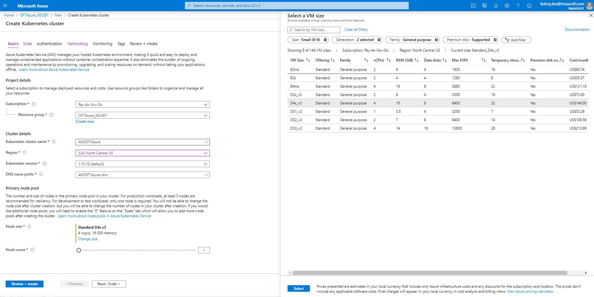
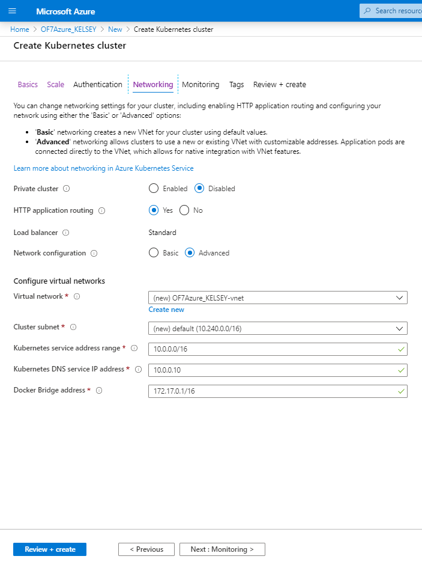
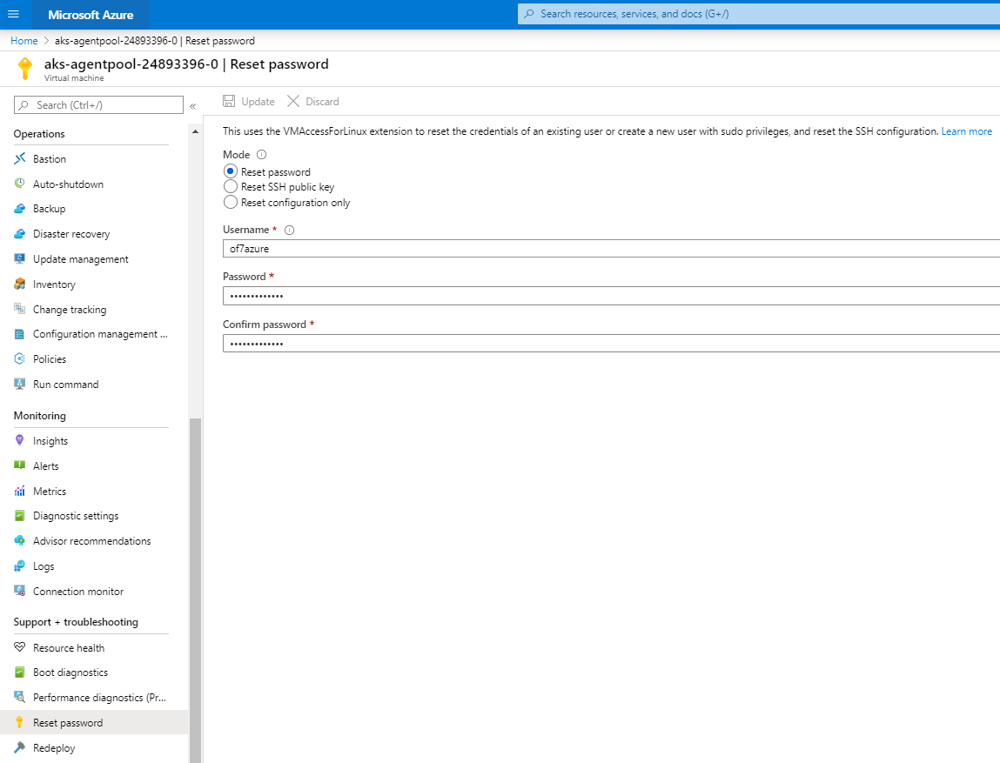

# Fail-over test with Azure Kubernetes service(AKS)

## Table of Contents

+ [1. Fail-over Environment setting](#11-install-docker)
  + [1.1 Fail-over concept](#11-install-docker)
  + [1.2 Storage setting](#13-install-openframe)
      + [1.2.1 Storage Class](#131-pre-settings)
      + [1.2.2 Persistant Volume](#131-pre-settings)
      + [1.2.3 Persistant Volume Claim](#131-pre-settings)
  + [1.3 Deployment with replicated Pods](#12-get-centos-container)
+ [2. Fail-over test](#step-2-azure-service)
  + [2.1 Test senario](#21-add-azure-kubernetes-serviceaks)
  + [2.2 Test results](#22-set-pods)

## Step 1. Fail-over Environment setting

### 1.1 Fail-over concept

* A Pod which has OpenFrame container is running in NODE1. NODE2 is a back up Node which is empty.


* When NODE1 is dead, the Pod will be terminated from NODE1 but created in NODE2.


*A Pod is the basic execution unit of a Kubernetes application–the smallest and simplest unit in the Kubernetes object model that you create or deploy. A Pod represents processes running on your Cluster.*

Here are two check points for doing this fail-over test.

When NODE1 dies,

1) A new Pod should not lose the critical data of the old Pod.

2) A Pod should be automatically created in a different Node and run successfully.

For 1, Persistant Vloume and Persistant Volume Claim will be used.

*I will talk about Persistant Vloume and Persistant Volume Claim concepts in 1.2 part*

For 2, Deployment with replicated Pods will be used(in this case, only one Pod is needed).

*The reason why Deployment for creating replicated Pods will be used is - updating the Deployment(in this case, OpenFrame) is more suitable than using Replication controller.(It only replicates the Pods, do not supports rolling-back and rolling-out for updating the application.) It will be discussed in 1.3 part.*


### 1.2 Storage setting

### 1.2.1 Persistant Volume Claim

* A PersistentVolumeClaim (PVC) is a request for storage by a user. It is similar to a Pod. Pods consume node resources and PVCs consume PV resources. Pods can request specific levels of resources (CPU and Memory). **Claims can request specific size and access modes (e.g., they can be mounted once read/write or many times read-only).**

    *While PersistentVolumeClaims allow a user to consume abstract storage resources, it is common that users need PersistentVolumes with varying properties, such as performance, for different problems. Cluster administrators need to be able to offer a variety of PersistentVolumes that differ in more ways than just size and access modes, without exposing users to the details of how those volumes are implemented. For these needs, there is the StorageClass resource.*

1) Check StorageClasss

    ```kubectl get sc```
    ```bash
    NAME                PROVISIONER                AGE
    azurefile           kubernetes.io/azure-file   6d1h
    azurefile-premium   kubernetes.io/azure-file   6d1h
    default (default)   kubernetes.io/azure-disk   6d1h
    managed-premium     kubernetes.io/azure-disk   6d1h
    ```
* Those four storage classes are provided by Azure service. You can create custom storage class (StorageClass will be discussed in 1.2.3 part)

* In this case, I will use managed-premium to use Azure Kubernetes Service(AKS).

2) Create Persistent Volume Claim (PVC)

    ```vi volumeclaim.yaml```
    ```bash 
    apiVersion: v1
    kind: PersistentVolumeClaim
    metadata:
      name: of7storage
    spec:
      accessModes:
      - ReadWriteOnce
      storageClassName: managed-premium
      resources:
        requests:
          storage: 500Gi
    ```
    ``` kubectl create -f volumeclaim.yaml```
    
    ``` kubectl get pvc``` -> Check Persistent Volume Claim (PVC)
    ```bash
    NAME         STATUS   VOLUME                                     CAPACITY   ACCESS MODES   STORAGECLASS      AGE
    of7storage   Bound    pvc-a0a48609-8975-433f-9b73-bc371cbb0702   500Gi      RWO            managed-premium   16h
    ```
    
    ``` kubectl describe pvc of7storage```
    ```bash
    Name:          of7storage
    Namespace:     default
    StorageClass:  managed-premium
    Status:        Bound
    Volume:        pvc-a0a48609-8975-433f-9b73-bc371cbb0702
    Labels:        <none>
    Annotations:   pv.kubernetes.io/bind-completed: yes
                   pv.kubernetes.io/bound-by-controller: yes
                   volume.beta.kubernetes.io/storage-provisioner: kubernetes.io/azure-disk
    Finalizers:    [kubernetes.io/pvc-protection]
    Capacity:      500Gi
    Access Modes:  RWO
    VolumeMode:    Filesystem
    Mounted By:    <none>
    Events:        <none>
    ```
    
### 1.2.2 Persistant Volume

* From the PVC above, it uses managed-premium storageClass whose provisioner is kubernetes.io/**azure-disk**. So, it automatically generates **azure-disk**(Persistant Volume) in Azure service.
    
    
     
* When you create a Pod using the PVC, Disk state changes from Unattached to Attached & Owner VM changes from --(none) to the VM where the Pod is running. (Creating a Deployment which uses the PVC will be discussed in 1.3 part.)
        
    
     
* You can also check PV with kubectl commands
     
    ``` kubectl get pv ```
    ```bash
    NAME                                     CAPACITY ACCESS MODES RECLAIM POLICY STATUS CLAIM              STORAGECLASS   REASON   AGE
    pvc-a0a48609-8975-433f-9b73-bc371cbb0702 500Gi    RWO          Delete         Bound  default/of7storage managed-premium         16h
    ```
    
    ``` kubectl describe pv pvc-a0a48609-8975-433f-9b73-bc371cbb0702 ```
    ```bash
    Name:            pvc-a0a48609-8975-433f-9b73-bc371cbb0702
    Labels:          <none>
    Annotations:     pv.kubernetes.io/bound-by-controller: yes
                     pv.kubernetes.io/provisioned-by: kubernetes.io/azure-disk
                     volumehelper.VolumeDynamicallyCreatedByKey: azure-disk-dynamic-provisioner
    Finalizers:      [kubernetes.io/pv-protection]
    StorageClass:    managed-premium
    Status:          Bound
    Claim:           default/of7storage
    Reclaim Policy:  Delete
    Access Modes:    RWO
    VolumeMode:      Filesystem
    Capacity:        500Gi
    Node Affinity:   <none>
    Message:
    Source:
        Type:         AzureDisk (an Azure Data Disk mount on the host and bind mount to the pod)
        DiskName:     kubernetes-dynamic-pvc-a0a48609-8975-433f-9b73-bc371cbb0702
        DiskURI:      /subscriptions/9c327935-ea7c-4dfe-a425-f45aee2a1959/resourceGroups/mc_of7azure_kelsey_aksof7azure_northcentralus/providers/Microsoft.Compute/disks/kubernetes-dynamic-pvc-a0a48609-8975-433f-9b73-bc371cbb0702
        Kind:         Managed
        FSType:
        CachingMode:  ReadOnly
        ReadOnly:     false
    Events:           <none>
    ```
    
* A PersistentVolume (PV) is a piece of storage in the cluster that has been provisioned by an administrator or dynamically provisioned using Storage Classes. It is a resource in the cluster just like a node is a cluster resource.

**PVs are volume plugins like Volumes, but have a lifecycle independent of any individual Pod that uses the PV.** This API object captures the details of the implementation of the storage, be that NFS, iSCSI, or a cloud-provider-specific storage system.

A PersistentVolumeClaim (PVC) is a request for storage by a user. It is similar to a Pod. Pods consume node resources and PVCs consume PV resources. Pods can request specific levels of resources (CPU and Memory). **Claims can request specific size and access modes (e.g., they can be mounted once read/write or many times read-only).**

While PersistentVolumeClaims allow a user to consume abstract storage resources, it is common that users need PersistentVolumes with varying properties, such as performance, for different problems. Cluster administrators need to be able to offer a variety of PersistentVolumes that differ in more ways than just size and access modes, without exposing users to the details of how those volumes are implemented. For these needs, there is the StorageClass resource

From https://kubernetes.io/docs/concepts/storage/persistent-volumes/


Access Modes
A PersistentVolume can be mounted on a host in any way supported by the resource provider. As shown in the table below, providers will have different capabilities and each PV’s access modes are set to the specific modes supported by that particular volume. For example, NFS can support multiple read/write clients, but a specific NFS PV might be exported on the server as read-only. Each PV gets its own set of access modes describing that specific PV’s capabilities.

The access modes are:

ReadWriteOnce – the volume can be mounted as read-write by a single node
ReadOnlyMany – the volume can be mounted read-only by many nodes
ReadWriteMany – the volume can be mounted as read-write by many nodes
In the CLI, the access modes are abbreviated to:

RWO - ReadWriteOnce
ROX - ReadOnlyMany
RWX - ReadWriteMany


### 1.2.1 Storage Class

* A claim can request a particular class by specifying the name of a StorageClass using the attribute storageClassName. Only PVs of the requested class, ones with the same storageClassName as the PVC, can be bound to the PVC.

    ```kubectl get sc```
    ```bash
    NAME                PROVISIONER                AGE
    azurefile           kubernetes.io/azure-file   6d1h
    azurefile-premium   kubernetes.io/azure-file   6d1h
    default (default)   kubernetes.io/azure-disk   6d1h
    managed-premium     kubernetes.io/azure-disk   6d1h
    ```


```

Other docker commands :

| COMMAND                    | DESCRIPTION                     |
|----------------------------|---------------------------------|
| docker ps                  | check running containers        |
| docker ps -a               | check all containers            |
| docker exec [container ID] | execute a running container     |
| docker stop [container ID] | stop the container              |
| docker rm   [container ID] | remove the container            |

**docker run and docker exec are different!!**

Example :

```sudo docker ps -a | grep centos```
     
     CONTAINER ID  IMAGE   COMMAND      CREATED        STATUS       PORTS  NAMES          
     fc58fa646357  centos  "/bin/bash"  2 minutes ago  Up 2 minutes        keen_poitras

```sudo docker exec -i -t fc58fa646357 /bin/bash```

```sudo docker stop fc58fa646357```


### 1.3 Install OpenFrame

### 1.3.1 Pre settings
__a.__  Required Package Installation
```bash 
yum install -y  dos2unix
yum install -y  glibc*
yum install -y  glibc.i686 glibc.x86_64
yum install -y *libtermcap*
yum install -y  gcc
yum install -y  gcc-c++
yum install -y libncurses*
yum install ncurses*
yum update
```
* Packages for running tibero
```bash
yum install libaio
yum install libnsl
```

* Extra Packages if needed
```bash
yum install strace
yum install ltrace
yum install gdb 
yum install nano 
yum install vim-enhanced 
yum install git 
yum install htop
```

__b.__ Create symbolic link
```bash
ln -s /usr/lib64/libncurses.so.5.9 /usr/lib/libtermcap.so
ln -s /usr/lib64/libncurses.so.5.9 /usr/lib/libtermcap.so.2
```

__c.__ Kernel Parameters Modification 

vi /etc/sysctl.conf  

```bash
kernel.shmall = 2097152
kernel.shmmax = 4294967295
kernel.shmmni = 4096
kernel.sem = 100000 32000 10000 10000
fs.file-max = 65536
net.ipv4.ip_local_port_range = 1024 65000  
```
* The parameters below are not supported in a container environment, so you can discard those.
```bash
net.core.rmem_default=262144
net.core.wmem_default=262144
net.core.rmem_max=262144
net.core.wmem_max=262144
```
```bash
sysctl: cannot stat /proc/sys/net/core/rmem_default: No such file or directory
sysctl: cannot stat /proc/sys/net/core/wmem_default: No such file or directory
sysctl: cannot stat /proc/sys/net/core/rmem_max: No such file or directory
sysctl: cannot stat /proc/sys/net/core/wmem_max: No such file or directory
```

* Refresh the kernel parameters.
```bash
/sbin/sysctl –p 
```

__d.__ Firewall setting
* Firewall does not work in the container. Instead, you can use port forwarding option(-p) when you run the container. I will talk about this later in 'use OpenFrame image' part.

__e.__ Prepare licenses from Technet
* Use the correct hostname for downloading license files from Technet website.
* You need to check hostname and the number of cores.

__f.__ Set hostname
* Use -h option when you run the container. It automatically sets the hostname for the container.
* Check /etc/hosts file to see if the hostname sets correctly.

**Copy OpenFrame binary files from host to container**
```sudo docker cp [filename] [containername]:[path]```

### 1.3.2 JAVA installation


### 1.3.3 Tibero installation

```bash
tar -xzvf [tibero tar file]
mv license.xml tibero6/license/
```
    vi .bash_profile
```bash
# Tibero6 ENV
export TB_HOME=$HOME/tibero6
export TB_SID=oframe
export TB_PROF_DIR=$TB_HOME/bin/prof
export LD_LIBRARY_PATH=$TB_HOME/lib:$TB_HOME/client/lib:$LD_LIBRARY_PATH
export PATH=$TB_HOME/bin:$TB_HOME/client/bin:$PATH
```
    source ~/.bash_profile

    sh $TB_HOME/config/gen_tip.sh

    vi $TB_HOME/config/$TB_SID.tip
```bash
DB_NAME=oframe
LISTENER_PORT=8629
CONTROL_FILES="/home/oframe7/tbdata/c1.ctl"
DB_CREATE_FILE_DEST="/home/oframe7/tbdata" -> match the directory CONTROL_FILES
#CERTIFICATE_FILE="/home/oframe7/tibero6/config/svr_wallet/oframe.crt"
#PRIVKEY_FILE="/home/oframe7/tibero6/config/svr_wallet/oframe.key"
#WALLET_FILE="/home/oframe7/tibero6/config/svr_wallet/WALLET"
#EVENT_TRACE_MAP="/home/oframe7/tibero6/config/event.map"
MAX_SESSION_COUNT=100
TOTAL_SHM_SIZE=2G
MEMORY_TARGET=3G 
THROW_WHEN_GETTING_OSSTAT_FAIL = N -> THIS IS IMPORTANT (network Kernel Parameters)
```
    tbboot nomount 
    
    tbsql sys/tibero
```bash
SQL> CREATE DATABASE
USER SYS IDENTIFIED BY TIBERO
MAXINSTANCES 8                                            
MAXDATAFILES 4096                                         
CHARACTER SET MSWIN949
LOGFILE   GROUP 1 ('redo001.redo') SIZE 512M,            
          GROUP 2 ('redo002.redo') SIZE 512M,            
          GROUP 3 ('redo003.redo') SIZE 512M,            
          GROUP 4 ('redo004.redo') SIZE 512M,            
          GROUP 5 ('redo005.redo') SIZE 512M             
MAXLOGGROUPS 255                                          
MAXLOGMEMBERS 8                                           
NOARCHIVELOG                                              
DATAFILE 'system001.dtf' SIZE 200M autoextend on maxsize 1G
DEFAULT TABLESPACE USR                                    
DATAFILE 'usr001.dtf' SIZE 200M  autoextend on maxsize 1G 
DEFAULT TEMPORARY TABLESPACE TEMP                         
TEMPFILE 'temp001.dtf' SIZE 200M autoextend on maxsize 1G 
UNDO TABLESPACE UNDO0                                     
DATAFILE 'undo001.dtf' SIZE 200M autoextend on maxsize 1G; 
```
    tbboot
    
    sh $TB_HOME/scripts/system.sh 
    SYS password : tibero
    SYSCAT password : syscat
    
    tbsql tibero/tmax
```bash
create tablespace "DEFVOL" datafile 'DEFVOL.dbf' size 100M autoextend on;
create tablespace "TACF00" datafile 'TACF00.dbf' size 50M  autoextend on;
create tablespace "OFM_REPOSITORY" datafile 'OFM_REPOSITORY.dbf' size 50M  autoextend on;
create tablespace "OFMLOG" datafile 'OFM_LOG.dbf' size 300M  autoextend on next 300M;
create tablespace "OFMGR01" datafile 'OFMGR01.DBF'  size 100M autoextend on  next 50M;
```

### 1.3.4 UnixODBC installation

**Container environment does not have make file under /usr/bin**

* Copy make(/usr/bin) file from the host to the container.

```bash
wget ftp://ftp.unixodbc.org/pub/unixODBC/unixODBC-2.3.4.tar.gz
tar -zxvf unixODBC-2.3.4.tar.gz
cd unixODBC-2.3.4
./configure --prefix=$HOME/unixODBC --sysconfdir=$HOME/unixODBC/etc
make
make install
```
    vi ~/.bash_profile
```bash
# UNIX ODBC ENV
export ODBC_HOME=$HOME/unixODBC
export PATH=$ODBC_HOME/bin:$PATH
export LD_LIBRARY_PATH=$ODBC_HOME/lib:$LD_LIBRARY_PATH
export ODBCINI=$HOME/unixODBC/etc/odbc.ini
export ODBCSYSINI=$HOME
```
    source ~/.bash_profile
    
    odbcinst -j
```bash
# UNIX ODBC ENV
export ODBC_HOME=$HOME/unixODBC
export PATH=$ODBC_HOME/bin:$PATH
export LD_LIBRARY_PATH=$ODBC_HOME/lib:$LD_LIBRARY_PATH
export ODBCINI=$HOME/unixODBC/etc/odbc.ini
export ODBCSYSINI=$HOME
```

### 1.3.5 OFCOBOL installation

### 1.3.6 PROSORT installation

### 1.3.7 Base installation

### 1.3.8 Batch installation

### 1.3.9 TACF installation

### 1.3.10 OSC installation

### 1.3.11 JEUS installation

### 1.3.12 OFGW installation

### 1.3.13 OFManager installation


### 1.4 Create OpenFrame image

**Exit(stop) the container and commit the current container.**

```sudo docker ps -a | grep centos```

    CONTAINER ID  IMAGE    COMMAND      CREATED         STATUS          PORTS   NAMES  
    fc58fa646357  centos   "/bin/bash"  16 hours ago    Up 30 minutes            keen_poitras

``` sudo docker stop fc58fa646357 ```

``` sudo docker commit -a "kelsey" -m "of7azure" keen_poitras kelsey92/of7azurefinal:of7azure ```

**You need to name it with the rule below for pushung/pulling the image through Dockerhub.**

```bash
username/repository:tag
kelsey92/of7azurefinal:of7azure
```

```sudo docker login```

```bash
Login with your Docker ID to push and pull images from Docker Hub. If you don't have a Docker ID, head over to https://hub.docker.com to create one.
Username: kelsey92
Password: 
WARNING! Your password will be stored unencrypted in /home/of7azure/.docker/config.json.
Configure a credential helper to remove this warning. See
https://docs.docker.com/engine/reference/commandline/login/#credentials-store

Login Succeeded
````

``` sudo docker push kelsey92/of7azurefinal:of7azure ```

``` The push refers to repository [docker.io/kelsey92/of7azurefinal]```

* If you want to cut down the layers of the image

```sudo docker export f3b5881af3b7 | sudo docker import - kelsey92/of7azurefinal:of7azure```

### 1.5 Use OpenFrame image

**Docker should be installed and you need to login to Dockerhub.** 
[Install docker](#11-install-docker)

```bash
sudo docker login
dockerhub username
password
```

**Pull the image from the Dockerhub repository**

```sudo docker pull kelsey92/of7azurefinal:of7azure```

**Check if the image is successfully pulled in your VM**

```sudo docker images | grep kelsey```

**Run the container with OpenFrame image**

- Port forwarding with -p option when you run the container. Use multiple options with all ports you need.

```sudo docker run -i -t -h of7azure -p 9736:9736 -p 8088:8088 -p 8087:8087 kelsey92/of7azurefinal:of7azure /bin/bash```

#### If you run more than one containers.

- Docker container ip address changes if you run more than one containers.

- First container
```bash
18: eth0@if19: <BROADCAST,MULTICAST,UP,LOWER_UP> mtu 1500 qdisc noqueue state UP group default 
    link/ether 02:42:ac:11:00:03 brd ff:ff:ff:ff:ff:ff link-netnsid 0
    inet 172.17.0.2/16 brd 172.17.255.255 scope global eth0
       valid_lft forever preferred_lft forever
```

- Second container
```bash
18: eth0@if19: <BROADCAST,MULTICAST,UP,LOWER_UP> mtu 1500 qdisc noqueue state UP group default 
    link/ether 02:42:ac:11:00:03 brd ff:ff:ff:ff:ff:ff link-netnsid 0
    inet 172.17.0.3/16 brd 172.17.255.255 scope global eth0
       valid_lft forever preferred_lft forever
```

**Those environment variables from bash_profile shoule be changed.**

    vi ~/.bash_profile
```bash
TMAX_HOST_ADDR=localhost ip address(127.0.0.1)
export TMAX_HOST_ADDR
alias msdown1='stopServer -u administrator -p tmax123 -host localhost:9936'
alias msdown2='stopServer -u administrator -p tmax123 -host localhost:9636'
alias dsdown='stopServer -u administrator -p tmax123 -host localhost:9736'
```
    source ~/.bash_profile
    
**Region configuration file should be modified.**

    vi osc.OSCOIVP1.conf
```bash
[TDQ]
        TDQ_INTRA_DSNAME=OSC.TDQLIB.INTRA
        TDQ_LOG_ADDRESS=localhost ip address(127.0.0.1):8896
```

**Webterminal setting should be modified.**

    vi ofgw.properties
```bash
tmax.retrytime = 60000
#tmax.node.list = NODE1,NODE2
tmax.node.list = NODE1
tmax.node.NODE1.name = NODE1
tmax.node.NODE1.ip = localhost ip address(127.0.0.1)
tmax.node.NODE1.port = 8001
tmax.node.NODE1.min = 5
tmax.node.NODE1.max = 1024
tmax.node.NODE1.rate = 2
tmax.node.NODE1.timeout = 20000
tmax.node.NODE1.idletime = 90
```

**OFManager setting should be modified**

    vi ofmanager.properties
```bash
# OFGW Property
openframe.webterminal.url = localhost ip address(127.0.0.1):5556/webterminal
openframe.webterminal.name= ofgw

# Tmax Property
openframe.tmax.ip= localhost ip address(127.0.0.1)
openframe.tmax.port= 8001
```

**JEUS setting should be modified**

*Change 172.17.0.3 to 0.0.0.0 from data-resource section to use localhost ip address.*

    vi domain.xml
```bash
   <resources>
      <data-source>
         <database>
            <data-source-id>ofgw</data-source-id>
            <export-name>ofgw</export-name>
            <data-source-class-name>com.tmax.tibero.jdbc.ext.TbConnectionPoolDataSource</data-source-class-name>
            <data-source-type>ConnectionPoolDataSource</data-source-type>
            <vendor>tibero</vendor>
            <server-name>172.17.0.3</server-name>
            <port-number>8629</port-number>
            <database-name>oframe</database-name>
            <user>tibero</user>
            <password>tmax</password>

           (continues)

         <database>
            <data-source-id>ds_ofm1</data-source-id>
            <export-name>ds_ofm1</export-name>
            <data-source-class-name>com.tmax.tibero.jdbc.ext.TbConnectionPoolDataSource</data-source-class-name>
            <data-source-type>ConnectionPoolDataSource</data-source-type>
            <vendor>tibero</vendor>
            <server-name>172.17.0.3</server-name>
            <port-number>8629</port-number>
            <database-name>oframe</database-name>
            <user>tibero</user>
            <password>tmax</password>
```


## Step 2. Azure Service

### 2.1 Add Azure Kubernetes service(AKS)

1. Add the service from Azure Website.

* Add resource as kubernetes service

    

* Basic

    
    **Set the region as NorthCentralUS here. Resources may vary depends on the region**



*Select the Node(VM) size*

* Scale

    

* Authentication as default

* Networking

    

* Monitoring

    

* Tag as you want

* Review + create

    
    
* Set the user id and password for the node(VM)

    Hit the "Reset password" menu from the node(VM).
    
        

2. Set the Node 

    **Use Azure cloud**

* Get access credentials for a managed Kubernetes cluster

    ```az aks get-credentials --resource-group [resource_group_name] --name [AKS_cluster_name]```

    *Example :*

    ``` az aks get-credentials --resource-group OF7Azure_KELSEY --name AKSOF7Azure```

    *Merged "AKSOF7azure" as current context in /home/kelsey/.kube/config*


* Check the node status

    ```kubectl get nodes```
    ```bash
    NAME                       STATUS   ROLES   AGE     VERSION
    aks-agentpool-13644011-1   Ready    agent   2m20s   v1.15.10
    ```

* When you need to reset the cluster 

    ```kubectl config delete-cluster [cluster name]```

    *Example :*

    ```kubectl config delete-cluster AKSOF7azure```

    *deleted cluster AKSOF7Azure from /home/kelsey/.kube/config*

### 2.2 Set pods

1. Crate a pod yaml file

    ```bash
    apiVersion: v1
    kind: Pod
    metadata:
      name: of7azure
      labels:
        of7azurefinal: of7azure
    spec:
      containers:
      - name: of7azure
        image: kelsey92/of7azurefinal:of7azure
        ports:
          - containerPort: 6606
        command: ["/bin/sh", "-ec", "while :; do echo '.'; sleep 5 ; done"]
    ```

    * Containerport is used for connecting another container in the same pod

2. Create a pod

* Use the command below for creating a new pod

    ```kubectl create -f [yaml file name]```

    *Example :*

    ```kubectl create -f of7test.yaml```

    *pod/of7azure created*

* Check the specific pod

    ```kubectl get pod [pod name]```

* Check all pods

    ```kubectl get pods``` 

    ```bash
    NAME       READY   STATUS              RESTARTS   AGE
    of7azure   0/1     ContainerCreating   0          2m14s

    NAME       READY   STATUS              RESTARTS   AGE
    of7azure   1/1     Running             0          26m
    ```

* Get the detailed information of the pod

    ```kubectl describe pod [pod name]```

    ```bash
  Name:         of7azure
  Namespace:    default
  Priority:     0
  Node:         aks-agentpool-13644011-1/10.240.0.35
  Start Time:   Thu, 26 Mar 2020 01:40:36 +0000
  Labels:       of7azurefinal=of7azure
  Annotations:  <none>
  Status:       Running
  IP:           10.240.0.40
  IPs:          <none>
  Containers:
    of7azure:
      Container ID:  docker://05a08dc994462c770b43b3954f49071dcb8d059ff6eaf23ba93c7c71c3f813f4
      Image:         kelsey92/of7azurefinal:of7azure
      Image ID:      docker-pullable://kelsey92/of7azurefinal@sha256:f74723dd0541d9a7643eb1c7751321398ec1f76253ac28d50cb2cee57f663d2c
      Port:          6606/TCP
      Host Port:     0/TCP
      Command:
        /bin/sh
        -ec
        while :; do echo '.'; sleep 5 ; done
      State:          Running
        Started:      Thu, 26 Mar 2020 01:40:38 +0000
      Ready:          True
      Restart Count:  0
      Environment:    <none>
      Mounts:
        /var/run/secrets/kubernetes.io/serviceaccount from default-token-pvcdl (ro)
  Conditions:
    Type              Status
    Initialized       True
    Ready             True
    ContainersReady   True
    PodScheduled      True
  Volumes:
    default-token-pvcdl:
      Type:        Secret (a volume populated by a Secret)
      SecretName:  default-token-pvcdl
      Optional:    false
  QoS Class:       BestEffort
  Node-Selectors:  <none>
  Tolerations:     node.kubernetes.io/not-ready:NoExecute for 300s
                   node.kubernetes.io/unreachable:NoExecute for 300s
  Events:
    Type    Reason     Age    From                               Message
    ----    ------     ----   ----                               -------
    Normal  Scheduled  27m    default-scheduler                  Successfully assigned default/of7azure to aks-agentpool-13644011-1
    Normal  Pulling    27m    kubelet, aks-agentpool-13644011-1  Pulling image "kelsey92/of7azurefinal:of7azure"
    Normal  Pulled     3m40s  kubelet, aks-agentpool-13644011-1  Successfully pulled image "kelsey92/of7azurefinal:of7azure"
    Normal  Created    3m19s  kubelet, aks-agentpool-13644011-1  Created container of7azure
    Normal  Started    3m18s  kubelet, aks-agentpool-13644011-1  Started container of7azure
  ```

* Execute a running pod

    ```kubectl exec -it of7azure -- /bin/bash```

   *Check IP address*

  ```bash
  [root@of7azure /]# su - of7azure
  Last login: Thu Mar 26 01:01:15 UTC 2020 on pts/0

  [of7azure@of7azure ~]$ ip addr
  1: lo: <LOOPBACK,UP,LOWER_UP> mtu 65536 qdisc noqueue state UNKNOWN group default qlen 1000
      link/loopback 00:00:00:00:00:00 brd 00:00:00:00:00:00
      inet 127.0.0.1/8 scope host lo
         valid_lft forever preferred_lft forever
  31: eth0@if32: <BROADCAST,UP,LOWER_UP> mtu 1500 qdisc noqueue state UP group default qlen 1000
      link/ether ce:6d:4e:8e:e8:10 brd ff:ff:ff:ff:ff:ff link-netnsid 0
      inet 10.240.0.40/16 scope global eth0
         valid_lft forever preferred_lft forever
  ```

* When you need to delete pods

  ```kubectl delete pod --all```
  
  *pod "of7azure" deleted*

### 2.3 Set services

* Nodeport service for using JEUS, Webterminal, OFManager

1. Create a service yaml file.

    ```bash
    apiVersion: v1
    kind: Service
    metadata:
      name: jeus
    spec:
      type: NodePort
      selector:
        of7azurefinal: of7azure
      ports:
      - protocol: TCP
        port: 9736
        targetPort: 9736
    ```

    ```bash
    apiVersion: v1
    kind: Service
    metadata:
      name: ofmanager
    spec:
      type: NodePort
      selector:
        of7azurefinal: of7azure
      ports:
      - protocol: TCP
        port: 8087
        targetPort: 8087
    ```

    ```bash
    apiVersion: v1
    kind: Service
    metadata:
      name: webterminal
    spec:
      type: NodePort
      selector:
        of7azurefinal: of7azure
      ports:
      - protocol: TCP
        port: 8088
        targetPort: 8088
    ```

2. Create services

* Create services by using the command below

    ```kubectl create -f NodePort_8088.yaml```
    
    *service/webterminal created*

    ```kubectl create -f NodePort_8087.yaml```
    
    *service/ofmanager created*

    ```kubectl create -f NodePort_9736.yaml```
    
    *service/jeus created*

* Check services

    ```kubectl get services```

    ```bash
    NAME          TYPE        CLUSTER-IP     EXTERNAL-IP   PORT(S)          AGE
    jeus          NodePort    10.0.139.162   <none>        9736:32362/TCP   2m58s
    kubernetes    ClusterIP   10.0.0.1       <none>        443/TCP          47h
    ofmanager     NodePort    10.0.234.165   <none>        8087:30896/TCP   3m7s
    webterminal   NodePort    10.0.179.58    <none>        8088:30011/TCP   3m11s
    ```

* Get detailed information of services

    ```kubectl describe services [service name]```

    ```bash
    Name:                     jeus
    Namespace:                default
    Labels:                   <none>
    Annotations:              <none>
    Selector:                 of7azurefinal=of7azure
    Type:                     NodePort
    IP:                       10.0.139.162
    Port:                     <unset>  9736/TCP
    TargetPort:               9736/TCP
    NodePort:                 <unset>  32362/TCP
    Endpoints:                10.240.0.40:9736
    Session Affinity:         None
    External Traffic Policy:  Cluster
    Events:                   <none>
    ```

    ```bash
    Name:                     ofmanager
    Namespace:                default
    Labels:                   <none>
    Annotations:              <none>
    Selector:                 of7azurefinal=of7azure
    Type:                     NodePort
    IP:                       10.0.234.165
    Port:                     <unset>  8087/TCP
    TargetPort:               8087/TCP
    NodePort:                 <unset>  30896/TCP
    Endpoints:                10.240.0.40:8087
    Session Affinity:         None
    External Traffic Policy:  Cluster
    Events:                   <none>
    ```

    ```bash
    Name:                     webterminal
    Namespace:                default
    Labels:                   <none>
    Annotations:              <none>
    Selector:                 of7azurefinal=of7azure
    Type:                     NodePort
    IP:                       10.0.179.58
    Port:                     <unset>  8088/TCP
    TargetPort:               8088/TCP
    NodePort:                 <unset>  30011/TCP
    Endpoints:                10.240.0.40:8088
    Session Affinity:         None
    External Traffic Policy:  Cluster
    Events:                   <none>
    ```

* When you need to delete services

   ```kubectl delete service [service name]```


### 2.4 Network configuration 

1. Set the Inbound NAT rules of Kubernetes with the Nodeports.

  * Hit the add button from Inbound NAT rules.
  
    

  * Jeus

    **Type the jeus Nodeport in Target port**

    


  * Webterminal

    **Type the webterminal Nodeport in Target port**

    


  * Ofmanager

    **Type the ofmanager Nodeport in Target port**

    


2. Set the Inbound ports 

* Hit the Add inbound port rule from the Node Networking setting.
   
   

* Add inbound ports

    Type the port in "Destination port ranges"

    
    
    Add all nodeports as inbound ports like above.

### 2.5 Azure monitoring service


