# TAC environment configuration using Azure File Share Premium by Kelsey

## Table of Contents

+ [1. Architecture](#1-architecture)
+ [2. Create Azure File Share Premium](#2-create-azure-file-share-premium)
+ [3. Create Two DB Servers](#3-create-two-db-servers)
+ [4. Mount Azure File Share Premium to DB Servers](#4-mount-azure-file-share-premium-to-db-servers)
+ [5. IP Configuration](#5-ip-configuration)
+ [6. How To Validate the Performance](#6-how-to-validate-the-result)

### 1. Architecture

   
    
- Use Azure File Share Premium as a storage.

- Mount this storage to each DB server.

- One IP is for public use and another one is for internal use.

### 2. Create Azure File Share Premium

- Create storage account

   
   
   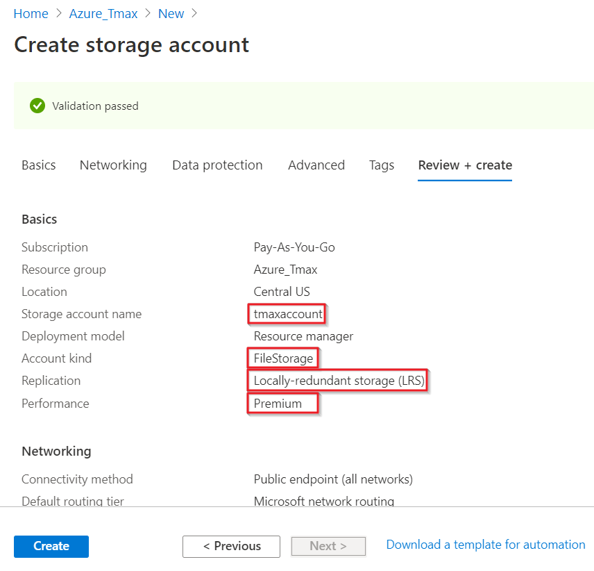
 
- Create file share
 
   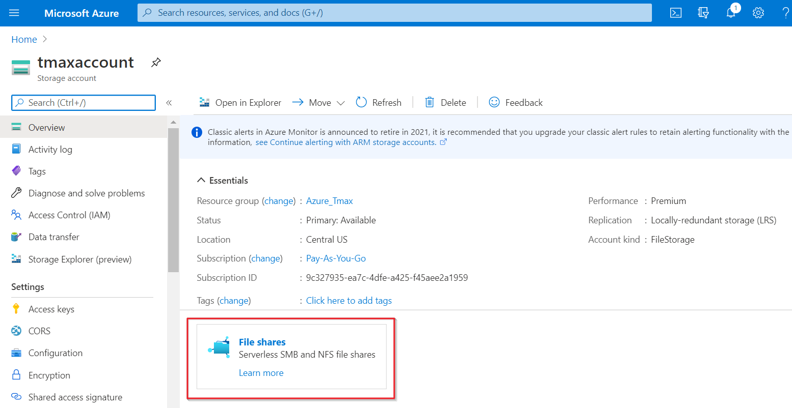
   
   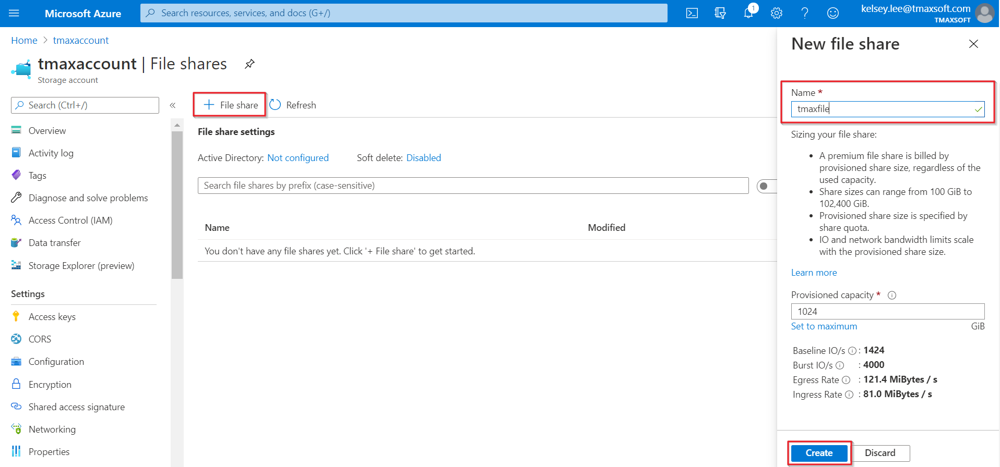
   
   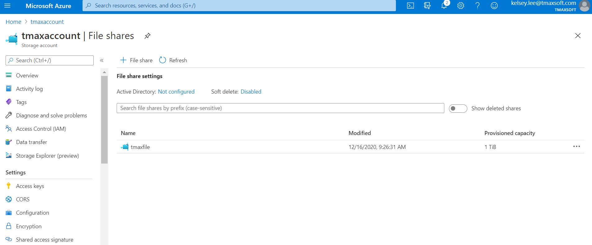

### 3. Create Two DB Servers

- Specification
    - Need to use CentOS8 for using file share.

      ```
      CentOS 8
      4 core
      16 GB
      ```

- Create VMs 

   - Check the image version

        

   - Check the VM size
 
       

### 4. Mount Azure File Share Premium to DB Servers

1) Install Azure CLI

```
sudo rpm --import https://packages.microsoft.com/keys/microsoft.asc
```

```
vi .bash_profile

echo -e "[azure-cli]
name=Azure CLI
baseurl=https://packages.microsoft.com/yumrepos/azure-cli
enabled=1
gpgcheck=1
gpgkey=https://packages.microsoft.com/keys/microsoft.asc" | sudo tee /etc/yum.repos.d/azure-cli.repo

source ~/.bash_profile
```

```
sudo yum install azure-cli
```

- Follow the steps
    
    
    - az login
      ```
      Go to https://microsoft.com/devicelogin and enter the code, then check the account you are going to use.


      az login
      To sign in, use a web browser to open the page https://microsoft.com/devicelogin and enter the code S7QNPWTRB to authenticate.
      The following tenants don't contain accessible subscriptions. Use 'az login --allow-no-subscriptions' to have tenant level access.
      693358f3-dc90-4442-aeec-274d3289a40e
      [
        {
          "cloudName": "AzureCloud",
          "homeTenantId": "ef439009-53c1-4a0c-8012-edabcdeb7e05",
          "id": "9c327935-ea7c-4dfe-a425-f45aee2a1959",
          "isDefault": true,
          "managedByTenants": [],
          "name": "Pay-As-You-Go",
          "state": "Enabled",
          "tenantId": "ef439009-53c1-4a0c-8012-edabcdeb7e05",
          "user": {
            "name": "kelsey.lee@tmaxsoft.com",
            "type": "user"
          }
        }
      ]
      ```


When you need to logout
```
az logout
```

2) Mount the storage

- Install the pakage

```
sudo yum install cifs-utils 
```

```
vi 445.sh
```

```
#!/bin/bash

#resourceGroupName="Storagetest"
#storageAccountName="tmaxaccount"

# This command assumes you have logged in with az login
httpEndpoint=$(az storage account show \
    --resource-group Storagetest \
    --name tmaxaccount \
    --query "primaryEndpoints.file" | tr -d '"')
smbPath=$(echo $httpEndpoint | cut -c7-$(expr length $httpEndpoint))
fileHost=$(echo $smbPath | tr -d "/")

nc -zvw3 $fileHost 445
```

```
sh 445.sh
```

```
-bash: nc: command not found 

sudo yum install -y nmap-ncat
```

```
[azureuser@02DBserver ~]$ sh 445.sh 
Ncat: Version 7.70 ( https://nmap.org/ncat )
Ncat: Connected to 52.239.164.232:445.
Ncat: 0 bytes sent, 0 bytes received in 0.07 seconds.
```

```
vi directory.sh
```

```
#!/bin/bash

resourceGroupName="Storagetest"
storageAccountName="tmaxaccount"
fileShareName="tmaxfile"

mntPath="/mnt/$storageAccountName/$fileShareName"

sudo mkdir -p $mntPath
```

```
sh directory.sh
```

```
vi cre.sh 
```

```
#!/bin/bash

if [ ! -d "/etc/smbcredentials" ]; then
    sudo mkdir "/etc/smbcredentials"
fi

storageAccountKey=$(az storage account keys list \
    --resource-group StorageTest \
    --account-name tmaxaccount \
    --query "[0].value" | tr -d '"')

smbCredentialFile="/etc/smbcredentials/tmaxaccount.cred"
if [ ! -f $smbCredentialFile ]; then
    echo "username=tmaxaccount" | sudo tee $smbCredentialFile > /dev/null
    echo "password=$storageAccountKey" | sudo tee -a $smbCredentialFile > /dev/null
else
    echo "The credential file $smbCredentialFile already exists, and was not modified."
fi
```

```
sh cre.sh
```

```
sudo chmod 600 $smbCredentialFile
```

```
vi mount.sh
```

```
#!/bin/bash

# This command assumes you have logged in with az login
httpEndpoint=$(az storage account show \
    --resource-group StorageTest \
    --name tmaxaccount \
    --query "primaryEndpoints.file" | tr -d '"')

smbPath=$(echo $httpEndpoint | cut -c7-$(expr length $httpEndpoint))tmaxfile

smbCredentialFile="/etc/smbcredentials/tmaxaccount.cred"

if [ -z "$(grep $smbPath\ /mnt/tmaxaccount/tmaxfile /etc/fstab)" ]; then
    echo "$smbPath /mnt/tmaxaccount/tmaxfile cifs nofail,vers=3.0,credentials=$smbCredentialFile,serverino" | sudo tee -a /etc/fstab > /dev/null
else
    echo "/etc/fstab was not modified to avoid conflicting entries as this Azure file share was already present. You may want to double check /etc/fstab to ensure the configuration is as desired."
fi

sudo mount -a
```

- You can set UID and GID when you mount the directory.

     - Tibero group and user setting like below.

         ```
         groupadd dba -g 10005
         useradd -d /home/oftibr -g dba -s /bin/bash -m oftibr -u 10002
         passwd oftibr
         ```
         
         ```
             echo "$smbPath /mnt/tmaxaccount/tmaxfile cifs nofail,vers=3.0,credentials=$smbCredentialFile,serverino" | sudo tee -a /etc/fstab > /dev/null
         -->> Put uid,gid information like below.    
             echo "$smbPath /mnt/tmaxaccount/tmaxfile cifs nofail,vers=3.0,credentials=$smbCredentialFile,serverino,uid=oftibr,gid=dba" | sudo tee -a /etc/fstab > /dev/null 
         ```

         ```
         sudo mount /mnt/tmaxaccount/tmaxfile -o uid=oftibr -o gid=dba
         ```
         
```
sh  mount.sh
```         

- When you need to unmount 

   1. Use the unmount comment

   ```
   sudo umount /mnt/tmaxaccount/tmaxfile/
   ```

   2. Modify the fstab file

   ```
   sudo vi fstab

   UUID=60e06333-2fb4-4e92-aa22-2644748fde8a       /               xfs     defaults        0 0
   /dev/disk/cloud/azure_resource-part1    /mnt/resource   auto    defaults,nofail,x-systemd.requires=cloud-init.service,comment=cloudconfig       0       2
   //tmaxaccount.file.core.windows.net/tmaxfile /mnt/tmaxaccount/tmaxfile cifs nofail,vers=3.0,credentials=/etc/smbcredentials/tmaxaccount.cred,serverino

   Delete the last line.
   ```

### 5. IP Configuration

- 1111DBtest
   - IP address
      ```
      [azureuser@1111DBtest ~]$ ifconfig
      eth0: flags=4163<UP,BROADCAST,RUNNING,MULTICAST>  mtu 1500
              inet 192.168.0.4  netmask 255.255.255.0  broadcast 192.168.0.255
              inet6 fe80::222:48ff:fe44:9106  prefixlen 64  scopeid 0x20<link>
              ether 00:22:48:44:91:06  txqueuelen 1000  (Ethernet)
              RX packets 341  bytes 158200 (154.4 KiB)
              RX errors 0  dropped 0  overruns 0  frame 0
              TX packets 393  bytes 73460 (71.7 KiB)
              TX errors 0  dropped 0 overruns 0  carrier 0  collisions 0

      eth1: flags=4163<UP,BROADCAST,RUNNING,MULTICAST>  mtu 1500
              inet 172.17.0.11  netmask 255.255.255.0  broadcast 172.17.0.255
              inet6 fe80::908a:c54a:fceb:c760  prefixlen 64  scopeid 0x20<link>
              ether 00:0d:3a:a4:f5:f4  txqueuelen 1000  (Ethernet)
              RX packets 1  bytes 381 (381.0 B)
              RX errors 0  dropped 0  overruns 0  frame 0
              TX packets 13  bytes 1328 (1.2 KiB)
              TX errors 0  dropped 0 overruns 0  carrier 0  collisions 0

      lo: flags=73<UP,LOOPBACK,RUNNING>  mtu 65536
              inet 127.0.0.1  netmask 255.0.0.0
              inet6 ::1  prefixlen 128  scopeid 0x10<host>
              loop  txqueuelen 1000  (Local Loopback)
              RX packets 0  bytes 0 (0.0 B)
              RX errors 0  dropped 0  overruns 0  frame 0
              TX packets 0  bytes 0 (0.0 B)
              TX errors 0  dropped 0 overruns 0  carrier 0  collisions 0
      ```
   - Public ip address - 52.176.56.147 / Private ip address - 192.168.0.4

   - Another network ip address - 172.17.0.11

   - Login information
      ```
      Connection ip - 52.176.56.147
      username : azureuser
      public key : 1111DBtest_key.pem 
      ```

- 2222DBtest
   - IP address
      ```
      [azureuser@2222DBtest ~]$ ifconfig
      eth0: flags=4163<UP,BROADCAST,RUNNING,MULTICAST>  mtu 1500
              inet 192.168.0.5  netmask 255.255.255.0  broadcast 192.168.0.255
              inet6 fe80::20d:3aff:fe43:a245  prefixlen 64  scopeid 0x20<link>
              ether 00:0d:3a:43:a2:45  txqueuelen 1000  (Ethernet)
              RX packets 22099  bytes 19175591 (18.2 MiB)
              RX errors 0  dropped 0  overruns 0  frame 0
              TX packets 16705  bytes 3076297 (2.9 MiB)
              TX errors 0  dropped 0 overruns 0  carrier 0  collisions 0

      eth1: flags=4163<UP,BROADCAST,RUNNING,MULTICAST>  mtu 1500
              inet 172.17.0.22  netmask 255.255.255.0  broadcast 172.17.0.255
              inet6 fe80::9d7b:1942:504d:b690  prefixlen 64  scopeid 0x20<link>
              ether 00:0d:3a:a4:fc:3a  txqueuelen 1000  (Ethernet)
              RX packets 20  bytes 2517 (2.4 KiB)
              RX errors 0  dropped 0  overruns 0  frame 0
              TX packets 17  bytes 1664 (1.6 KiB)
              TX errors 0  dropped 0 overruns 0  carrier 0  collisions 0

      lo: flags=73<UP,LOOPBACK,RUNNING>  mtu 65536
              inet 127.0.0.1  netmask 255.0.0.0
              inet6 ::1  prefixlen 128  scopeid 0x10<host>
              loop  txqueuelen 1000  (Local Loopback)
              RX packets 0  bytes 0 (0.0 B)
              RX errors 0  dropped 0  overruns 0  frame 0
              TX packets 0  bytes 0 (0.0 B)
              TX errors 0  dropped 0 overruns 0  carrier 0  collisions 0
      ```
   - Public ip address - 52.173.23.68 / Private ip address - 192.168.0.5

   - Another network ip address - 172.17.0.22

   - Login information
      ```
      Connection IP - 52.173.23.68
      username : azureuser
      public key : 2222DBtest_key.pem 
      ```


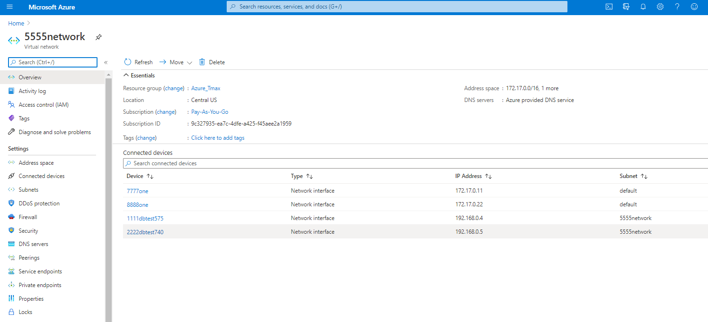

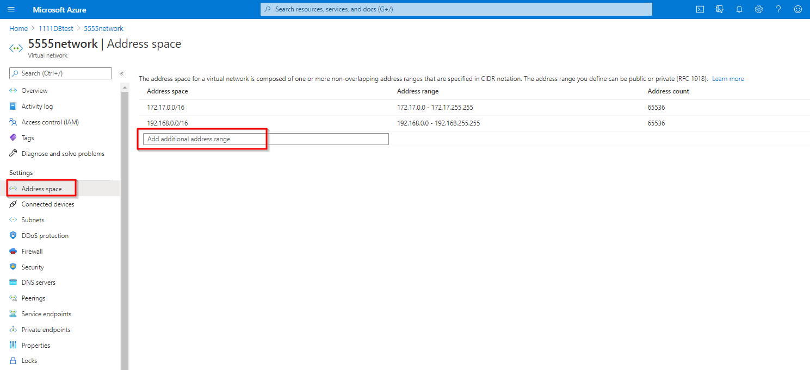

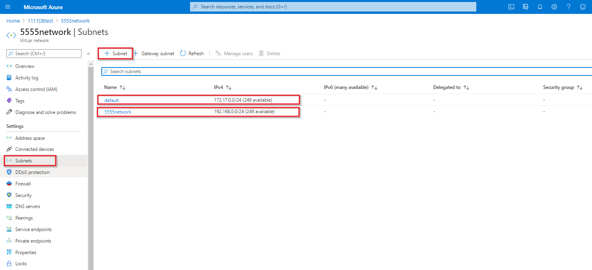

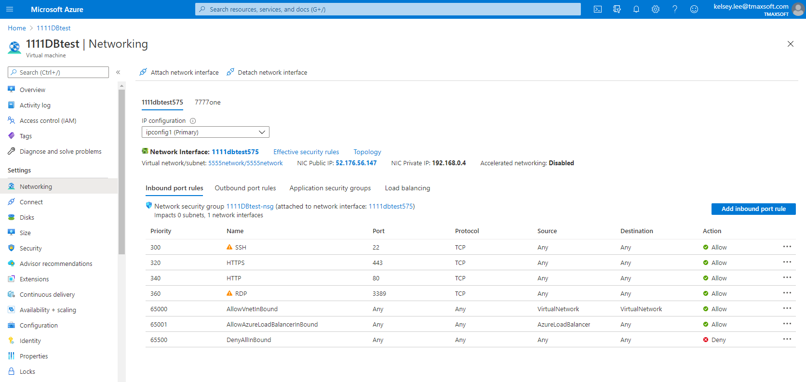

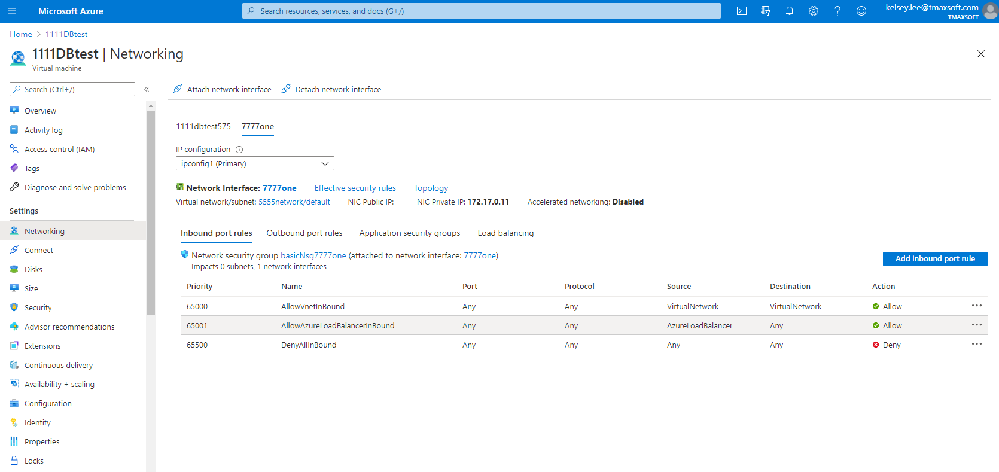

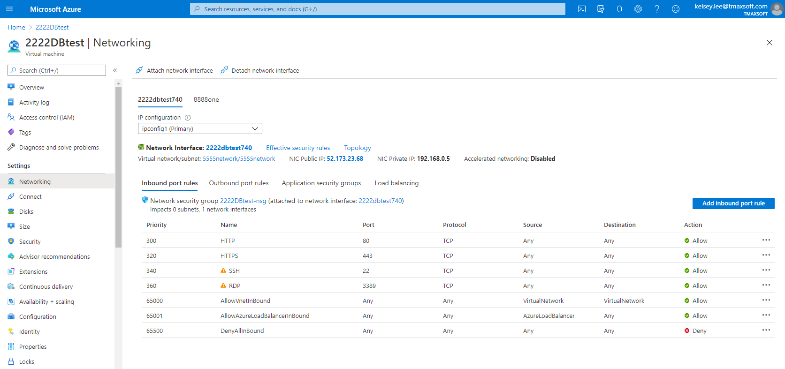

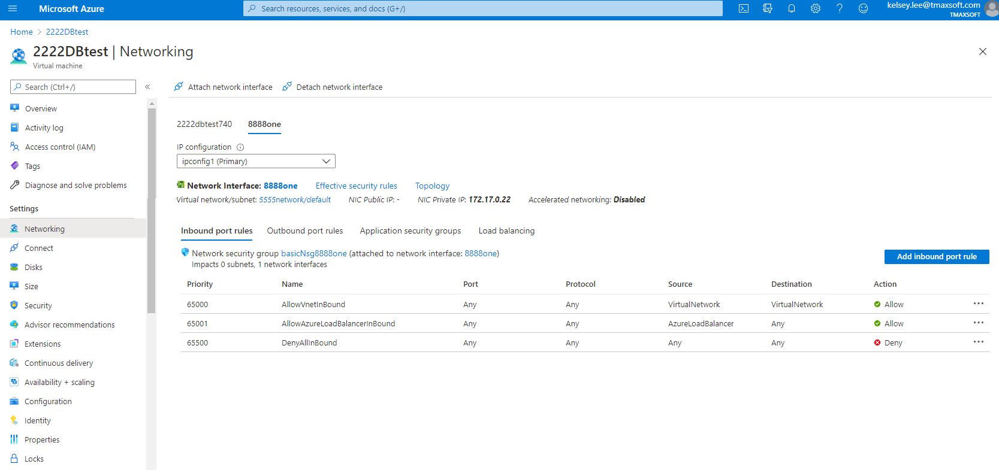

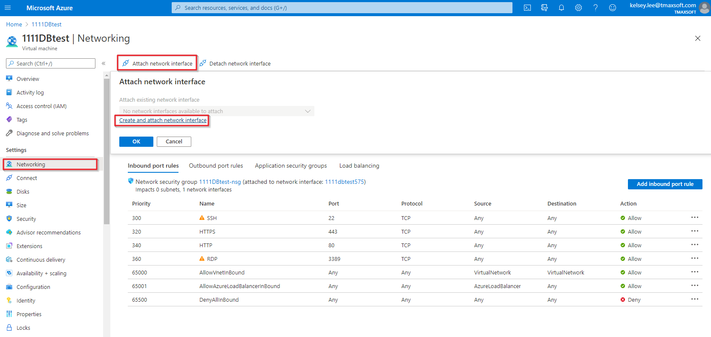

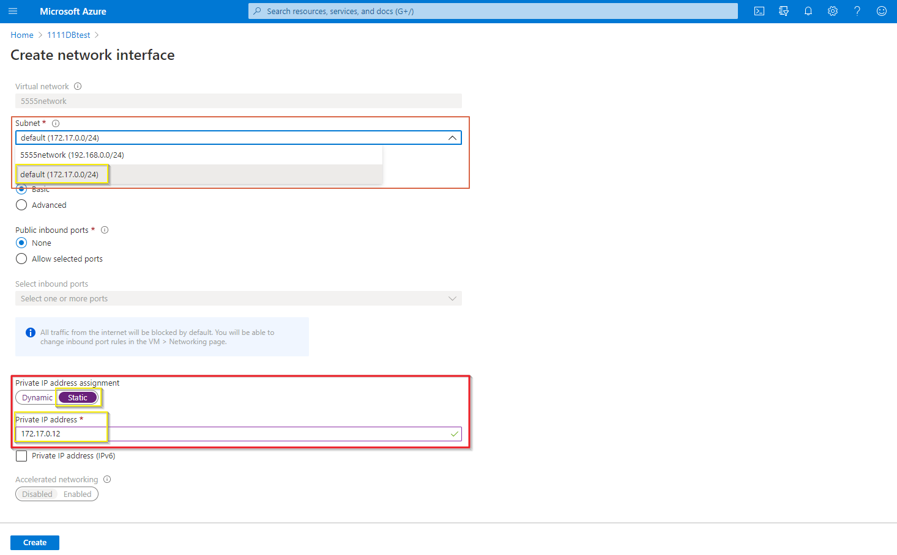


### 6. How To Validate the Performance

- tbiobench
   - This tool creates the 1GB file for checking I/O and you can use various options. Please refer to the manual if needed.
```
oftibr@DB1:/home/oftibr> tbiobench -h
-h : help
-H <header size>
-b <block size>
-s <total size>
-F <flag> : O_DIRECT|O_SYNC|O_DSYNC|O_TRUNC|O_NONBLOCK
-t <target file>
-f : overwrite target file ("force")
-k : keep target file after test
-i <io_type> : SW|SR|RR|RW|SEQ|RND|ALL
-T <thread count>
-S <random seed>
-o <output file>
```


