# Azure service with OpenFrame by Kelsey

## Table of Contents

+ [1. Divided modules of OpenFrame as PODs](#step-1-divided-modules-of-openframe-as-pods)
  + [1.1 Concept of divided modules](#11-concept-of-divided-modules)
      + [1.1.1 TIbero(DB server)](#111-tiberodb-server)
      + [1.2.2 Online/Batch](#112-online--batch)
      + [1.2.3 UI tool](#113-ui-tool)
  + [1.2 Configuration of each modules](#12-configuration-of-each-modules)
      + [1.2.1 TIbero(DB server)](#121-tiberodb-server)
      + [1.2.2 Online/Batch](#122-online--batch)
      + [1.2.3 UI tool](#123-ui-tool)

+ [2. Fail-over with PODs of divided modules](#1-fail-over-environment-setting)
  + [2.1 Risk analysis]()
  + [2.2 Suggestion]()
  
## Step 1. Divided modules of OpenFrame as PODs

### 1.1 Concept of divided modules

**Use four containers(work as seperate VMs) for installing OSC, Batch, Tibero and JEUS for each.**

**picture**

#### 1.1.1 Tibero(DB server)

- Install only Tibero in one container.

#### 1.1.2 Online / Batch

- Install both Online and Batch in both containers using same the DB(1.1.1), but configure TMAX as multi NODE to divide Online/Batch modules. It will be explained from [Configuration of each modules](#122-online--batch).

- NODE1 will be Online module and NODE2 will be Batch module.

```bash
$$1 NODE1 (tmadm): si
------------------------------------------------------------------------
  clh   svrname    (svri)   status     count   qcount   qpcount  emcount
------------------------------------------------------------------------
    0   ofrsasvr   (   4)      RDY        16        0         0        0
    0   ofrlhsvr   (   5)      RDY         9        0         0        0
    0   ofrdmsvr   (   6)      RDY         0        0         0        0
    0   ofrdsedt   (   7)      RDY         0        0         0        0
    0   ofrcmsvr   (   8)      RDY         0        0         0        0
    0   ofruisvr   (   9)      RDY         0        0         0        0
    0   ofrsmlog   (  10)      RDY         0        0         0        0
    0   vtammgr    (  11)      RDY         0        0         0        0
    0   oscmgr     (  12)      RDY         2        0         0        0
    0   oscmcsvr   (  13)      RDY         0        0         0        0
    0   oscmnsvr   (  14)      RDY         0        0         0        0
    0   oscncsvr   (  15)      RDY         0        0         0        0
    0   oscscsvr   (  16)      RDY         2        0         0        0
    0   oscdfsvr   (  17)      RDY         0        0         0        0
    0   oscjcsvr   (  18)      RDY         0        0         0        0
    0   OSCOIVP1   (  19)      RDY         1        0         0        0
    0   OSCOIVP1C  (  20)      RDY         0        0         0        0
    0   OSCOIVP1OMC (  21)      RDY         0        0         0        0
    0   OSCOIVP1TL (  22)      RDY         2        0         0        0
    0   OSCOIVP1_TCL1 (  23)      RDY         0        0         0        0
    0   TPFMAGENT  (  24)      RDY         1        0         0        0

Msg from rnode(NODE2): 
------------------------------------------------------------------------
  clh   svrname    (svri)   status     count   qcount   qpcount  emcount
------------------------------------------------------------------------
    0   ofrsasvr   (   4)      RDY        49        0         0        0
    0   ofrlhsvr   (   5)      RDY         1        0         0        0
    0   ofrdmsvr   (   6)      RDY         0        0         0        0
    0   ofrdsedt   (   7)      RDY         0        0         0        0
    0   ofrcmsvr   (   8)      RDY         0        0         0        0
    0   ofruisvr   (   9)      RDY         1        0         0        0
    0   ofrsmlog   (  10)      RDY         0        0         0        0
    0   vtammgr    (  11)      RDY         0        0         0        0
    0   obmjmsvr   (  12)      RDY        53        0         0        0
    0   obmjschd   (  13)      RDY         8        0         0        0
    0   obmjinit   (  14)      RDY        15        0         0        0
    0   obmjhist   (  15)      RDY         6        0         0        0
    0   obmjspbk   (  16)      RDY         0        0         0        0
    0   ofrpmsvr   (  17)      RDY         0        0         0        0
    0   obmtsmgr   (  18)      RDY         0        0         0        0
    0   obmjtimr   (  19)      RDY         0        0         0        0
    0   tmsvr      (  20)      RDY         0        0         0        0
```

#### 1.1.3 UI tool

- Install JEUS, OFGW, OFManager in the same container using the same DB(1.1.1).

### 1.2 Configuration of each modules

#### 1.2.1 TIbero(DB server)

tibero6/client/config/tbdsn.tbr

```bash
#-------------------------------------------------
# /home/of7azure/tibero6/client/config/tbdsn.tbr
# Network Configuration File.
# Generated by gen_tip.sh at Thu May 14 04:17:52 UTC 2020
oframe=(
    (INSTANCE=(HOST=localhost)
              (PORT=8629)
              (DB_NAME=oframe)
    )
)
```

#### 1.2.2 Online / Batch

__a.__ Hostname should be different by the NODE.

**Hostname should be different for each, but username should be the same. (When you check the spool, username should be the same for checking it.)**

- /etc/hosts 
    
```bash
# Kubernetes-managed hosts file.
127.0.0.1       localhost
::1     localhost ip6-localhost ip6-loopback
fe00::0 ip6-localnet
fe00::0 ip6-mcastprefix
fe00::1 ip6-allnodes
fe00::2 ip6-allrouters
10.240.0.41     of7azure
10.240.0.54     of7azure01
```
__b.__ Set tibero client configuration on both NODEs.

- tibero6/client/config/tbdsn.tbr


```bash
#-------------------------------------------------
# /home/of7azure/tibero6/client/config/tbdsn.tbr
# Network Configuration File.
# Generated by gen_tip.sh at Thu May 14 04:17:52 UTC 2020
oframe=(
    (INSTANCE=(HOST=10.240.0.46)     -> DB server ip address
              (PORT=8629)
              (DB_NAME=oframe)
    )
)
```

__c.__ Set RACPORT and TMAX configuration on both NODEs.

- .bash_profile

```bash
# RAC PORT INFORMATION
export TMAX_RAC_PORT=9450
TMAX_RAC_IPV6="IPV6"
TMAX_RAC_IPV6="SDP"
SYSTEM_PROTOCOL="IPV6"
SYSTEM_PROTOCOL="SDP"

LD_LIBRARY_PATH_64="${LD_LIBRARY_PATH_64}:$OPENFRAME_HOME/lib:/usr/lib64"
export LD_LIBRARY_PATH_64

LD_LIBRARY_PATH="${LD_LIBRARY_PATH}:$OPENFRAME_HOME/lib:/usr/lib"
export LD_LIBRARY_PATH
```

- Set racd on both NODEs.

```racd -k 9450```

**Set OSC,Batch TMAX configuration file.**

```bash

*DOMAIN
domain
    SHMKEY      = 80111,
    MAXUSER     = 256,
    MINCLH      = 1,
    MAXCLH      = 3,
    CPC         = 2,
    BLOCKTIME   = 60,
    MAXCPC      = 256,
    TXTIME      = 60,
    MAXSPR      = 512,
    MAXSVR      = 128,
    MAXSVC      = 2048,
    DOMAINID    = 4,
    IPCPERM     = 0777,
    TIPSVC      = TIPSVC,
    MAXSACALL   = 1024,
    MAXCACALL   = 1024

#
# HOSTNAME should be replaced with actual hostname.
#

*NODE
DEFAULT:
#    HOSTNAME = "of7azure",
    DOMAINNAME = "domain"

#
# TMAXDIR should be replaced with actual tmax directory.
#

NODE1
    HOSTNAME = "of7azure01",
    TMAXDIR = "/home/of7azure/OpenFrame/core",
    APPDIR  = "/home/of7azure/OpenFrame/core/appbin",
    TLOGDIR = "/home/of7azure/OpenFrame/log/tmax/tlog",
    ULOGDIR = "/home/of7azure/OpenFrame/log/tmax/ulog",
    SLOGDIR = "/home/of7azure/OpenFrame/log/tmax/slog",
    CLHOPT  = " -o /home/of7azure/OpenFrame/log/tmax/clh.log -e /home/of7azure/OpenFrame/log/tmax/clh.err",
    TPORTNO = 8001, SHMKEY = 80111,
    TMAXPORT = "8001, 8050",
    CLLUNBLKPORT = "8050",
    CLLBLOCK = NO,
    RACPORT = 9450 

NODE2
    HOSTNAME = "of7azure",
    TMAXDIR = "/home/of7azure/OpenFrame/core",
    APPDIR  = "/home/of7azure/OpenFrame/core/appbin",
    TLOGDIR = "/home/of7azure/OpenFrame/log/tmax/tlog",
    ULOGDIR = "/home/of7azure/OpenFrame/log/tmax/ulog",
    SLOGDIR = "/home/of7azure/OpenFrame/log/tmax/slog",
    CLHOPT  = " -o /home/of7azure/OpenFrame/log/tmax/clh.log -e /home/of7azure/OpenFrame/log/tmax/clh.err",
    TPORTNO = 8001, SHMKEY = 80111,
    TMAXPORT = "8001, 8050",
    CLLUNBLKPORT = "8050",
    CLLBLOCK = NO,
    RACPORT = 9450


*SVRGROUP
svg_domain1
    NODENAME = "NODE1"
svg_domain2
    NODENAME = "NODE2"
svg_node1
    NODENAME = "NODE1"
svg_node2
    NODENAME = "NODE2"
svg_node_all
    NODENAME = "NODE1",COUSIN = "svg_batch", LOAD = 0
svg_batch
    NODENAME = "NODE2", LOAD = -2

*SERVER
################################################################################
# OpenFrame Base Servers                                                       #
# - TACF Server                 (UCS)                                          #
# - Lock Server                 (UCS)                                          #
# - Lock Worker                                                                #
# - Dataset Management Server   (UCS)                                          #
# - Dataset Edit Server         (CONV)                                         #
# - Console Server              (UCS)                                          #
# - User Interface Server                                                      #
# - System Management Logger                                                   #
# - VTAM server                                                                #
################################################################################
ofrsasvr    SVGNAME = svg_node_all,   MIN = 1, MAX = 1, SVRTYPE=UCS,
            CLOPT="-o $(SVR)$(CDATE).out -e $(SVR)$(CDATE).err"
ofrlhsvr    SVGNAME = svg_node_all,
            CLOPT="-o $(SVR)$(CDATE).out -e $(SVR)$(CDATE).err"
ofrdmsvr    SVGNAME = svg_node_all,   MIN = 1, MAX = 1, SVRTYPE=UCS,
            CLOPT="-o $(SVR)$(CDATE).out -e $(SVR)$(CDATE).err"
ofrdsedt    SVGNAME = svg_node_all,    CONV=Y,
            CLOPT="-o $(SVR)$(CDATE).out -e $(SVR)$(CDATE).err"
ofrcmsvr    SVGNAME = svg_node_all,   MIN = 1, MAX = 1, SVRTYPE=UCS,
            CLOPT="-o $(SVR)$(CDATE).out -e $(SVR)$(CDATE).err"
ofruisvr    SVGNAME = svg_node_all,    MIN = 2, MAX = 5,
            CLOPT="-o $(SVR)$(CDATE).out -e $(SVR)$(CDATE).err"
ofrsmlog    SVGNAME = svg_node_all,	MIN	= 1, MAX = 1,
            CLOPT="-o $(SVR)$(CDATE).out -e $(SVR)$(CDATE).err"
vtammgr     SVGNAME = svg_node_all, MIN = 1, MAX = 1, RESTART=NO, SVRTYPE=UCS,
            CLOPT="-o $(SVR)$(CDATE).out -e $(SVR)$(CDATE).err"

*SERVER
################################################################################
# OpenFrame TJES Servers                                                       #
# - Job Mangement Server                                                       #
# - Job Scheduling Server       (UCS)                                          #
# - Job Initiator Server        (UCS)                                          #
# - Job History Server                                                         #
# - Spool Backup Server         (UCS)                                          #
# - Print Management Server     (UCS)                                          #
################################################################################
obmjmsvr    SVGNAME = svg_node2,        MIN = 10, MAX = 10,
            CLOPT="-o $(SVR)$(CDATE).out -e $(SVR)$(CDATE).err"
obmjschd    SVGNAME = svg_domain2,
            MIN = 1, MAX = 1, SVRTYPE=UCS,
            CLOPT="-o $(SVR)$(CDATE).out -e $(SVR)$(CDATE).err"
obmjinit    SVGNAME = svg_node2,
            MIN = 1, MAX = 1, SVRTYPE=UCS,
            CLOPT="-o $(SVR)$(CDATE).out -e $(SVR)$(CDATE).err"
obmjhist    SVGNAME = svg_domain2,
            CLOPT="-o $(SVR)$(CDATE).out -e $(SVR)$(CDATE).err"
obmjspbk    SVGNAME = svg_domain2,   MIN = 1, MAX = 1, SVRTYPE=UCS,
            CLOPT="-o $(SVR)$(CDATE).out -e $(SVR)$(CDATE).err"
ofrpmsvr    SVGNAME = svg_domain2,   MIN = 1, MAX = 1, SVRTYPE=UCS,
            CLOPT="-o $(SVR)$(CDATE).out -e $(SVR)$(CDATE).err"
obmtsmgr    SVGNAME = svg_domain2,   MIN = 1, MAX = 1, SVRTYPE=UCS,
	    CLOPT="-o $(SVR)$(DATE).out -e $(SVR)$(DATE).err"
obmjtimr    SVGNAME = svg_domain2,   MIN = 1, MAX = 1, SVRTYPE=UCS,
			CLOPT="-o $(SVR)$(CDATE).out -e $(SVR)$(CDATE).err"

*SERVER
################################################################################
# OpenFrame TACF  Servers                                                      #
# - TACF Mangement Server                                                      #
################################################################################
tmsvr		SVGNAME = svg_domain2,
			MIN = 1, MAX = 1,
			CLOPT="-o $(SVR)$(DATE).out -e $(SVR)$(DATE).err"

################################################################################
#   OpenFrame Online System Servers (OSC)                                      #
################################################################################
######## OSC svgotpn: Unique for node
oscmgr           SVGNAME = svg_domain, MAX = 1, SVRTYPE = UCS,
                 CLOPT = "-o $(SVR)$(CDATE).out -e $(SVR)$(CDATE).err"
oscmcsvr         SVGNAME = svg_domain,
                 CLOPT = "-o $(SVR)$(CDATE).out -e $(SVR)$(CDATE).err"
oscmnsvr         SVGNAME = svg_domain, MAX = 1, SVRTYPE = UCS,
                 CLOPT = "-o $(SVR)$(CDATE).out -e $(SVR)$(CDATE).err"

######## OSC svgotpb: BACKUP setting possible

oscncsvr         SVGNAME = svg_domain, MAX = 1, SVRTYPE = UCS,
                 CLOPT = "-o $(SVR)$(CDATE).out -e $(SVR)$(CDATE).err"
oscscsvr         SVGNAME = svg_domain, MAX = 1, SVRTYPE = UCS,
                 CLOPT = "-o $(SVR)$(CDATE).out -e $(SVR)$(CDATE).err"
oscdfsvr         SVGNAME = svg_domain, MAX = 1, SVRTYPE = UCS,
                 CLOPT = "-o $(SVR)$(CDATE).out -e $(SVR)$(CDATE).err"
oscjcsvr         SVGNAME = svg_domain, MAX = 1, SVRTYPE = UCS,
                 CLOPT = "-o $(SVR)$(CDATE).out -e $(SVR)$(CDATE).err"

################################################################################
#   OpenFrame OSC User Application                                             #
################################################################################
OSCOIVP1        SVGNAME = svg_domain,
                MIN = 3, 
                MAX = 10, 
                SCHEDULE = FA,
                CLOPT = "-n -o $(SVR)$(CDATE).out -e $(SVR)$(CDATE).err"

OSCOIVP1C       SVGNAME = svg_domain,
                TARGET = OSCOIVP1,
                CONV = O,
                MAX = 1, 
                SCHEDULE = FA,
                CLOPT = "-n -o $(SVR)$(CDATE).out -e $(SVR)$(CDATE).err"

OSCOIVP1OMC     SVGNAME = svg_domain,
                TARGET = oscossvr,
                MIN = 1, 
                MAX = 5, 
                SCHEDULE = FA,
                CLOPT = "-o $(SVR)$(CDATE).out -e $(SVR)$(CDATE).err -x OSCOSSVRSVC1:OSCOIVP1_OMC1,OSCOSSVRSVC2:OSCOIVP1_OMC2,OSCOSSVRMON:OSCOIVP1_MON,OSCOSSVR_ST:OSCOIVP1_ST"

OSCOIVP1TL      SVGNAME = svg_domain, MAX = 1, SVRTYPE = UCS, target=osctlsvr,
                CLOPT = "-o $(SVR)$(CDATE).out -e $(SVR)$(CDATE).err -x OSCTLSVRSVC:OSCOIVP1_TL"

OSCOIVP1_TCL1   SVGNAME= svg_domain, 
                TARGET = OSCOIVP1,
                MIN = 1,
                CLOPT = "-n -o $(SVR)$(CDATE).out -e $(SVR)$(CDATE).err"
		
################################################################################
#   OSC USER APPLICATION TRANCLASS SERVER                                      #
################################################################################
OSCOIVP1_TCL1            SVRNAME=OSCOIVP1_TCL1

*SVRGROUP
OPFMGRP01               NODENAME = NODE1

*SERVER
TPFMAGENT               SVGNAME = OPFMGRP01, MIN = 1, MAX = 1,
                        CLOPT = "-o $(SVR)$(CDATE).out -e $(SVR)$(CDATE).err"
*SERVICE
SPFMAGENT               SVRNAME = TPFMAGENT
	
```

**Set OSC,Batch tjes configuration.**

tjes.conf

```bash

#   NODENAME= TMAX node name (recommend to use HOSTNAME)
#   NODELIST= all node's node names.
#     - usage) node_name;node_name;...

[NODEINFO]
#    DOMAINNAME=DOM1
#    DOMAINLIST=DOM1;DOM2
    NODENAME=NODE2              -> name of current NODE
    NODELIST=NODE2;NODE1        -> list all node names
    
    
#   NODENAME= Spedifies the node that will run the job submitted through an
#   internal reader.
    
[INTRDR]
    HOLD=NO
    NODENAME=NODE2              -> NODE which will be used for running JOBs
    USERNAME=ROOT
    GROUPNAME=SYS1
    PASSWORD=SYS1
#   ENPASSWD=**** 
   
```

**Region configuration file from OSC should be modified.**

    vi osc.OSCOIVP1.conf
    
```bash
[TDQ]
        TDQ_INTRA_DSNAME=OSC.TDQLIB.INTRA
        TDQ_LOG_ADDRESS=127.0.0.1:8896 # localhost ip address
```


#### 1.2.3 UI tool

__a.__ Set tibero client configuration on both NODEs.

**tibero6/client/config/tbdsn.tbr**

```bash
#-------------------------------------------------
# /home/of7azure/tibero6/client/config/tbdsn.tbr
# Network Configuration File.
# Generated by gen_tip.sh at Thu May 14 04:17:52 UTC 2020
oframe=(
    (INSTANCE=(HOST=10.240.0.46)     -> DB server ip address
              (PORT=8629)
              (DB_NAME=oframe)
    )
)
```

__b.__ Set DB server address for each datasource.

**domain.xml**
    
```bash
   <resources>
      <data-source>
         <database>
            <data-source-id>ofgw</data-source-id>
            <export-name>ofgw</export-name>
            <data-source-class-name>com.tmax.tibero.jdbc.ext.TbConnectionPoolDataSource</data-source-class-name>
            <data-source-type>ConnectionPoolDataSource</data-source-type>
            <vendor>tibero</vendor>
            <server-name>172.17.0.3</server-name> # DB server ip address
            <port-number>8629</port-number>
            <database-name>oframe</database-name>
            <user>tibero</user>
            <password>tmax</password>

           (continues)

         <database>
            <data-source-id>ds_ofm1</data-source-id>
            <export-name>ds_ofm1</export-name>
            <data-source-class-name>com.tmax.tibero.jdbc.ext.TbConnectionPoolDataSource</data-source-class-name>
            <data-source-type>ConnectionPoolDataSource</data-source-type>
            <vendor>tibero</vendor>
            <server-name>172.17.0.3</server-name> # DB server ip address
            <port-number>8629</port-number>
            <database-name>oframe</database-name>
            <user>tibero</user>
            <password>tmax</password>
```

__c.__ Set ofgw.properties.

**ofgw.properties**

```bash
tmax.retrytime = 60000
#tmax.node.list = NODE1,NODE2
tmax.node.list = NODE1
tmax.node.NODE1.name = NODE1
tmax.node.NODE1.ip = 127.0.0.1 # OSC ip address
tmax.node.NODE1.port = 8001
tmax.node.NODE1.min = 5
tmax.node.NODE1.max = 1024
tmax.node.NODE1.rate = 2
tmax.node.NODE1.timeout = 20000
tmax.node.NODE1.idletime = 90
```

__d.__ Set ofmanager.properties.

**ofmanager.properties**

```bash
# OFGW Property
openframe.webterminal.url = 127.0.0.1:5556/webterminal # Tmax engine ip address
openframe.webterminal.name= ofgw

# Tmax Property
openframe.tmax.ip= 127.0.0.1 # Tmax engine ip address
openframe.tmax.port= 8001
```


#### Since Tibero, OSC, Batch, JEUS are running on different containers, IP settings should be changed.

- Docker container ip address changes if you run more than one containers.

- First container
```bash
18: eth0@if19: <BROADCAST,MULTICAST,UP,LOWER_UP> mtu 1500 qdisc noqueue state UP group default 
    link/ether 02:42:ac:11:00:03 brd ff:ff:ff:ff:ff:ff link-netnsid 0
    inet 172.17.0.2/16 brd 172.17.255.255 scope global eth0
       valid_lft forever preferred_lft forever
```

- Second container
```bash
18: eth0@if19: <BROADCAST,MULTICAST,UP,LOWER_UP> mtu 1500 qdisc noqueue state UP group default 
    link/ether 02:42:ac:11:00:03 brd ff:ff:ff:ff:ff:ff link-netnsid 0
    inet 172.17.0.3/16 brd 172.17.255.255 scope global eth0
       valid_lft forever preferred_lft forever
```

**TMAX_HOST_ADDR from bash_profile shoule be changed for OSC, Batch containers.**

    vi ~/.bash_profile

```bash
TMAX_HOST_ADDR= 127.0.0.1 # localhost ip address
export TMAX_HOST_ADDR
```

**JEUS bootup/down setting should be changed**

```bash
alias msdown1='stopServer -u administrator -p tmax123 -host localhost:9936'
alias msdown2='stopServer -u administrator -p tmax123 -host localhost:9636'
alias dsdown='stopServer -u administrator -p tmax123 -host localhost:9736'
```
    source ~/.bash_profile


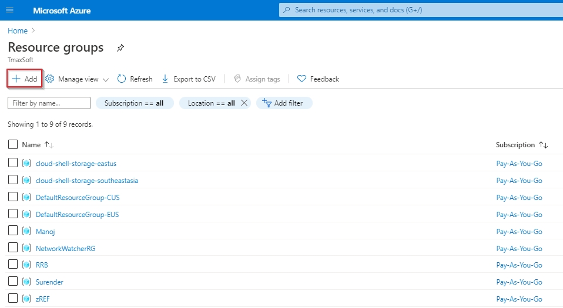

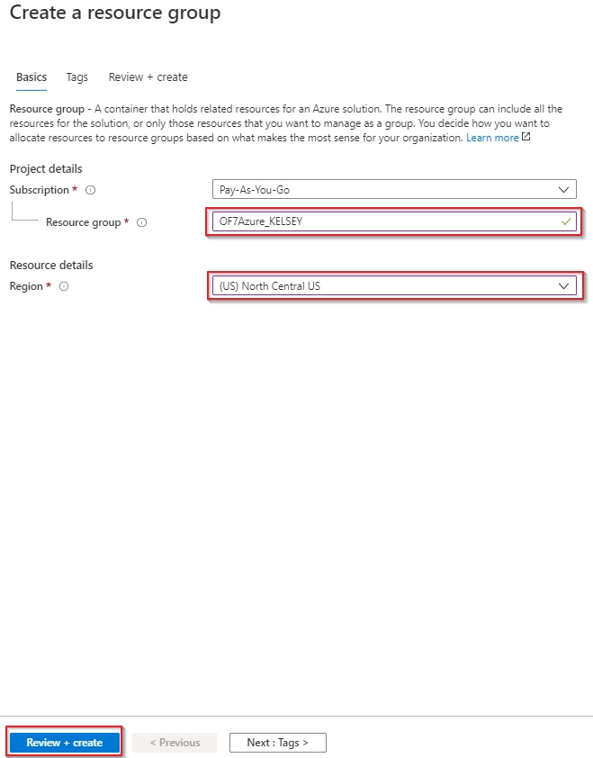

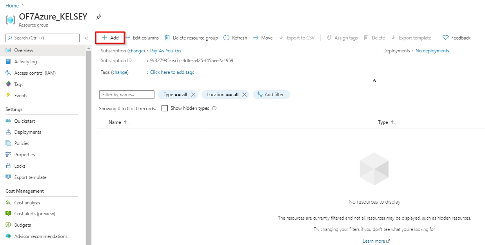

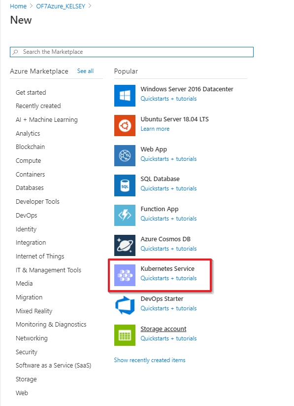

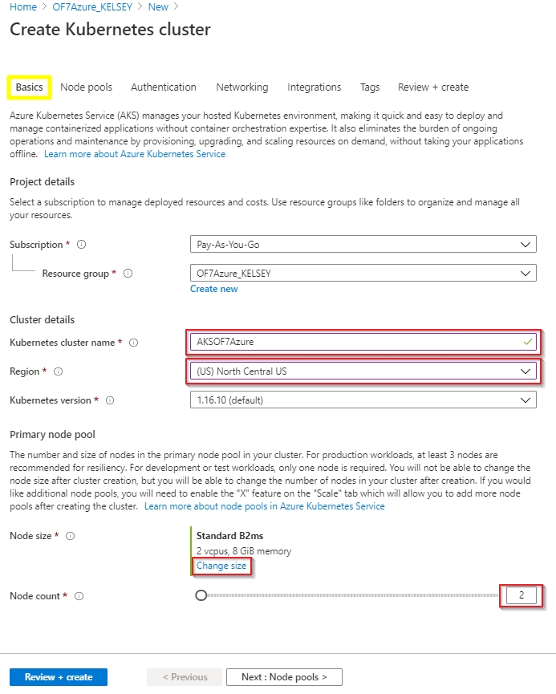

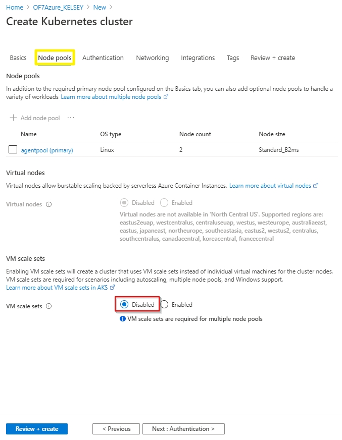

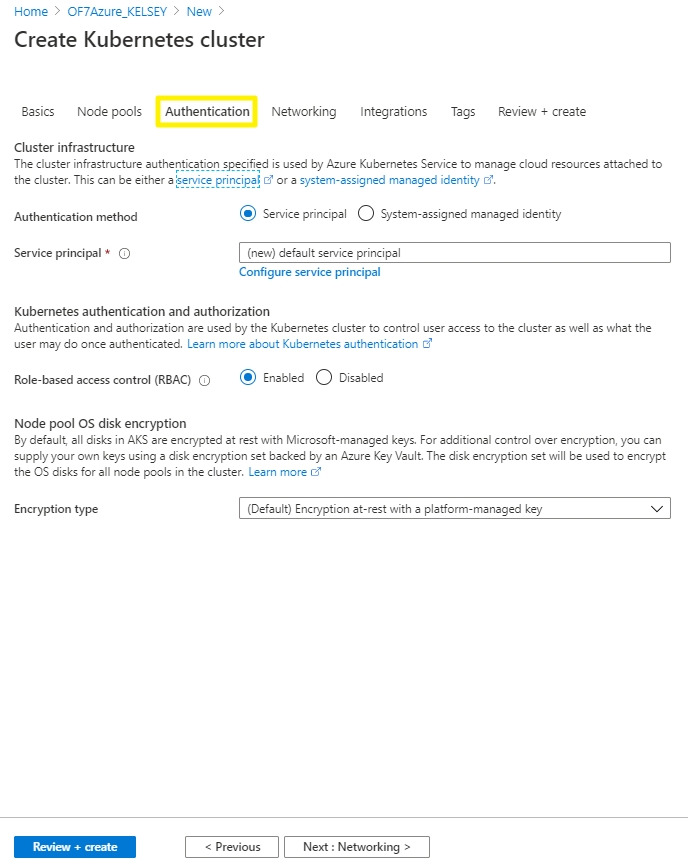

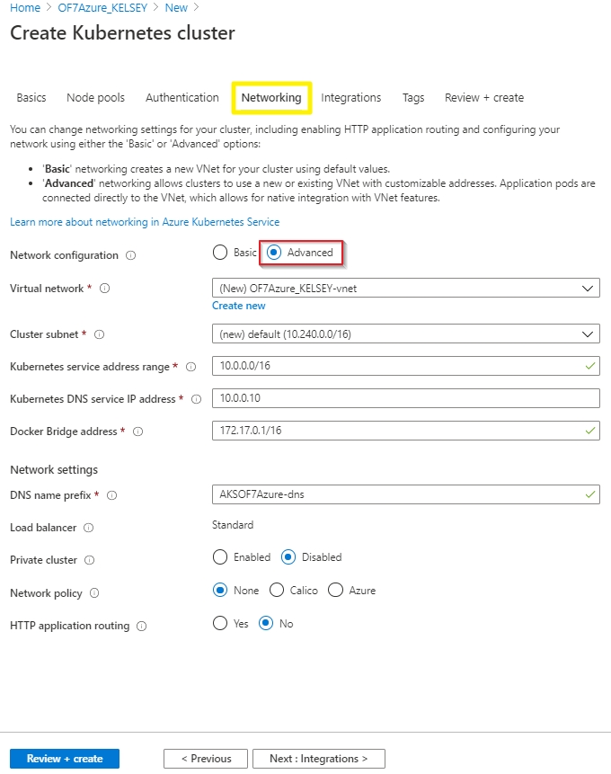

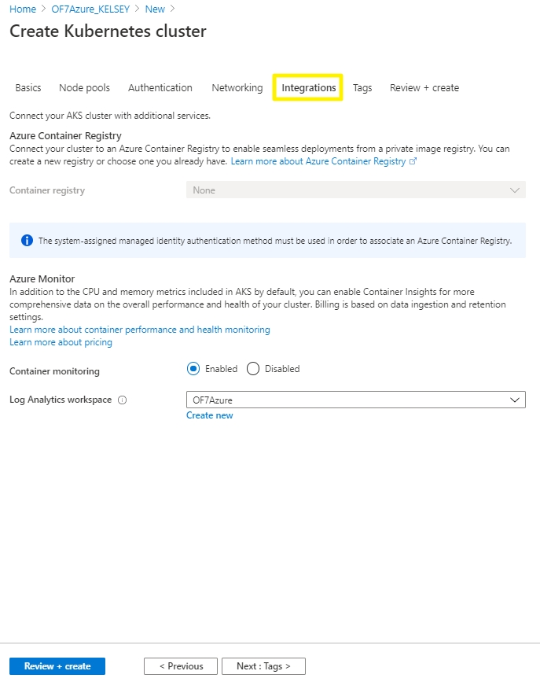

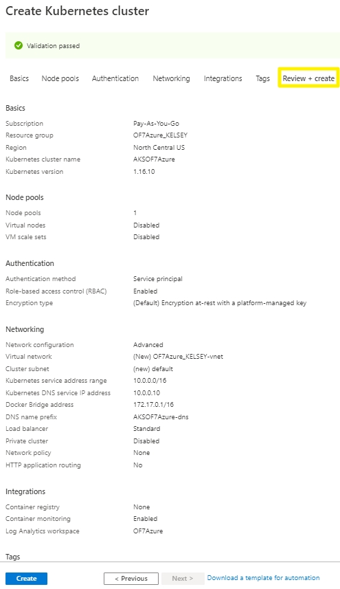

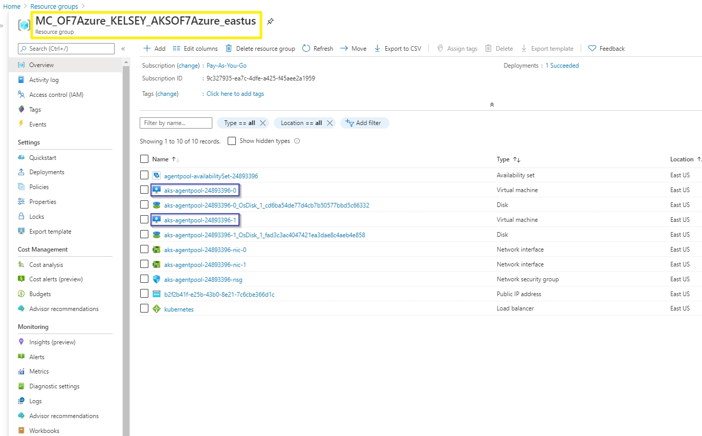

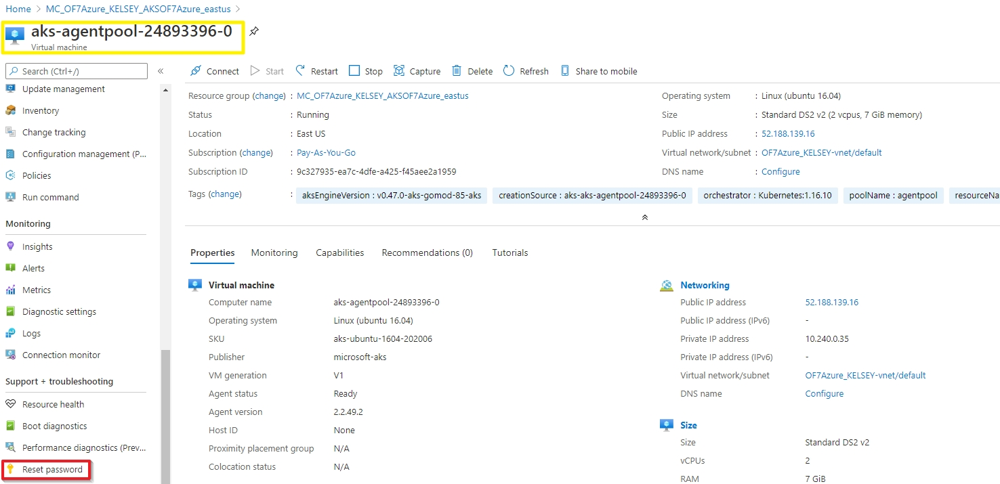

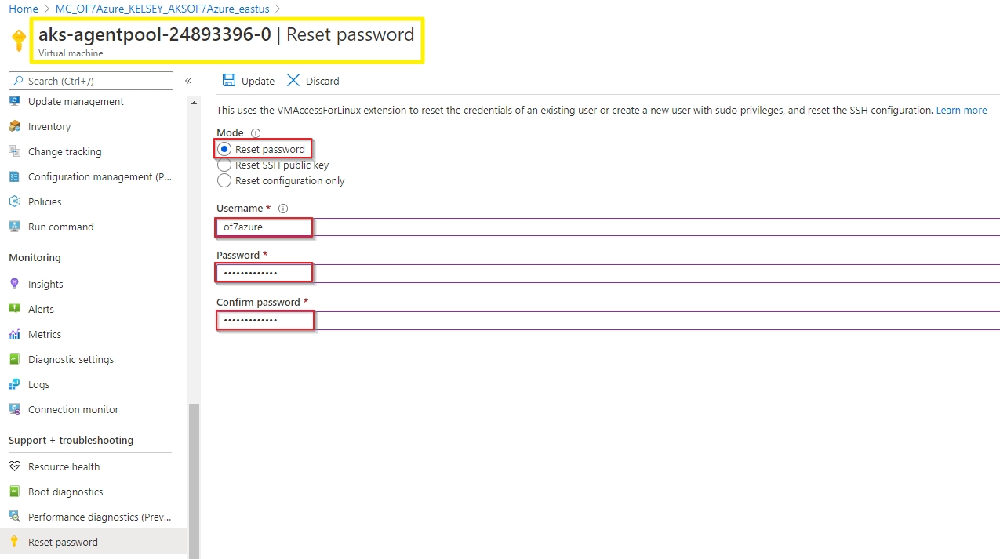

**nfs_deployment_tibero.yaml**

```
apiVersion: apps/v1
kind: Deployment
metadata:
  name: nfsof7azure-tibero
spec:
  selector:
    matchLabels:
      of7azurefinal: nfsof7azure
  replicas: 1
  template:
    metadata:
      name: of7azure
      labels:
        of7azurefinal: nfsof7azure
    spec:
      hostname: of7azure
      terminationGracePeriodSeconds: 10
      containers:
      - name: of7azure-tibero-link
        image: kelsey92/of7azure_tibero_link:tibero_link
        ports:
        - containerPort: 6066
        command: ["/bin/sh", "-ec", "while :; do echo '.'; sleep 5 ; done"]
        lifecycle:
          preStop:
            exec:
              command: [ "/bin/sleep", "120" ]
        volumeMounts:
        - name: sharedvolume
          mountPath: /mnt/azure
      volumes:
      - name: sharedvolume
        persistentVolumeClaim:
          claimName: nfs-pvc
```

**nfs_deployment_batch.yaml**

```
apiVersion: apps/v1
kind: Deployment
metadata:
  name: nfsof7azure-batch
spec:
  selector:
    matchLabels:
      of7azurefinal: nfsof7azure
  replicas: 1
  template:
    metadata:
      name: of7azure
      labels:
        of7azurefinal: nfsof7azure
    spec:
      hostname: of7azure
      terminationGracePeriodSeconds: 10
      containers:
      - name: of7azure-batch-link
        image: kelsey92/of7azure_batch_link:batch_link
        ports:
        - containerPort: 6066
        command: ["/bin/sh", "-ec", "while :; do echo '.'; sleep 5 ; done"]
        lifecycle:
          preStop:
            exec:
              command: [ "/bin/sleep", "120" ]
        volumeMounts:
        - name: sharedvolume
          mountPath: /mnt/azure
      volumes:
      - name: sharedvolume
        persistentVolumeClaim:
          claimName: nfs-pvc
```

**nfs_deployment_osc.yaml**

```
apiVersion: apps/v1
kind: Deployment
metadata:
  name: nfsof7azure-osc
spec:
  selector:
    matchLabels:
      of7azurefinal: nfsof7azure
  replicas: 1
  template:
    metadata:
      name: of7azure
      labels:
        of7azurefinal: nfsof7azure
    spec:
      hostname: of7azure01
      terminationGracePeriodSeconds: 10
      containers:
      - name: of7azure-osc-link
        image: kelsey92/of7azure_osc_link:osc_link
        ports:
        - containerPort: 6066
        command: ["/bin/sh", "-ec", "while :; do echo '.'; sleep 5 ; done"]
        lifecycle:
          preStop:
            exec:
              command: [ "/bin/sleep", "120" ]
        volumeMounts:
        - name: sharedvolume
          mountPath: /mnt/azure
      volumes:
      - name: sharedvolume
        persistentVolumeClaim:
          claimName: nfs-pvc
```

**nfs_deployment_jeus.yaml**

```
apiVersion: apps/v1
kind: Deployment
metadata:
  name: nfsof7azure-jeus
spec:
  selector:
    matchLabels:
      of7azurefinal: nfsof7azure
  replicas: 1
  template:
    metadata:
      name: of7azure
      labels:
        of7azurefinal: nfsof7azure
    spec:
      hostname: of7azure
      terminationGracePeriodSeconds: 10
      containers:
      - name: of7azure-jeus
        image: kelsey92/of7azure_jeus:jeus
        ports:
        - containerPort: 6066
        command: ["/bin/sh", "-ec", "while :; do echo '.'; sleep 5 ; done"]
        lifecycle:
          preStop:
            exec:
              command: [ "/bin/sleep", "120" ]
        volumeMounts:
        - name: sharedvolume
          mountPath: /mnt/azure
      volumes:
      - name: sharedvolume
        persistentVolumeClaim:
          claimName: nfs-pvc
```

**nfs_provisioner.yaml**

```
kind: Deployment
apiVersion: apps/v1
metadata:
  name: nfs-pod-provisioner
spec:
  selector:
    matchLabels:
      app: nfs-pod-provisioner
  replicas: 1
  strategy:
    type: Recreate
  template:
    metadata:
      labels:
        app: nfs-pod-provisioner
    spec:
      serviceAccountName: nfs-pod-provisioner-sa # name of service account
      containers:
        - name: nfs-pod-provisioner
          image: quay.io/external_storage/nfs-client-provisioner:latest
          volumeMounts:
            - name: nfs-provisioner-vol
              mountPath: "/mnt/azure"
          env:
            - name: PROVISIONER_NAME # do not change
              value: nfs-of7azure # SAME AS PROVISIONER NAME VALUE IN STORAGECLASS
            - name: NFS_SERVER # do not change
              value: 65.52.2.96 # Ip of the NFS SERVER
            - name: NFS_PATH # do not change
              value: "/azure_share" # path to nfs directory setup
      volumes:
       - name: nfs-provisioner-vol # same as volumemouts name
         nfs:
           server: 65.52.2.96
           path: "/azure_share"
```

**nfs_serviceaccount.yaml**

```
kind: ServiceAccount
apiVersion: v1
metadata:
  name: nfs-pod-provisioner-sa
---
kind: ClusterRole # Role of kubernetes
apiVersion: rbac.authorization.k8s.io/v1 # auth API
metadata:
  name: nfs-provisioner-clusterrole
rules:
  - apiGroups: [""] # rules on persistentvolumes
    resources: ["persistentvolumes"]
    verbs: ["get", "list", "watch", "create", "delete"]
  - apiGroups: [""]
    resources: ["persistentvolumeclaims"]
    verbs: ["get", "list", "watch", "update"]
  - apiGroups: ["storage.k8s.io"]
    resources: ["storageclasses"]
    verbs: ["get", "list", "watch"]
  - apiGroups: [""]
    resources: ["events"]
    verbs: ["create", "update", "patch"]
---
kind: ClusterRoleBinding
apiVersion: rbac.authorization.k8s.io/v1
metadata:
  name: nfs-provisioner-rolebinding
subjects:
  - kind: ServiceAccount
    name: nfs-pod-provisioner-sa
    namespace: default
roleRef: # binding cluster role to service account
  kind: ClusterRole
  name: nfs-provisioner-clusterrole # name defined in clusterRole
  apiGroup: rbac.authorization.k8s.io
---
kind: Role
apiVersion: rbac.authorization.k8s.io/v1
metadata:
  name: nfs-pod-provisioner-otherroles
rules:
  - apiGroups: [""]
    resources: ["endpoints"]
    verbs: ["get", "list", "watch", "create", "update", "patch"]
---
kind: RoleBinding
apiVersion: rbac.authorization.k8s.io/v1
metadata:
  name: nfs-pod-provisioner-otherroles
subjects:
  - kind: ServiceAccount
    name: nfs-pod-provisioner-sa # same as top of the file
    # replace with namespace where provisioner is deployed
    namespace: default
roleRef:
  kind: Role
  name: nfs-pod-provisioner-otherroles
  apiGroup: rbac.authorization.k8s.io
```

**nfs_storage.yaml**

```
apiVersion: storage.k8s.io/v1
kind: StorageClass
metadata:
  name: nfs-storageclass # IMPORTANT pvc needs to mention this name
provisioner: nfs-of7azure # name can be anything
parameters:
  archiveOnDelete: "false"
```

**nfs_pvc.yaml**

```
apiVersion: v1
kind: PersistentVolumeClaim
metadata:
  name: nfs-pvc
spec:
  storageClassName: nfs-storageclass # SAME NAME AS THE STORAGECLASS
  accessModes:
    - ReadWriteMany #  must be the same as PersistentVolume
  resources:
    requests:
      storage: 100Gi
```

**NFS_NodePort_8088.yaml**

```
apiVersion: v1
kind: Service
metadata:
  name: nfswebterminal
spec:
  type: NodePort
  selector:
    of7azurefinal: nfsof7azure
  ports:
  - protocol: TCP
    port: 8088
    targetPort: 8088
```

**NFS_NodePort_8087.yaml**

```
apiVersion: v1
kind: Service
metadata:
  name: nfsofmanager
spec:
  type: NodePort
  selector:
    of7azurefinal: nfsof7azure
  ports:
  - protocol: TCP
    port: 8087
    targetPort: 8087
```

**NFS_NodePort_9736.yaml**

```
apiVersion: v1
kind: Service
metadata:
  name: nfsjeus
spec:
  type: NodePort
  selector:
    of7azurefinal: nfsof7azure
  ports:
  - protocol: TCP
    port: 9736
    targetPort: 9736
```

**nfs_storage.yaml**

```
apiVersion: storage.k8s.io/v1
kind: StorageClass
metadata:
  name: nfs-storageclass # IMPORTANT pvc needs to mention this name
provisioner: nfs-of7azure # name can be anything
parameters:
  archiveOnDelete: "false"
```

**nfs_serviceaccount.yaml**

```
kind: ServiceAccount
apiVersion: v1
metadata:
  name: nfs-pod-provisioner-sa
---
kind: ClusterRole # Role of kubernetes
apiVersion: rbac.authorization.k8s.io/v1 # auth API
metadata:
  name: nfs-provisioner-clusterrole
rules:
  - apiGroups: [""] # rules on persistentvolumes
    resources: ["persistentvolumes"]
    verbs: ["get", "list", "watch", "create", "delete"]
  - apiGroups: [""]
    resources: ["persistentvolumeclaims"]
    verbs: ["get", "list", "watch", "update"]
  - apiGroups: ["storage.k8s.io"]
    resources: ["storageclasses"]
    verbs: ["get", "list", "watch"]
  - apiGroups: [""]
    resources: ["events"]
    verbs: ["create", "update", "patch"]
---
kind: ClusterRoleBinding
apiVersion: rbac.authorization.k8s.io/v1
metadata:
  name: nfs-provisioner-rolebinding
subjects:
  - kind: ServiceAccount
    name: nfs-pod-provisioner-sa
    namespace: default
roleRef: # binding cluster role to service account
  kind: ClusterRole
  name: nfs-provisioner-clusterrole # name defined in clusterRole
  apiGroup: rbac.authorization.k8s.io
---
kind: Role
apiVersion: rbac.authorization.k8s.io/v1
metadata:
  name: nfs-pod-provisioner-otherroles
rules:
  - apiGroups: [""]
    resources: ["endpoints"]
    verbs: ["get", "list", "watch", "create", "update", "patch"]
---
kind: RoleBinding
apiVersion: rbac.authorization.k8s.io/v1
metadata:
  name: nfs-pod-provisioner-otherroles
subjects:
  - kind: ServiceAccount
    name: nfs-pod-provisioner-sa # same as top of the file
    # replace with namespace where provisioner is deployed
    namespace: default
roleRef:
  kind: Role
  name: nfs-pod-provisioner-otherroles
  apiGroup: rbac.authorization.k8s.io
```

**nfs_provisioner.yaml**

```
kind: Deployment
apiVersion: apps/v1
metadata:
  name: nfs-pod-provisioner
spec:
  selector:
    matchLabels:
      app: nfs-pod-provisioner
  replicas: 1
  strategy:
    type: Recreate
  template:
    metadata:
      labels:
        app: nfs-pod-provisioner
    spec:
      serviceAccountName: nfs-pod-provisioner-sa # name of service account
      containers:
        - name: nfs-pod-provisioner
          image: quay.io/external_storage/nfs-client-provisioner:latest
          volumeMounts:
            - name: nfs-provisioner-vol
              mountPath: "/mnt/azure"
          env:
            - name: PROVISIONER_NAME # do not change
              value: nfs-of7azure # SAME AS PROVISIONER NAME VALUE IN STORAGECLASS
            - name: NFS_SERVER # do not change
              value: 65.52.2.96 # Ip of the NFS SERVER
            - name: NFS_PATH # do not change
              value: "/azure_share" # path to nfs directory setup
      volumes:
       - name: nfs-provisioner-vol # same as volumemouts name
         nfs:
           server: 65.52.2.96
           path: "/azure_share"
```

**CONCLUSION**

**SUGGESTION**


