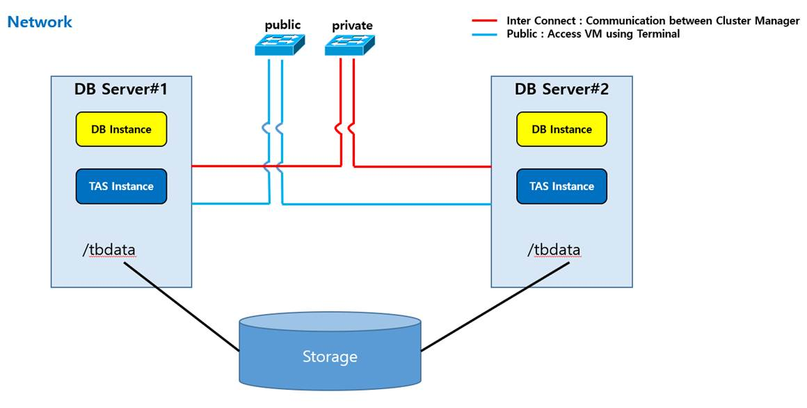
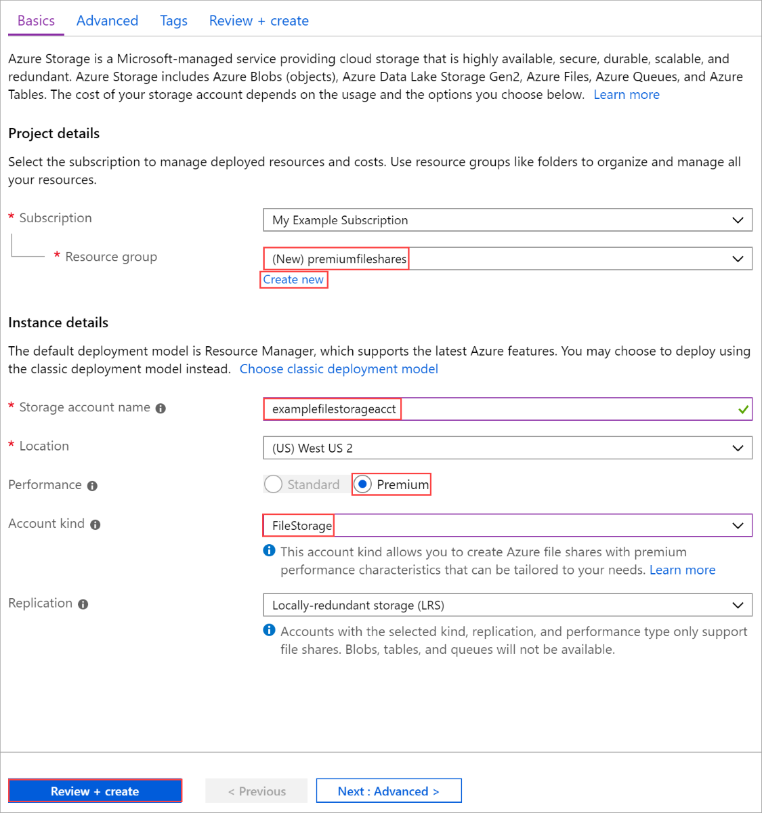
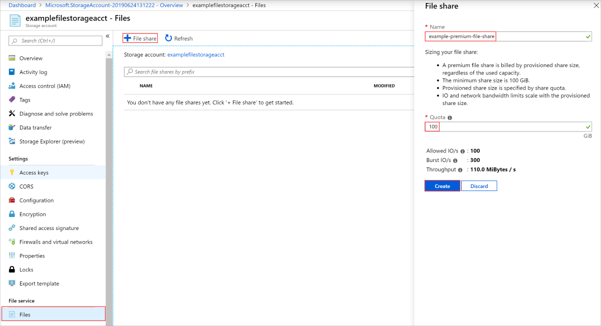
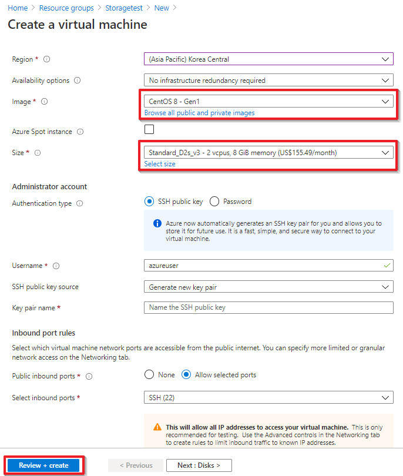
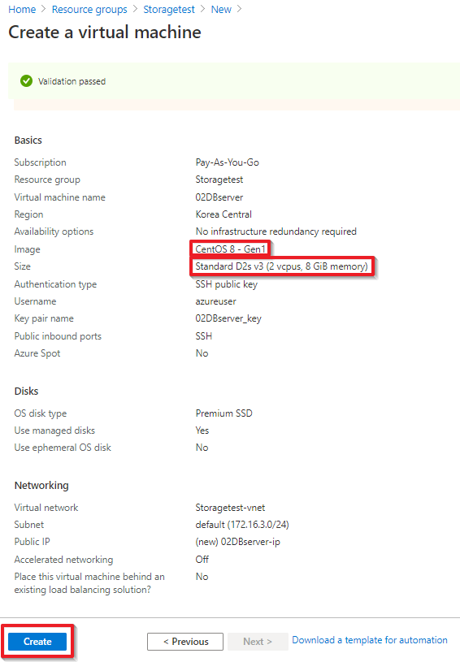

# TAC environment configuration using Azure File Share Premium by Kelsey

## Table of Contents

+ [1. Architecture](#1-architecture)
+ [2. Create Azure File Share Premium](#2-create-azure-file-share-premium)
+ [3. Create Two DB Servers](#3-create-two-db-servers)
+ [4. Mount Azure File Share Premium to DB Servers](#4-mount-azure-file-share-premium-to-db-servers)

### 1. Architecture

   
    
- Use Azure File Share Premium as a storage.

- Mount this storage to each DB server.

### 2. Create Azure File Share Premium

- Create storage account

   
 
- Create file share
 
   

### 3. Create Two DB Servers

- Specification

```
CentOS 8
2 core
8GB
```

- Create VMs 

   - Check the image version

        

   - Check the VM size
 
       

### 4. Mount Azure File Share Premium to DB Servers

1) Install Azure CLI

```
sudo rpm --import https://packages.microsoft.com/keys/microsoft.asc
```

```
vi bash_profile

echo -e "[azure-cli]
name=Azure CLI
baseurl=https://packages.microsoft.com/yumrepos/azure-cli
enabled=1
gpgcheck=1
gpgkey=https://packages.microsoft.com/keys/microsoft.asc" | sudo tee /etc/yum.repos.d/azure-cli.repo

source ~/.bash_profile
```

```
sudo yum install azure-cli
```

- Follow the steps
    - Go to https://microsoft.com/devicelogin and enter the code, then check the account you are going to use.
    
```
az login
To sign in, use a web browser to open the page https://microsoft.com/devicelogin and enter the code S7QNPWTRB to authenticate.
The following tenants don't contain accessible subscriptions. Use 'az login --allow-no-subscriptions' to have tenant level access.
693358f3-dc90-4442-aeec-274d3289a40e
[
  {
    "cloudName": "AzureCloud",
    "homeTenantId": "ef439009-53c1-4a0c-8012-edabcdeb7e05",
    "id": "9c327935-ea7c-4dfe-a425-f45aee2a1959",
    "isDefault": true,
    "managedByTenants": [],
    "name": "Pay-As-You-Go",
    "state": "Enabled",
    "tenantId": "ef439009-53c1-4a0c-8012-edabcdeb7e05",
    "user": {
      "name": "kelsey.lee@tmaxsoft.com",
      "type": "user"
    }
  }
]
```

When you need to logout
```
az logout
```

2) Mount the storage

```
sudo yum install cifs-utils 
```


```
vi 445.sh

#!/bin/bash

#resourceGroupName="Storagetest"
#storageAccountName="tmaxaccount"

# This command assumes you have logged in with az login
httpEndpoint=$(az storage account show \
    --resource-group Storagetest \
    --name tmaxaccount \
    --query "primaryEndpoints.file" | tr -d '"')
smbPath=$(echo $httpEndpoint | cut -c7-$(expr length $httpEndpoint))
fileHost=$(echo $smbPath | tr -d "/")

nc -zvw3 $fileHost 445
```

```
-bash: nc: command not found 

sudo yum install -y nmap-ncat
```

```
[azureuser@02DBserver ~]$ sh 445.sh 
Ncat: Version 7.70 ( https://nmap.org/ncat )
Ncat: Connected to 52.239.164.232:445.
Ncat: 0 bytes sent, 0 bytes received in 0.07 seconds.
```

```
vi directory.sh

#!/bin/bash

resourceGroupName="Storagetest"
storageAccountName="tmaxaccount"
fileShareName="tmaxfile"

mntPath="/mnt/$storageAccountName/$fileShareName"

sudo mkdir -p $mntPath
```


```
vi cre.sh 

#!/bin/bash

if [ ! -d "/etc/smbcredentials" ]; then
    sudo mkdir "/etc/smbcredentials"
fi

storageAccountKey=$(az storage account keys list \
    --resource-group StorageTest \
    --account-name tmaxaccount \
    --query "[0].value" | tr -d '"')

smbCredentialFile="/etc/smbcredentials/tmaxaccount.cred"
if [ ! -f $smbCredentialFile ]; then
    echo "username=tmaxaccount" | sudo tee $smbCredentialFile > /dev/null
    echo "password=$storageAccountKey" | sudo tee -a $smbCredentialFile > /dev/null
else
    echo "The credential file $smbCredentialFile already exists, and was not modified."
fi
```

```
sudo chmod 600 $smbCredentialFile
```

```
vi mount.sh

#!/bin/bash

# This command assumes you have logged in with az login
httpEndpoint=$(az storage account show \
    --resource-group StorageTest \
    --name tmaxaccount \
    --query "primaryEndpoints.file" | tr -d '"')

smbPath=$(echo $httpEndpoint | cut -c7-$(expr length $httpEndpoint))tmaxfile

smbCredentialFile="/etc/smbcredentials/tmaxaccount.cred"

if [ -z "$(grep $smbPath\ /mnt/tmaxaccount/tmaxfile /etc/fstab)" ]; then
    echo "$smbPath /mnt/tmaxaccount/tmaxfile cifs nofail,vers=3.0,credentials=$smbCredentialFile,serverino" | sudo tee -a /etc/fstab > /dev/null
else
    echo "/etc/fstab was not modified to avoid conflicting entries as this Azure file share was already present. You may want to double check /etc/fstab to ensure the configuration is as desired."
fi

sudo mount -a
```
- You can set UID and GID when you mount the directory.

     - Tibero group and user setting like below.

         ```
         groupadd dba -g 10005
         useradd -d /home/oftibr -g dba -s /bin/bash -m oftibr -u 10002
         passwd oftibr
         ```

```
sudo mount /mnt/tmaxaccount/tmaxfile -o uid=oftibr -o gid=dba
```

- When you need to unmount 

   1. Use the unmount comment

   ```
   umount /mnt/tmaxaccount/tmaxfile/
   ```

   2. Modify the fstab file

   ```
   sudo vi fstab

   UUID=60e06333-2fb4-4e92-aa22-2644748fde8a       /               xfs     defaults        0 0
   /dev/disk/cloud/azure_resource-part1    /mnt/resource   auto    defaults,nofail,x-systemd.requires=cloud-init.service,comment=cloudconfig       0       2
   //tmaxaccount.file.core.windows.net/tmaxfile /mnt/tmaxaccount/tmaxfile cifs nofail,vers=3.0,credentials=/etc/smbcredentials/tmaxaccount.cred,serverino

   Delete the last line.

```
